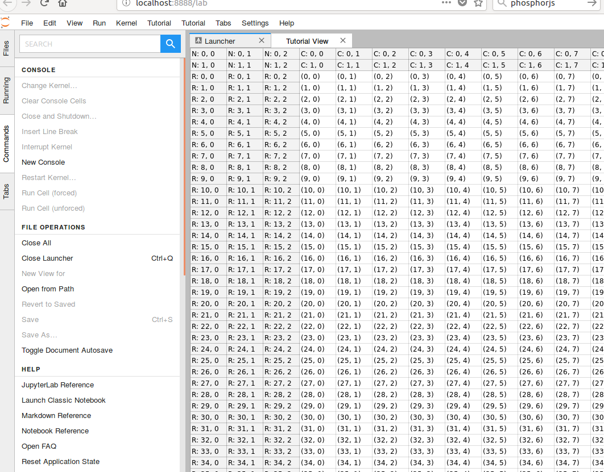
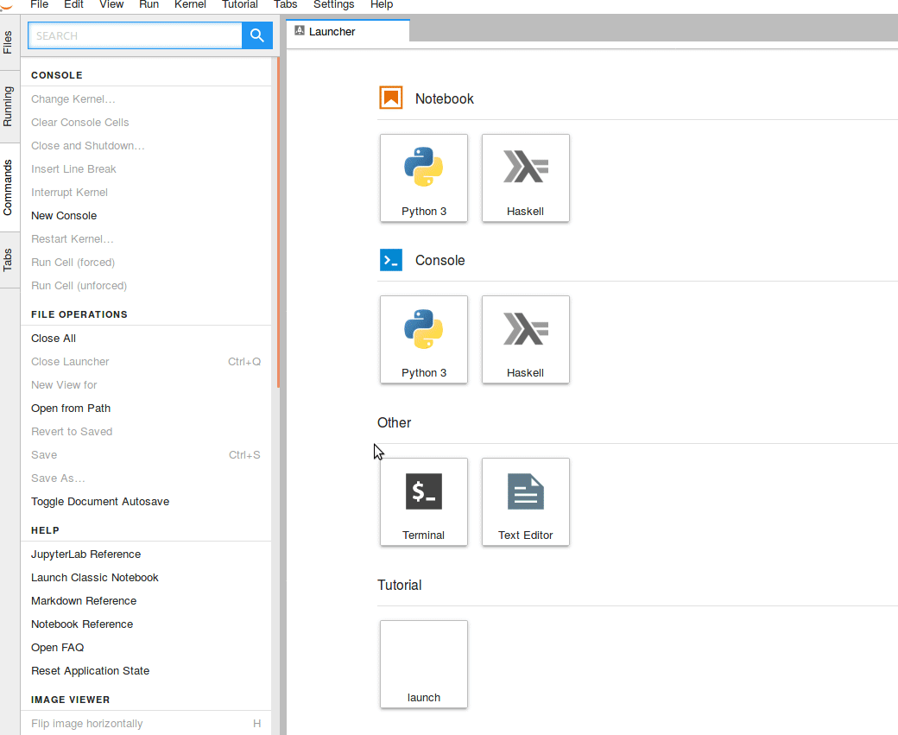
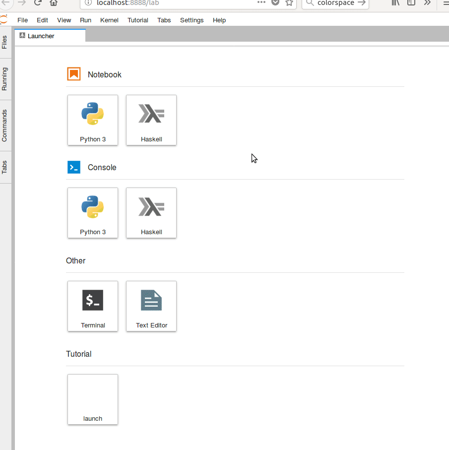
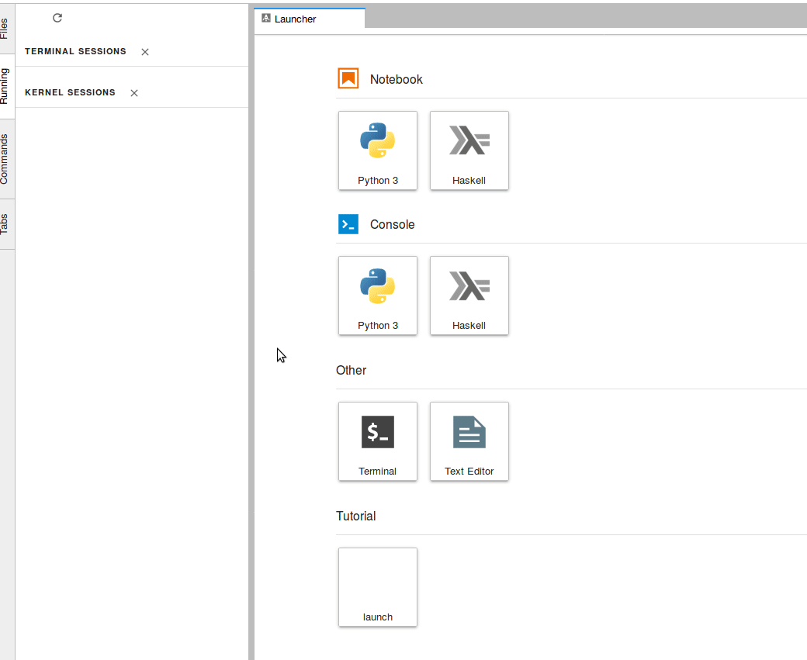

# Jupyterlab Extensions Walkthrough #

## Other tutorials ##
* http://jupyterlab.readthedocs.io/en/stable/developer/xkcd_extension_tutorial.html

## Table of Contents ##

* [Prerequesites](#prerequesites)
* [Hello World: Setting up the development environment](#hello-world-extension-setting-up-the-development-environment)
  * [The template folder structure](#the-template-folder-structure)
  * [A minimal extension that prints to the browser console](#a-minimal-extension-that-prints-to-the-browser-console)
  * [Building and Installing an Extension](#building-and-installing-an-extension)
* [Commands and Menu Extension: Extending the main app](#commands-and-menu-extension-extending-the-main-app)
  * [Jupyterlab Commands](#jupyterlab-commands)
  * [Adding new Menu tabs and items](#adding-new-menu-tabs-and-items)
* [Widgets: Adding new elements](#widgets-adding-new-elements)
  * [A basic tab](#a-basic-tab)
* [Datagrid: An Example of a Fancy Phosphor Widgets](#datagrid-an-example-of-a-fancy-phosphor-widgets)
* [The OutputArea class: Notebook-style Output Rendering](#the-outputarea-class-notebook-style-output-rendering)
  * [Reorganizing the extension code](#reorganizing-the-extension-code)
* [IPyWidgets: A Quick Look Into a New Rendermime Extension](#ipywidgets-a-quick-look-into-a-new-rendermime-extension)
* [Buttons and Signals: Interactions Between Different Widgets](#buttons-and-signals-interactions-between-different-widgets)
  * [Phosphor Signaling 101](#phosphor-signaling-101)
  * [Reorganizing the extension code](#reorganizing-the-extension-code-1)
  * [A simple react button](#a-simple-react-button)
  * [subscribing to a signal](#subscribing-to-a-signal)
  * [asynchronous extension initialization](#asynchronous-extension-initialization)
* [Custom Kernel Interactions: Kernel Managment and Messaging](#custom-kernel-interactions-kernel-managment-and-messaging)
  * [Component Overview](#component-overview)
  * [Initializing and managing a kernel session (panel.ts)](#initializing-and-managing-a-kernel-session-panelts)
  * [Executing code and retrieving messages from a kernel (model.ts)](#executing-code-and-retrieving-messages-from-a-kernel-modelts)
  * [Connecting a View to the Kernel](#connecting-a-view-to-the-kernel)
  * [How does it look like](#how-does-it-look-like)

## Prerequesites ##

This is a short tutorial series on how to write jupyterlab extensions. Writing
an extension is not particularly difficult but requires a very basic knowledge
of javascript and typescript.

_Don't be scared of typescript, I never coded in typescript before I touched 
jupyterlab but found it easier to understand than pure javascript if you have a 
basic understanding of object oriented programming and types._

## Hello World: Setting up the development environment ##

#### The template folder structure ####

Writing a jupyterlab extension usually starts from a configurable template. It
can be downloded with the `cookiecutter` tool:

```bash
cookiecutter https://github.com/jupyterlab/extension-cookiecutter-ts
```

It asks for some basic information that could for example be setup like this:
```bash
author_name []: tuto
extension_name [jupyterlab_myextension]: 1_hello_world
project_short_description [A JupyterLab extension.]: minimal lab example
repository [https://github.com/my_name/jupyterlab_myextension]: 
```

The cookiecutter creates the directory `1_hello_world` [or your extension name]
that looks like this:

```bash
1_hello_world/

├── README.md
├── package.json
├── tsconfig.json
├── src
│   └── index.ts
└── style
    └── index.css
```

* `README.md` contains some instructions
* `package.json` contains information about the extension such as dependencies
* `tsconfig.json` contains information for the typescript compilation
* `src/index.ts` _this contains the actual code of our extension_
* `style/index.css` contains style elements that we can use

What does this extension do?


#### A minimal extension that prints to the browser console ####

Well, let's have a step by step look at
`src/index.ts`. The file begins with an import section:

```typescript
import {
  JupyterLab, JupyterLabPlugin
} from '@jupyterlab/application';

import '../style/index.css';
```

`JupyterLab` is the main application class that will allow us to interact and
modify Jupyterlab. The `JupyterLabPlugin` is the class of the extension that we
are building. Both are imported from a module called `@jupyterlab/application`.
The dependency of our extension on this module is declared in the
`package.json` file:
```json
[...]
  "dependencies": {
    "@jupyterlab/application": "^0.16.0"
  },
[...]
```

With this basic import setup, we can move on to construct a new instance
of the `JupyterLabPlugin` class:

```typescript
const extension: JupyterLabPlugin<void> = {
  id: '1_hello_world',
  autoStart: true,
  activate: (app: JupyterLab) => {
    console.log('JupyterLab extension 1_hello_world is activated!');
  }
};

export default extension;
```

a JupyterLabPlugin takes a few attributes when constructed that are fairly
self-explanatory in the case of `id` and `autoStart`. The `activate`
attribute links to a function (`() => {}` notation) that takes one 
argument `app` of type `JupyterLab` and then calls the
`console.log` function that is used to output something into the browser
console in javascript. This simple example shows the basic approach when
writing a jupyterlab extension. The activate function acts as an entry point
and gets the main JupyterLab application instance passed as an argument, which
allows us to interact and modify it. Finally our new `JupyterLabPlugin`
instance has to be exported to be visible to JupyterLab.

This brings us to the next point. How can we plug this extension into
JupyterLab?

#### Building and Installing an Extension ####

Let's look at the `README.md` file. It contains instructions how
our labextension can be installed for development:

_For a development install (requires npm version 4 or later), do the following 
in the repository directory:_

```bash
npm install
npm run build
jupyter labextension link .
```

Roughly the first command installs dependencies that are specified in 
`package.json`. Among the dependencies are also all of the `jupyterlab` 
components that we want to use in our project, but more about this later.
The second step runs the build script. In this step, the typescript code gets
converted to javascript using the compiler `tsc` and stored in a `lib`
directory. Finally, we link the module to jupyterlab.

After all of these steps are done, running
```bash
jupyter labextension list
```
should now show something like:
```bash
   local extensions:
        1_hello_world: [...]/labextension_tutorial/1_hello_world
```

Now let's check inside of jupyterlab if it works. Run [can take a while]:

```bash
jupyter lab --watch
```

Our extension doesn't do much so far, it just writes something to the browser
console. So let's check if it work. In firefox you can open the console
pressing the `f12` key. You should see something like:

```
JupyterLab extension 1_hello_world is activated
```

Our extension works but it is incredibly boring. Let's start with the
development and modify the source code a bit. Simply replace the `activate`
function with the following lines:

```typescript
    activate: (app: JupyterLab) => {
        console.log('the JupyterLab main application:');
        console.log(app);
    }
```

to update the module, we simply need to go into the extension directory and
run again:

```bash
npm run build
```

Since we used the `--watch` option when starting jupyterlab, we now only have
to refresh the jupyterlab website and should see in the browser console:

```
Object { _started: true, _pluginMap: {…}, _serviceMap: Map(28), _delegate: {…}, commands: {…}, contextMenu: {…}, shell: {…}, registerPluginErrors: [], _dirtyCount: 0, _info: {…}, … } index.js:12
```

This is the main application JupyterLab object and we will see how to interact
with it in the next section. We see a few of it's attributes.

An overview of the classes and their attributes and methods can be found in the jupyterlab
documentation. The `@jupyterlab/application` module documentation is
[here](https://jupyterlab.github.io/jupyterlab/modules/_application_src_index_.html)
and which links to the [JupyterLab class](https://jupyterlab.github.io/jupyterlab/classes/_application_src_index_.jupyterlab.html).
The `JupyterLabPlugin` is a type alias [a new name] for the type `IPlugin`.
The definition of `IPlugin` is more difficult to find because it is defined by
the `phosphor.js` library that runs jupyterlab under the hood
(more about this later). Its documentation is therefore located on the
[phosphor.js website](http://phosphorjs.github.io/phosphor/api/application/interfaces/iplugin.html)


[Click here for the final 1_hello_world](1_hello_world)

## Commands and Menu Extension: Extending the main app ##

For the next extension you can either copy the last folder to a new one or 
simply continue modifying it. In case that you want to have a new extension,
open the file `package.json` and modify the package name, e.g. into 
`2_commands_and_menus`. The same name change needs to be done in `src/index.ts`.

#### Jupyterlab Commands ####

If you don't have jupyterlab open, start it with `jupyter lab --watch`. In this
extension, we are going to add a command to the application command registry
and expose it to the user in the command palette.
The command palette can be seen when clicking on _Commands` on the left hand
side of Jupyterlab. The command palette can be seen as a list of actions that
can be executed by jupyterlab. (see screenshot below).


Often, extension provide some new functions to jupyterlab to the
applications command registry and then expose them to the user through the
command palette or through a menu item.

Two types play a role in this: the `CommandRegistry` type ([documentation](http://phosphorjs.github.io/phosphor/api/commands/classes/commandregistry.html))
and the command palette interface `ICommandPalette` that has to be imported:

```typescript
import {
  ICommandPalette
} from '@jupyterlab/apputils';
```

Let's see how we access the applications command registry and command palette:
to do this, open the file `src/index.ts`.

The CommandRegistry is simply an attribute of the JupyterLab application (variable
`app` in the previous section). It provides a function `addCommand` to add our
own functionality.
The ICommandPalette ([documentation](https://jupyterlab.github.io/jupyterlab/interfaces/_apputils_src_commandpalette_.icommandpalette.html))
needs to be passed in addition to the JupyterLab application (variable `app`)
as second argument (variable `palette`) to the activate function. We specify
with the property `requires: [ICommandPalette],` which additional arguments we
pass to the `activate` function in the JupyterLabPlug. The ICommandPalette
provides the method `addItem` that links a palette entry to a command in the
command registry. Our new plugin code then becomes:

```typescript
const extension: JupyterLabPlugin<void> = {
    id: '2_commands_and_menus',
    autoStart: true,
    requires: [ICommandPalette],
    activate: (
        app: JupyterLab,
        palette: ICommandPalette) =>
    {
        const { commands } = app;

        let command = 'labtutorial';
        let category = 'Tutorial';

        commands.addCommand(command, {
            label: 'New Labtutorial',
            caption: 'Open the Labtutorial',
            execute: (args) => {console.log('Hey')}});

        palette.addItem({command, category});
    }
};

export default extension;
```

When this extension is build (and linked if necessary), jupyterlab looks like
this:


#### Adding new Menu tabs and items ####

Adding new menu items works in a similar way. The IMainMenu interface can be
passed as a new argument two the activate function, but first it has to be
imported, together with the Menu phosphor type that describes a new tab:

```typescript
import {
  IMainMenu
} from '@jupyterlab/mainmenu';

import {
  Menu
} from '@phosphor/widgets';
```

We add the IMainMenu in the `requires:` property and can then change the
extension to:

```typescript
const extension: JupyterLabPlugin<void> = {
    id: '2_commands_and_menus',
    autoStart: true,
    requires: [ICommandPalette, IMainMenu],
    activate: (
        app: JupyterLab,
        palette: ICommandPalette,
        mainMenu: IMainMenu) =>
    {
        const { commands } = app;
        let command = 'labtutorial';
        let category = 'Tutorial';
        commands.addCommand(command, {
            label: 'New Labtutorial',
            caption: 'Open the Labtutorial',
            execute: (args) => {console.log('Hey')}});
        palette.addItem({command, category});


        let tutorialMenu: Menu = new Menu({commands});

        tutorialMenu.title.label = 'Tutorial';
        mainMenu.addMenu(tutorialMenu, {rank: 80});
        tutorialMenu.addItem({ command });
    }
};

export default extension;
```

In this extension, we have added a new dependency _jupyterlab/mainmenu_. Before
it builds, this dependency has to be added to the `package.json` file:

```json
  "dependencies": {
    "@jupyterlab/application": "^0.16.0",
    "@jupyterlab/mainmenu": "*"
  }
```

we can then do

```
npm install
npm run build
```

to rebuild the application. A refresh of the jupyterlab website should now show:


[the `tsconfig.json` file might have to be updated to:
```
{
  "compilerOptions": {
    "declaration": true,
    "noImplicitAny": true,
    "noEmitOnError": true,
    "noUnusedLocals": true,
    "module": "commonjs",
    "moduleResolution": "node",
    "target": "ES6",
    "outDir": "./lib",
    "lib": ["ES6", "ES2015.Promise", "DOM"],
    "types": []
  },
  "include": ["src/*"]
}
```
]

[Click here for the final 2_commands_and_menus](2_commands_and_menus)


## Widgets: Adding new elements ##

Woo finally we are going to do some real stuff and add a new tab to jupyterlab.
Particular visible elements such as a tab are represented by widgets in the
phosphor library that is the basis of the jupyterlab application.

#### A basic tab ####

The base
widget class can be imported with:

```typescript
import {
    Widget
} from '@phosphor/widgets';
```

a Widget can be added to the main area through the `shell` that can be accessed
as a property of the `app` variable that represents the main jupyterlab
application. Inside of our previous activate function, this looks like this:

```
    activate: (
        app: JupyterLab,
        palette: ICommandPalette,
        mainMenu: IMainMenu) =>
    {
        const { commands, shell } = app;
        let command = 'ex3:labtutorial';
        let category = 'Tutorial';
        commands.addCommand(command, {
            label: 'Ex3 command',
            caption: 'Open the Labtutorial',
            execute: (args) => {
                const widget = new TutorialView();
                shell.addToMainArea(widget);}});
        palette.addItem({command, category});

        let tutorialMenu: Menu = new Menu({commands});

        tutorialMenu.title.label = 'Tutorial';
        mainMenu.addMenu(tutorialMenu, {rank: 80});
        tutorialMenu.addItem({ command });
    }
```

Defining the custom widget `TutorialView`) is straight-forward as well:

```typescript
class TutorialView extends Widget {
    constructor() {
        super();
        this.addClass('jp-tutorial-view')
        this.id = 'tutorial'
        this.title.label = 'Tutorial View'
        this.title.closable = true;
    }
}
```

Note that we have used a custom css class that is defined in the file
`style/index.css` as:

```
.jp-tutorial-view {
    background-color: AliceBlue;
}
```

Our custom tab can be started in jupyterlab from the command palette and looks
like this:


[Click here for the Widget 3_widgets](3_widgets)


## Datagrid: An Example of a Fancy Phosphor Widgets ##

Now let's do something a little more fancy. Jupyterlab is build on top of
Phosphor.js. Let's see if we can plug [this phosphor example](http://phosphorjs.github.io/examples/datagrid/)
into jupyterlab. We start by importing the `Panel` widget and the `DataGrid`
and `DataModel` classes from phosphor.

```typescript
import {
    Panel
} from '@phosphor/widgets';

import {
  DataGrid, DataModel
} from '@phosphor/datagrid';
```

The Panel widget can hold several sub-widgets that are added with its
`.addWidget` property. `DataModel` is a class that provides data that is
shown in the `DataGrid` widget.

With these three classes, we adapt the `TutorialView` as follows:

```typescript
class TutorialView extends Panel {
    constructor() {
        super();
        this.addClass('jp-tutorial-view')
        this.id = 'tutorial'
        this.title.label = 'Tutorial View'
        this.title.closable = true;

        let model = new LargeDataModel();
        let grid = new DataGrid();
        grid.model = model;

        this.addWidget(grid);
    }
}
```

That's rather easy. Let's now dive into the `DataModel` class that is taken
from the official phosphor.js example. The first few lines look like this:

```typescript
class LargeDataModel extends DataModel {

  rowCount(region: DataModel.RowRegion): number {
    return region === 'body' ? 1000000000000 : 2;
  }

  columnCount(region: DataModel.ColumnRegion): number {
    return region === 'body' ? 1000000000000 : 3;
  }
```

While it is fairly obvious that `rowCount` and `columnCount` are supposed
to return some number of rows and columns, it is a little more cryptic what
the `RowRegion` and the `ColumnRegion` input arguments are. Let's have a
look at their definition in the phosphor.js source code:

```typescript
  export
  type RowRegion = 'body' | 'column-header';

  /**
   * A type alias for the data model column regions.
   */
  export
  type ColumnRegion = 'body' | 'row-header';

  /**
   * A type alias for the data model cell regions.
   */
  export
  type CellRegion = 'body' | 'row-header' | 'column-header' | 'corner-header';
```

The meaning of these lines might be obvious for experienced users of typescript
or Haskell. The `|` can be read as or, so the `RowRegion` type is either `body`
or `column-header`. This explains what the `rowCount` and `columnCount`
functions do: They define a table with `2` header rows, with 3 index columns,
with `1000000000000` rows and `1000000000000` columns.

The remaining part of the class defines the row and column number as
data values and adds a letter prefix in case that we are in any of the
header regions:

```typescript
  data(region: DataModel.CellRegion, row: number, column: number): any {
    if (region === 'row-header') {
      return `R: ${row}, ${column}`;
    }
    if (region === 'column-header') {
      return `C: ${row}, ${column}`;
    }
    if (region === 'corner-header') {
      return `N: ${row}, ${column}`;
    }
    return `(${row}, ${column})`;
  }
}
```

Let's see how this looks like in Jupyterlab:



[Click here for extension4](extension4)


## The `OutputArea` class: Notebook-style Output Rendering ##

In this extension we will see how we can do the same as in the previous
extension using the `OutputArea` class that jupyterlab provides. Essentially,
`OutputArea` will render the data that came as a reply to an execute message in
the same way as in the notebook. Under the hood, the `OutputArea` and the
`OutputAreaModel` classes act similar to the `KernelView` and `KernelModel`
classes that we have defined ourselves before. We therefore get rid of the
`model.ts` and `widget.tsx` files and change the panel class to:

#### Reorganizing the extension code ####

Since our extension is growing bigger and bigger, we begin by splitting our
code into more managable units. Roughly we can see three larger components
of our application:

1.  the `JupyterLabPlugin` that activates all extension components and connects
    them to the main `Jupyterlab` application via commands, launcher, or menu
    items.
2.  a Panel that combines different widgets into a single application
3.  different widgets that define smaller elements such as buttons 

We split these components in the three files:

```
src/
├── index.ts
├── panel.ts
└── widget.tsx
```

Let's go through these files one by one:

```
export
class TutorialPanel extends StackedPanel {
    constructor(manager: ServiceManager.IManager, rendermime: RenderMimeRegistry) {
        super();
        this.addClass(PANEL_CLASS);
        this.id = 'TutorialPanel';
        this.title.label = 'Tutorial View'
        this.title.closable = true;

        let path = './console';

        this._session = new ClientSession({
            manager: manager.sessions,
            path,
            name: 'Tutorial',
        });

        this._outputareamodel = new OutputAreaModel();
        this._outputarea = new SimplifiedOutputArea({ model: this._outputareamodel, rendermime: rendermime });

        this.addWidget(this._outputarea);
        this._session.initialize();
    }

    public execute(code: string) {
        SimplifiedOutputArea.execute(code, this._outputarea, this._session)
            .then((msg: KernelMessage.IExecuteReplyMsg) => {console.log(msg); })
    }

    [...]
```

To display the variable `df` from a kernel, we just need to add a command to
the command registry in `index.ts`

```
    command = CommandIDs.execute
    commands.addCommand(command, {
        label: 'Ex7: show dataframe',
        caption: 'show dataframe',
        execute: (args) => {panel.execute('df')}});
```

and we are ready to see, for example, a nicely rendered pandas dataframe.
Using the `OutputArea` class, the extension looks like this:



[Click here for 5_outputareas](5_outputareas)

## IPyWidgets: A Quick Look Into a New Rendermime Extension ##

A lot of advanced functionality in jupyter lab notebooks come in the form of
ipython widgets (or jupyter widgets). Such widgets have one representation in
the kernel and one representation in the jupyterlab javascript code. They can
for example be used to interactively examine very large datasets in the kernel
without a full copy in the frontend. Many other widgets are available and can
give an app-like feeling to a jupyter notebook. These widgets are therefore
ideal to build an interactive jupyterlab extension.

As an example, we show in this extension how the ipywidget `qgrid` can be
integrated into jupyterlab. As a first step, install `ipywidgets` and 
`grid`.

(These are the commands for a conda installation:
```
conda install -c conda-forge ipywidgets
conda install -c conda-forge qgrid
jupyter labextension install @jupyter-widgets/jupyterlab-manager
jupyter labextension install qgrid
```
)

Before continuing, test if you can (a) open a notebook, and (b) see a table
when executing these commands in a cell:

```
import pandas as pd
import numpy as np
import qgrid
df = pd.DataFrame(np.arange(25).reshape(5, 5))
qgrid.show_grid(df)
```

If yes, we can check out how we can include this table in our own app. It is
quite similar to the previous Extension7 but some minor adjustments have to
be made.

The first thing is to understand the nature of the ipywidget jupyterlab
extension (`jupyterlab-manager`). As this text is written (26/6/2018) it is a
*document* extension and not a general extension to jupyterlab. This means
it provides extra functionality to the notebook document and not the the full
app. The relevant lines from its source are here: 

```typescript
export
class NBWidgetExtension implements INBWidgetExtension {
  /**
   * Create a new extension object.
   */
  createNew(nb: NotebookPanel, context: DocumentRegistry.IContext<INotebookModel>): IDisposable {
    let wManager = new WidgetManager(context, nb.rendermime);
    this._registry.forEach(data => wManager.register(data));
    nb.rendermime.addFactory({
      safe: false,
      mimeTypes: [WIDGET_MIMETYPE],
      createRenderer: (options) => new WidgetRenderer(options, wManager)
    }, 0);
    return new DisposableDelegate(() => {
      if (nb.rendermime) {
        nb.rendermime.removeMimeType(WIDGET_MIMETYPE);
      }
      wManager.dispose();
    });
  }

  /**
   * Register a widget module.
   */
  registerWidget(data: base.IWidgetRegistryData) {
    this._registry.push(data);
  }
  private _registry: base.IWidgetRegistryData[] = [];
}
```

the `createNew` method of `NBWidgetExtension` takes a `NotebookPanel` as input
argument and then adds a custom mime renderer with the command
`nb.rendermime.addFactory` to it. The widget renderer (or rather RenderFactory)
is linked to the `WidgetManager` is going to store the underlying data of the
widgets.

Unfortunately, this means that we have to access IPython widgets through an
open notebook if we want to use it without changing the widget source code.
To access the current notebook, we can use the `INotebookTracker` in
the plugin's activate function:

```
const extension: JupyterLabPlugin<void> = {
    id: '6_ipywidgets',
    autoStart: true,
    requires: [ICommandPalette, INotebookTracker, ILauncher, IMainMenu],
    activate: activate
};


function activate(
    app: JupyterLab,
    palette: ICommandPalette,
    tracker: INotebookTracker,
    launcher: ILauncher,
    mainMenu: IMainMenu)
{
    [...]
```

We then pass the rendermime of the notebook (the one that has the IPyWidget
Renderer added) to our panel:

```
    function createPanel() {
        let current = tracker.currentWidget;
        console.log(current.rendermime);

        return manager.ready
            .then(() => {
                panel = new TutorialPanel(manager, current.rendermime);
                return panel.session.ready})
            .then(() => {
                shell.addToMainArea(panel);
                return panel});
    }
```

and add a command to the registry that executes the code `widget` that displays
the variable `widget` in which we are going to store the qgrid widget:

```
    let code = 'widget'
    command = CommandIDs.execute
    commands.addCommand(command, {
        label: 'Ex8: show widget',
        caption: 'show ipython widget',
        execute: () => {panel.execute(code)}});
```

To finally render the Output we have to allow the `OutputAreaModel` to use
non-default mime types, which can be done like this:

```
        this._outputareamodel = new OutputAreaModel({ trusted: true });
```

The final output looks is demonstrated in the gif below. We also show that
we can attach a console to a kernel, that shows all executed commands,
including the one that we send from our Extension.



[Click here for 6_ipywidgets](6_ipywidgets)

## Buttons and Signals: Interactions Between Different Widgets ##

#### Phosphor Signaling 101 ####

In this extension, we are going to add some simple buttons to the widget that
trigger the panel to print something to the console. Communication between
different components of jupyterlab are a key ingredient in building an
extension. Jupyterlab's phosphor engine uses the `ISignal` interface and the
`Signal` class that implements this interface for communication
([documentation](http://phosphorjs.github.io/phosphor/api/signaling/globals.html)).

The basic concept is the following: A widget, in our case the one that contains
some visual elements such as a button, defines a signal and exposes it to other
widgets, as this `_stateChanged` signal:

```typescript
    get stateChanged(): ISignal<TutorialView, void> {
        return this._stateChanged;
    }

    private _stateChanged = new Signal<TutorialView, void>(this);
```

Another widget, in our case the panel that boxes several different widgets,
subscribes to the `stateChanged` signal and links some function to it:

```typescript
[...].stateChanged.connect(() => { console.log('changed'); });
```

The function is executed when the signal is triggered with

```typescript
_stateChanged.emit(void 0)
```

Let's see how we can implement this ...


#### Reorganizing the extension code ####

Since our extension is growing bigger and bigger, we begin by splitting our
code into more managable units. Roughly we can see three larger components
of our application:

1.  the `JupyterLabPlugin` that activates all extension components and connects
    them to the main `Jupyterlab` application via commands, launcher, or menu
    items.
2.  a Panel that combines different widgets into a single application
3.  different widgets that define smaller elements such as buttons 

We split these components in the three files:

```
src/
├── index.ts
├── panel.ts
└── widget.tsx
```

Let's go through these files one by one:

#### A simple react button ####

`widget.tsx` allows because of the `tsx` extension to use XML-like syntax with
the tag notation `<>`to represent some visual elements (note that you might
have to add a line: `"jsx": "react",` to the `tsconfig.json` file).

`widget.tsx` contains one major class `TutorialView` that extends the
`VDomRendered` class that defines a `render()` method to display some react
elements, such as a button.

`TutorialView` further contains a private variable `stateChanged` of type
`Signal`. The buttons `onClick` event triggers `_stateChanged.emit(void 0)` to
emit an empty signal to its subscribers:

```typescript
export
class TutorialView extends VDomRenderer<any> {
    constructor() {
        super();
        this.id = `TutorialVDOM`
    }

    protected render(): React.ReactElement<any>[] {
        const elements: React.ReactElement<any>[] = [];
        elements.push(
            <button
                key='header-thread'
                className="jp-tutorial-button"
                onClick={() => {this._stateChanged.emit(void 0)}}>
            Clickme
            </button>
            );
        return elements;
    }

    get stateChanged(): ISignal<TutorialView, void> {
        return this._stateChanged;
    }

    private _stateChanged = new Signal<TutorialView, void>(this);
}
```

#### subscribing to a signal ####

The `panel.ts` class defines an extension panel that displays the
`TutorialView` widget and that subscribes to its signal. Subscription to a
signal is done using the `connect` method of the `stateChanged` attribute.
It registers a function (in this case `() => { console.log('changed'); }`
that is triggered when a signal is emitted:


```typescript
export
class TutorialPanel extends StackedPanel {
    constructor() {
        super();
        this.addClass(PANEL_CLASS);
        this.id = 'TutorialPanel';
        this.title.label = 'Tutorial View'
        this.title.closable = true;

        this.tutorial = new TutorialView();
        this.addWidget(this.tutorial);
        this.tutorial.stateChanged.connect(() => { console.log('changed'); });
    }

    private tutorial: TutorialView;
}
```

#### asynchronous extension initialization ####

`index.ts` is responsible to initialize the extension. We only go through
the changes with respect to the last sections.

First we reorganize the extension commands into one unified namespace:

```typescript
namespace CommandIDs {
    export
    const create = 'Ex5:create';

    export
    const closeAndShutdown = 'Ex5:close-and-shutdown';
}
```

This allows us to add commands from the command registry to the pallette and
menu tab in a single call:

```typescript
    // add items in command palette and menu
    [
        CommandIDs.create,
        CommandIDs.closeAndShutdown
    ].forEach(command => {
        palette.addItem({ command, category });
        tutorialMenu.addItem({ command });
    });
```

Another change is that we now use the `manager` to add our extension after the
other jupyter services are ready. The serviceManager can be obtained from the
main application as:

```typescript
    const manager = app.serviceManager;
```

to launch our application, we can then use:

```typescript
    function createPanel() {
        let panel: TutorialPanel;
        return manager.ready
            .then(() => {
                panel = new TutorialPanel();
                shell.addToMainArea(panel);
                return panel});
    }
```

The final extension writes a little `changed` text to the browser console when
a big red button is clicked. It is not very spectacular but the signaling is
conceptualy important for building extensions. It looks like this:


[Click here for 7_signals_and_buttons](7_signals_and_buttons)


## Custom Kernel Interactions: Kernel Managment and Messaging ##

One of the main features of jupyterlab is the possibility to manage and
interact underlying compute kernels. In this section, we explore how to
start a kernel and execute a simple command on it.

#### Component Overview ####

In terms of organization of this app, we want to have these components:

* `index.ts`: a JupyterLabPlugin that initializes the plugin and registers commands, menu tabs and a launcher
* `panel.ts`: a panel class that is responsible to initialize and hold the kernel session, widgets and models 
* `model.ts`: a KernelModel class that is responsible to execute code on the kernel and to store the execution result
* `widget.tsx`: a KernelView class that is responsible to provide visual elements that trigger the kernel model and display its results

The `KernelView` displays the `KernelModel` with some react html elements and
needs to get updated when `KernelModel` changes state, i.e. retrieves a new
execution result. Jupyterlab provides a two class model for such classes,
a `VDomRendered` that has a link to a `VDomModel` and a `render` function.
The `VDomRendered` listens to a `stateChanged` signal that is defined by the
`VDomModel`. Whenever the `stateChanged` signal is emitted, the
`VDomRendered` calls its `render` function again and updates the html elements
according to the new state of the model.


#### Initializing and managing a kernel session (`panel.ts`) ####

Jupyterlab provides a class `ClientSession`
([documentation](http://jupyterlab.github.io/jupyterlab/classes/_apputils_src_clientsession_.clientsession.html))
that manages a single kernel session. Here are the lines that we need to start
a kernel with it:

```
        this._session = new ClientSession({
            manager: manager.sessions,
            path,
            name: 'Tutorial',
        });
        this._session.initialize();
```

well, that's short, isn't it? We have already seen the `manager` class that is
provided directly by the main jupyterlab application. `path` is a link to the
path under which the console is opened (?).

With these lines, we can extend the panel widget from 7_signals_and_buttons to intialize a
kernel. In addition, we will initialize a `KernelModel` class in it and
overwrite the `dispose` and `onCloseRequest` methods of the `StackedPanel`
([documentation](phosphorjs.github.io/phosphor/api/widgets/classes/stackedpanel.html))
to free the kernel session resources if the panel is closed. The whole adapted
panel class looks like this:

```
export
class TutorialPanel extends StackedPanel {
    constructor(manager: ServiceManager.IManager) {
        super();
        this.addClass(PANEL_CLASS);
        this.id = 'TutorialPanel';
        this.title.label = 'Tutorial View'
        this.title.closable = true;

        let path = './console';

        this._session = new ClientSession({
            manager: manager.sessions,
            path,
            name: 'Tutorial',
        });

        this._model = new KernelModel(this._session);
        this._tutorial = new TutorialView(this._model);

        this.addWidget(this._tutorial);
        this._session.initialize();
    }

    dispose(): void {
        this._session.dispose();
        super.dispose();
    }

    protected onCloseRequest(msg: Message): void {
        super.onCloseRequest(msg);
        this.dispose();
    }

    get session(): IClientSession {
        return this._session;
    }

    private _model: KernelModel;
    private _session: ClientSession;
    private _tutorial: TutorialView;
}
```

#### Executing code and retrieving messages from a kernel (`model.ts`) ####

Once a kernel is initialized and ready, code can be executed on it through
the `ClientSession` class with the following snippet:

```
        this.future = this._session.kernel.requestExecute({ code });
```

Without getting too much into the details of what this `future` is, let's think
about it as an object that can receive some  messages from the kernel as an
answer on our execution request (see [jupyter messaging](http://jupyter-client.readthedocs.io/en/stable/messaging.html)).
One of these messages contains the data of the execution result. It is
published on a channel called `IOPub` and can be identified by the message
types `execute_result`, `display_data` and `update_display_data`.

Once such a message is received by the `future` object, it can trigger an
action.  In our case, we just store this message in `this._output` and then
emit a `stateChanged` signal. As we have explained above, our `KernelModel` is
a `VDomModel` that provides this  `stateChanged` signal that can be used by a
`VDomRendered`.  It is implemented as follows:

```
export
class KernelModel extends VDomModel {
    constructor(session: IClientSession) {
        super();
        this._session = session;
    }

    public execute(code: string) {
        this.future = this._session.kernel.requestExecute({ code });
    }

    private _onIOPub = (msg: KernelMessage.IIOPubMessage) => {
        let msgType = msg.header.msg_type;
        switch (msgType) {
            case 'execute_result':
            case 'display_data':
            case 'update_display_data':
                this._output = msg.content as nbformat.IOutput;
                console.log(this._output);
                this.stateChanged.emit(undefined);
            default:
                break;
        }
        return true
    }

    get output(): nbformat.IOutput {
        return this._output;
    }

    get future(): Kernel.IFuture {
        return this._future;
    }

    set future(value: Kernel.IFuture) {
        this._future = value;
        value.onIOPub = this._onIOPub;
    }

    private _output: nbformat.IOutput = null;
    private _future: Kernel.IFuture = null;
    private _session: IClientSession;
}
```

#### Connecting a View to the Kernel ####

The only remaining thing left is to connect a View to the Model. We have
already seen the `TutorialView` before. To trigger the `render` function of a
`VDomRendered` on a `stateChanged` signal, we just need to add our `VDomModel`
to `this.model` in the constructor.  We can then connect a button to
`this.model.execute` and a text field to `this.model.output` and our extension
is ready:

```
export
class KernelView extends VDomRenderer<any> {
    constructor(model: KernelModel) {
        super();
        this.id = `TutorialVDOM`
        this.model = model
    }

    protected render(): React.ReactElement<any>[] {
        console.log('render');
        const elements: React.ReactElement<any>[] = [];
        elements.push(
            <button key='header-thread'
            className="jp-tutorial-button"
            onClick={() => {this.model.execute('3+5')}}>
            Compute 3+5</button>,

            <span key='output field'>{JSON.stringify(this.model.output)}</span>
        );
        return elements;
    }
}
```

#### How does it look like ####



Well that's nice, the basics are clear, but what about this weird output
object? In the next extensions, we will explore how we can reuse some jupyter
components to make things look nicer...

[Click here for 8_kernel_messages](8_kernel_messages)
