# JupyterLab Extensions by Examples

[](https://github.com/jupyterlab/extension-examples/actions?query=workflow%3ACI)
[](https://mybinder.org/v2/gh/jupyterlab/extension-examples/main?urlpath=lab)

1. [Goal](#tldr)
1. [Develop by Examples](#develop-by-examples)
   1. [CodeMirror extension](#codemirror-extension)
   1. [Commands](#commands)
   1. [Command Palette](#command-palette)
   1. [Completer](#completer)
   1. Main Widget [Content Header](#main-widget-content-header)
   1. [Context Menu](#context-menu)
   1. [Custom Log Console](#custom-log-console)
   1. [Datagrid](#datagrid)
   1. [Dual Compatibility](#dual-compatibility)
      1. [Top Area Text Widget](#top-area-text-widget)
      1. [Shout Button](#shout-button)
      1. [Clap Button](#clap-button-message)
   1. [Collaborative Document](#collaborative-document)
   1. _[Hello World](#hello-world)_
   1. [Kernel Messaging](#kernel-messaging)
   1. [Kernel Output](#kernel-output)
   1. [Launcher](#launcher)
   1. [Log Messages](#log-messages)
   1. [Main Menu](#main-menu)
   1. [Metadata Form](#metadata-form)
   1. [MIME Renderer](#mime-renderer)
   1. [Notifications](#notifications)
   1. [React Widget](#react-widget)
   1. _[Server Hello World](#server-hello-world)_
   1. [Settings](#settings)
   1. [Signals](#signals)
   1. [State](#state)
   1. [Toolbar Item](#toolbar-item)
   1. [Widgets](#widgets)
1. [Prerequisites](#prerequisites)
1. [Develop and Use the Examples](#develop-and-use-the-examples)
1. [Test the Examples](#test-the-examples)
1. [Install a Published Extension](#install-a-published-extension)
1. [About JupyterLab](#about-jupyterlab)
1. [Credits](#credits)
1. [Community Guidelines and Code of Conduct](#community-guidelines-and-code-of-conduct)

## TL;DR

The goal of this repository is to show how to develop extensions for [JupyterLab](https://github.com/jupyterlab/jupyterlab), presented as short tutorial series.

To get started:

```bash
# clone the repository
git clone https://github.com/jupyterlab/extension-examples.git jupyterlab-extension-examples

# go to the extension examples folder
cd jupyterlab-extension-examples

# create a new environment
conda env create

# activate the environment
conda activate jupyterlab-extension-examples

# go to the hello world example
cd hello-world

# Required to deal with Yarn 3 workspace rules
touch yarn.lock

# install the extension in editable mode
python -m pip install -e .

# install your development version of the extension with JupyterLab
jupyter labextension develop . --overwrite

# build the TypeScript source after making changes
jlpm run build

# start JupyterLab
jupyter lab
```

The examples currently target **JupyterLab 4.0 or later**.

If you would like to use the examples with JupyterLab 3.x, check out the [3.x branch](https://github.com/jupyterlab/extension-examples/tree/3.x).

If you would like to use the examples with JupyterLab 2.x, check out the [2.x branch](https://github.com/jupyterlab/extension-examples/tree/2.x).

If you would like to use the examples with JupyterLab 1.x, check out the [1.x branch](https://github.com/jupyterlab/extension-examples/tree/1.x).

Note that the `1.x`, `2.x` and `3.x` branches are not updated anymore.

## Develop by Examples

You may find it easier to learn how to create extensions _by examples_, instead of going through the documentation.

Start with the [Hello World](hello-world) and then jump to the topic you are interested in.

- [Cell toolbar](cell-toolbar)
- [CodeMirror extension](codemirror-extension)
- [Commands](commands)
- [Command Palette](command-palette)
- [Completer](completer)
- Main Widget [Content Header](contentheader)
- [Context Menu](context-menu)
- [Custom Log Console](custom-log-console)
- [Datagrid](datagrid)
- Dual Compatibility
  - [Top Area Text Widget](toparea-text-widget)
  - [Shout Button](shout-button-message)
  - [Clap Button](clap-button-message)
- [Collaborative Document](documents)
- [Hello World](hello-world)
- [Kernel Messaging](kernel-messaging)
- [Kernel Output](kernel-output)
- [Launcher](launcher)
- [Log Messages](log-messages)
- [Main Menu](main-menu)
- [Metadata Form](metadata-form)
- [MIME Renderer](mimerenderer)
- [Notifications](notifications)
- [React Widget](react-widget)
- [Server Hello World](server-extension)
- [Settings](settings)
- [Signals](signals)
- [State](state)
- [Toolbar item](toolbar-button)
- [Widgets](widgets)

You can expect from each example:

- An explanation of its functionality.
- An image or screencast showing its usage.
- The list of used JupyterLab API and Extension Points.
- Explanations of the internal working, illustrated with code snippets.

We have structured the examples based on the [extension points](https://jupyterlab.readthedocs.io/en/stable/extension/extension_points.html). Browse the previews below or skip them and [jump directly to the sections for developers](#prerequisites).

You are welcome to open any [issue](https://github.com/jupyterlab/extension-examples/issues) or [pull request](https://github.com/jupyterlab/extension-examples/pulls).

### [Cell toolbar](cell-toolbar)

Add a command button to the cell toolbar.

[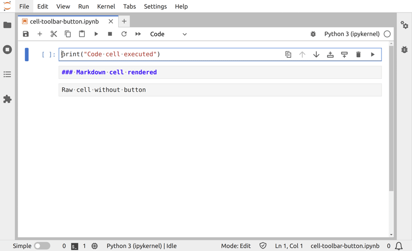](cell-toolbar)

### [CodeMirror extension](codemirror-extension)

Add a configurable CodeMirror extension.

[](codemirror-extension)

### [Commands](commands)

Extend the main app with a Command.

[](commands)

### [Command Palette](command-palette)

Register commands in the Command Palette.

[](command-palette)

### [Completer](completer)

Customize tab autocomplete data sources.

[](completer)

### Main Widget [Content Header](contentheader)

Put widgets at the top of a main JupyterLab area widget.

[](contentheader)

### [Context Menu](context-menu)

Add a new button to an existent context menu.

[](context-menu)

### [Custom Log Console](custom-log-console)

Create a new log console.

[](custom-log-console)

### [Datagrid](datagrid)

Display a Datagrid as a Lumino Widget.

[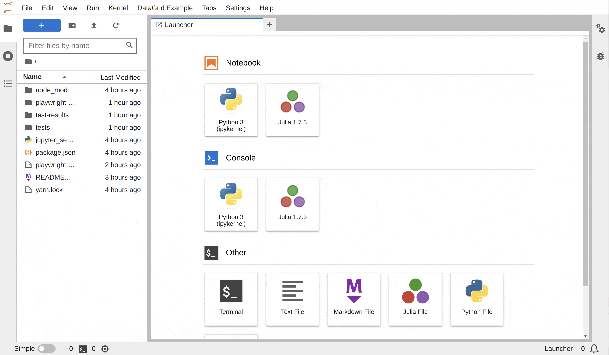](datagrid)

### Dual Compatibility

The dual compatibility examples demonstrates how to design an extension that can be
integrated similtaneously in JupyterLab and Jupyter Notebook v7+.

They are listed from the simplest to the most advanced case:

- [Top Area Text Widget](#top-area-text-widget): Example working right away in both frontends.
- [Shout Button](#shout-button): Example with a part only available in JupyterLab
- [Clap Button](#clap-button-message): Example with elements added differently depending on
  the frontends used.

#### [Top Area Text Widget](toparea-text-widget)

A very simple example that adds a basic text widget to the top area. See [related video.](https://www.youtube.com/watch?v=mqotG1MkHa4).
This example is part of the [Extension Dual Compatibility Guide](https://jupyterlab.readthedocs.io/en/latest/extension_dual_compatibility.html).

[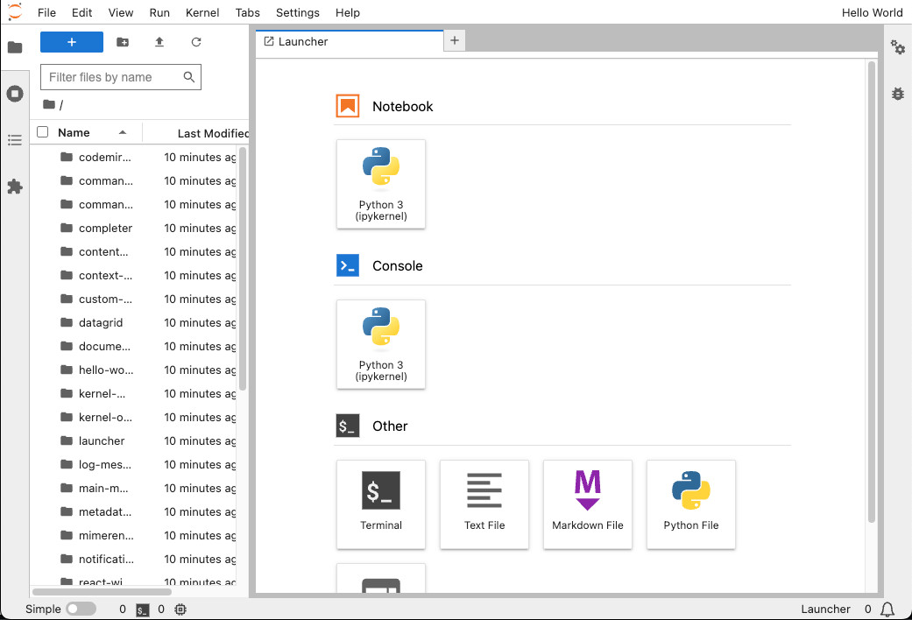](toparea-text-widget)

#### [Shout Button](shout-button-message)

This example shows dual compatibility: Make an extension that is compatible
with both JupyterLab and Jupyter Notebook by using optional features. Adds
a shout button to the right sidebar, and if running in JupyterLab, also adds
a status bar widget. This example is part of the [Extension Dual Compatibility Guide](https://jupyterlab.readthedocs.io/en/latest/extension_dual_compatibility.html).
Read more about this example on that page.

[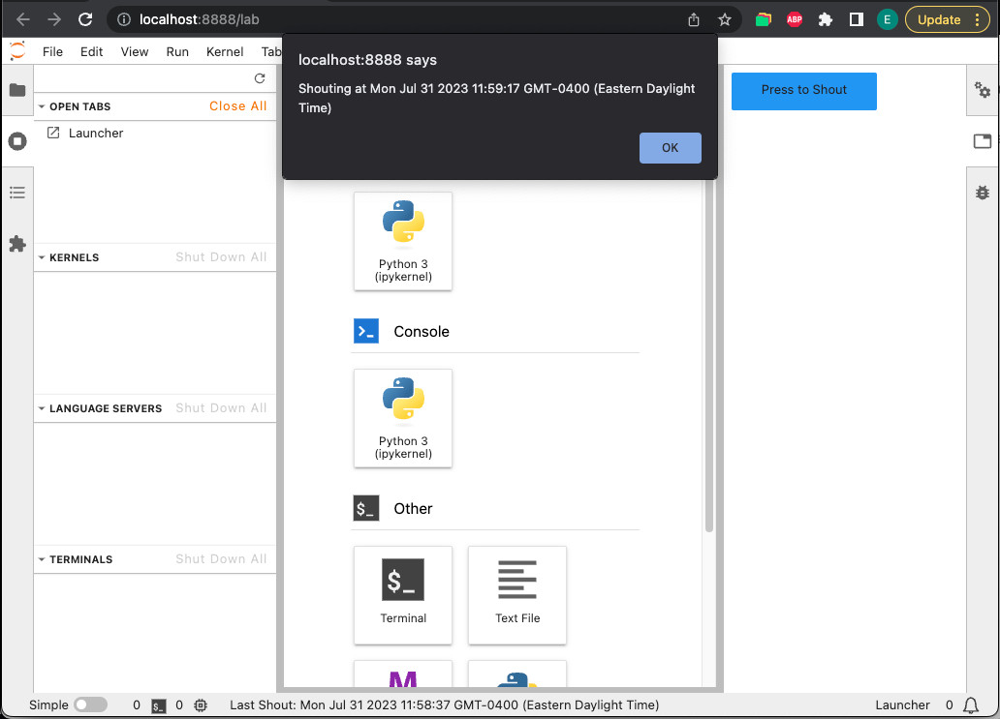](shout-button-message)

#### [Clap Button](clap-button-message)

This example shows an alternate method for achieving dual compatibility: Make an
extension that is compatible with both JupyterLab and Jupyter Notebook by exporting
multiple plugins and using "required" features to select different behaviors. Adds a clap button to
the top area (in JupyterLab) or the right sidebar (Jupyter Notebook). This example is part
of the [Extension Dual Compatibility Guide](https://jupyterlab.readthedocs.io/en/latest/extension_dual_compatibility.html).
Read more about this example on that page.

[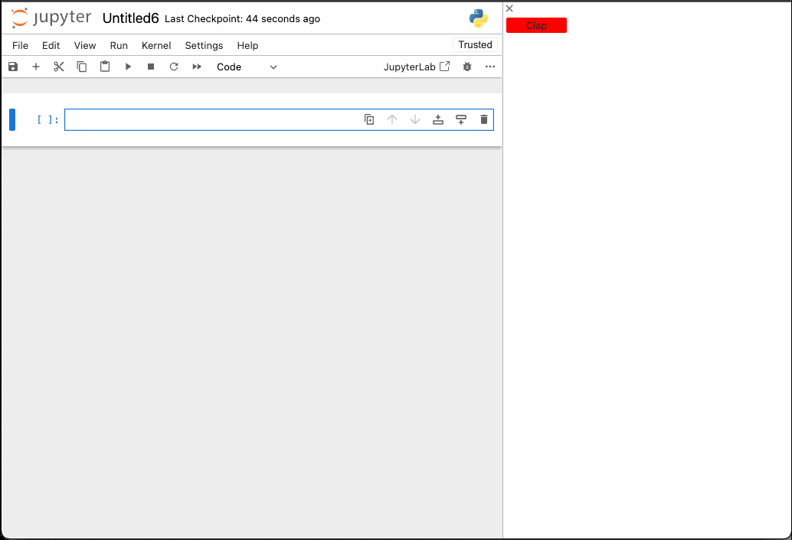](clap-button-message)

### [Collaborative Document](documents)

Create new documents and make them collaborative.

[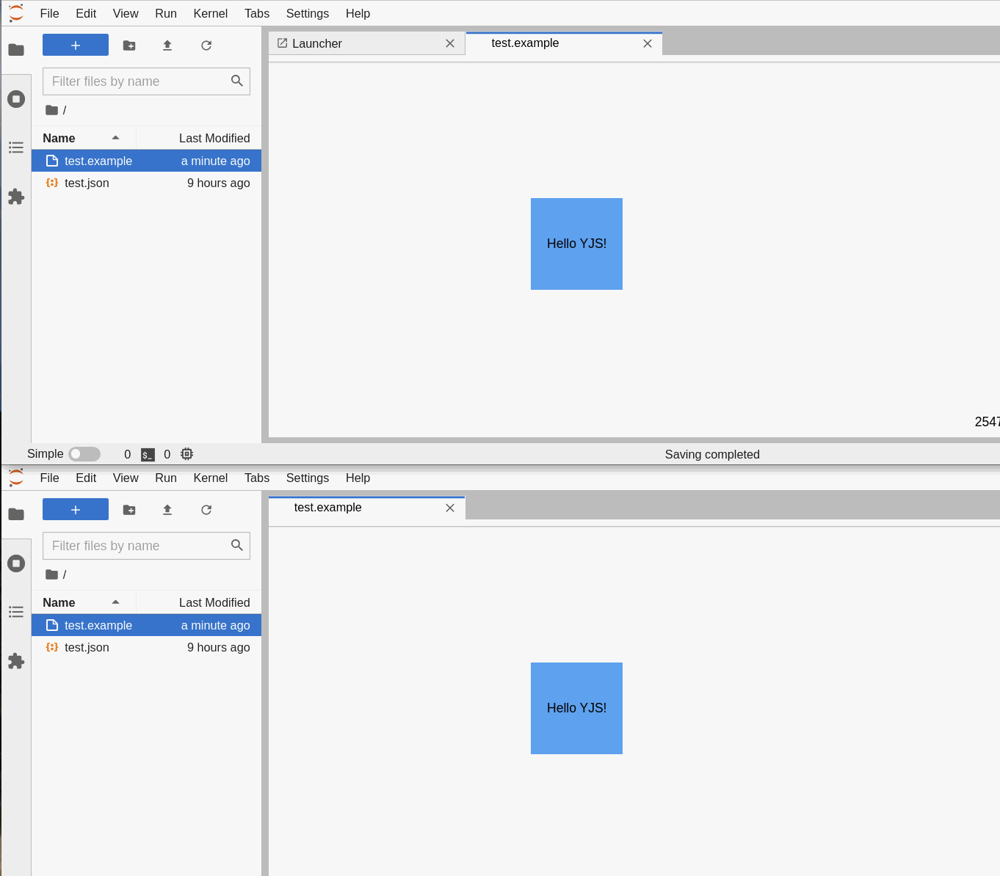](documents)

### [Hello World](hello-world)

Set up the development environment and print to the console.

[](hello-world)

### [Kernel Messaging](kernel-messaging)

Interact with a kernel from an extension.

[](kernel-messaging)

### [Kernel Output](kernel-output)

Render kernel messages in an OutputArea.

[](kernel-output)

### [Launcher](launcher)

Start your extension from the Launcher.

[](launcher)

### [Log Messages](log-messages)

Send a log message to the log console.

[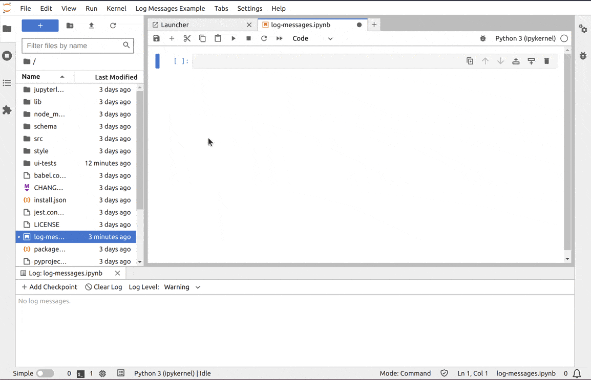](log-messages)

### [Main Menu](main-menu)

Add a Menu to the main app.

[](main-menu)

### [Metadata Form](metadata-form)

Add user interface to edit cell or notebook metadata.

[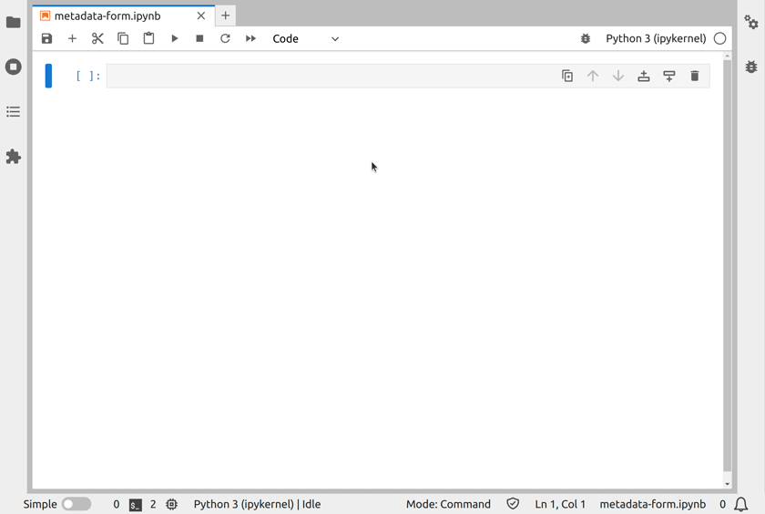](metadata-form)

### [MIME Renderer](mimerenderer)

Add a MIME renderer for mp4 content to the application.

[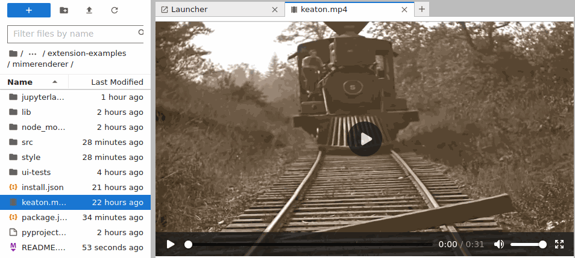](mimerenderer)

### [Notifications](notifications)

Emit notifications.

[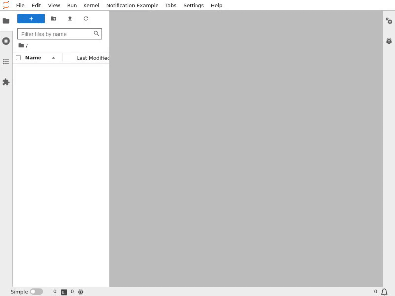](notifications)

### [React Widget](react-widget)

Create a React.js Widget in JupyterLab.

[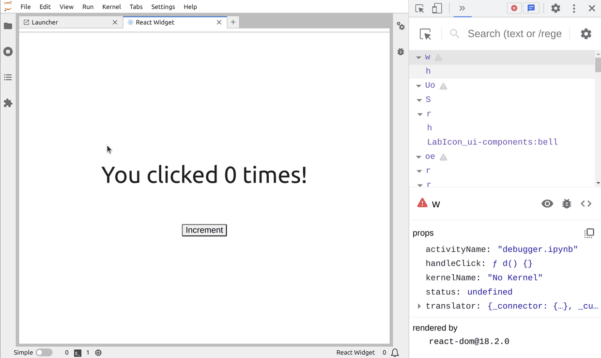](react-widget)

### [Server Hello World](server-extension)

Create a minimal extension with backend (i.e. server) and frontend parts.

[](server-extension)

### [Settings](settings)

Create and use new Settings for your extension.

[](settings)

### [Signals](signals)

Use Signals to allow Widgets communicate with each others.

[](signals)

### [State](state)

Use State persistence in an extension.

[](state)

### [Toolbar Item](toolbar-button)

Add a new button to the notebook toolbar.

[](toolbar-button)

### [Widgets](widgets)

Add a new Widget element to the main window.

[](widgets)

## Prerequisites

Writing an extension requires basic knowledge of JavaScript, Typescript and potentially Python.

_Don't be scared of Typescript, even if you never coded in TypeScript before you touch
JupyterLab you may find it easier to understand than pure JavaScript if you have a
basic understanding of object oriented programming and types._

These examples are developed and tested on top of JupyterLab.
You can create a [conda](https://docs.conda.io/en/latest/miniconda.html) environment to get started
after cloning this repository.

```bash
conda env create && \
  conda activate jupyterlab-extension-examples
```

> The previous command will use the [environment.yml](https://github.com/jupyterlab/extension-examples/blob/main/environment.yml) file as requirements for the environment.

## Develop and Use the Examples

### Build and Install all Examples at once

```bash
jlpm
jlpm build-ext
jlpm install-py
jlpm install-ext
jupyter lab
```

To rebuild all the extensions:

```bash
jlpm build-ext
```

To clean the lib folders:

```bash
jlpm clean-ext
```

### Build and Install one Example

Go to the example directory you want to install, e.g. `cd ./hello-world`, and run the following commands:

```bash
touch yarn.lock
pip install -e .
jupyter labextension develop . --overwrite
```

Rebuild the extension:

```bash
jlpm run build
```

You can now start JupyterLab and check if your extension is working fine:

```bash
jupyter lab
```

### Change the Sources

If you want to develop and iterate on the code, you will need to open 2 terminals.

In terminal 1, go to the extension folder and run the following:

```bash
jlpm watch
```

Then in terminal 2, start JupyterLab:

```bash
jupyter lab
```

From there, you can change your extension source code, it will be recompiled,
and you can refresh your browser to see your changes.

We are using [embedme](https://github.com/zakhenry/embedme) to embed code snippets into the markdown READMEs. If you make changes to the source code, ensure you update the README and run `jlpm embedme` from the root of the repository to regenerate the READMEs.

### Update extension template

Execute from the example root folder:

```sh
./scripts/update-template.sh
```

Then fix the conflicts.

## Test the Examples

The examples are automatically tested for:

- Homogeneous configuration:
  Configuration files are compared to the reference ones of the _hello-world_ example
- TypeScript code lint
- Installation in JupyterLab:
  The installation is checked by listing the installed extension and running JupyterLab with the helper `python -m jupyterlab.browser_check`
- Integration test:
  Those tests are emulating user action in JupyterLab to check the extension is behaving as expected.
  The tests are defined in the `ui-tests` subfolder within each example.
  This is possible thanks to a tool called [playwright](https://playwright.dev/).

## Install a Published Extension

Once your extension is published on [pypi.org](https://pypi.org/) (outside of this scope), you can install it
with the following command:

```bash
pip install <published_extension>
```

## About JupyterLab

JupyterLab can be used as a platform to combine existing data-science components into a
new powerful application that can be deployed remotely to many users. Some of the higher
level components that can be used are text editors, terminals, notebooks, interactive widgets,
filebrowser, renderers for different file formats that provide access to an enormous ecosystem
of libraries from different languages.

Complementary to these examples, you can rely on the official JupyterLab documentation.

- [Extension Developer Guide](https://jupyterlab.readthedocs.io/en/stable/extension/extension_dev.html)
- [Common Extension Points](https://jupyterlab.readthedocs.io/en/stable/extension/extension_points.html)
- [Astronomy Picture of the Day JupyterLab Extension](https://jupyterLab.readthedocs.io/en/stable/extension/extension_tutorial.html)

## Credits

We would like to thank [MMesch](https://github.com/MMesch) for [initiating this work](https://github.com/MMesch/labextension_tutorial), as well as everyone else who contributed!

## Community Guidelines and Code of Conduct

This examples repository is a Jupyter project and follows the Jupyter
[Community Guides and Code of Conduct](https://jupyter.readthedocs.io/en/latest/community/content-community.html).
