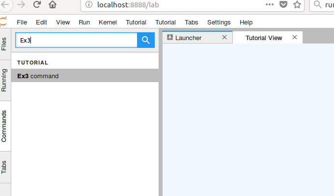
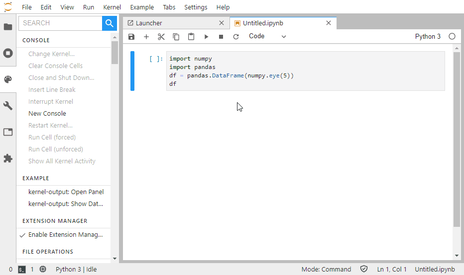
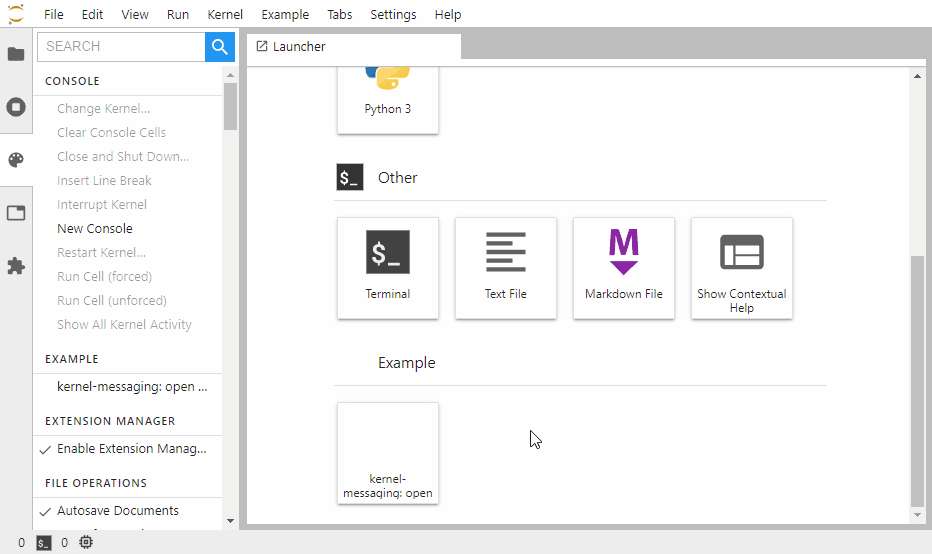

# JupyterLab Extensions by Examples


[](https://mybinder.org/v2/gh/jtpio/jupyterlab-extension-examples/master?urlpath=lab)

## TL;DR

The goal of this repository is to show how to develop extensions on [JupyterLab](https://github.com/jupyterlab/jupyterlab).
It is presented as short tutorial series.

```bash
git clone https://github.com/jtpio/jupyterlab-extension-examples.git &&
  cd jupyterlab-extension-examples && \
  conda env create && \
  conda activate jupyterlab-extension-examples && \
  cd basics/hello-world && \
  jlpm && \
  jlpm run build && \
  jupyter labextension link .

# In another terminal
jupyter lab --watch
```

## Develop by Examples

You may find easier to learn how to extend `by examples` instead of going through the documentation.

Start with the [Hello World](basics/hello-world) and then jump to the topic you are interested in.

- [Hello World](basics/hello-world)
- [Signals](basics/signals)
- [Datagrid](basics/datagrid)
- [Command Palette](command-palette)
- [Commands](commands)
- [Main Menu](main-menu)
- [Settings](settings)
- [State](state)
- [React Widget](react/react-widget)
- [Widgets](widget-tracker/widgets)
- [Jupyter Widgets](widget-tracker/jupyter-widgets)
- [Kernel Output](advanced/kernel-output)
- [Kernel Messaging](advanced/kernel-messaging)
- [Server Hello World](advanced/server-extension)

You can expect from each example:

- An explanation of its functionality.
- A image or screencast showing its usage.
- The list of used JupyterLab API and Contribution Points.
- Some code parts to explain the internal working.

We have structured the examples based on the [extension points](https://jupyterlab.readthedocs.io/en/stable/developer/extension_points.html). Browse the previews here after or skip them and [jump directly to the sections for developers](#prerequisites).

## Basic

| Example                           | Preview                                                              |
| --------------------------------- | -------------------------------------------------------------------- |
| [Hello World](basics/hello-world) | [](basics/hello-world) |
| [Signals](basics/signals)         | [](basics/signals)  |
| [Datagrid](basics/datagrid)       | [](basics/datagrid)          |

## Command Palette

| Example                            | Preview                                                             |
| ---------------------------------- | ------------------------------------------------------------------- |
| [Command Palette](command-palette) | [](command-palette) |

## Commands

| Example              | Preview                                               |
| -------------------- | ----------------------------------------------------- |
| [Commands](commands) | [](commands) |

## Menus

| Example                | Preview                                          |
| ---------------------- | ------------------------------------------------ |
| [Main Menu](main-menu) | [](main-menu) |

## Settings

| Example              | Preview                                       |
| -------------------- | --------------------------------------------- |
| [Settings](settings) | [](settings) |

## State

| Example        | Preview                              |
| -------------- | ------------------------------------ |
| [State](state) | [](state) |

## React

| Example                            | Preview                                                               |
| ---------------------------------- | --------------------------------------------------------------------- |
| [React Widget](react/react-widget) | [](react/react-widget) |

## Widget Tracker

| Example                                           | Preview                                                                                       |
| ------------------------------------------------- | --------------------------------------------------------------------------------------------- |
| [Widgets](widget-tracker/widgets)                 | [](widget-tracker/widgets)                   |
| [Jupyter Widgets](widget-tracker/jupyter-widgets) | [](widget-tracker/jupyter-widgets) |

## Advanced

| Example                                         | Preview                                                                                   |
| ----------------------------------------------- | ----------------------------------------------------------------------------------------- |
| [Kernel Output](advanced/kernel-output)         | [](advanced/kernel-output)         |
| [Kernel Messaging](advanced/kernel-messaging)   | [](advanced/kernel-messaging)    |
| [Server Hello World](advanced/server-extension) | [](advanced/server-extension) |

## Prerequisites

Writing an extension is not particularly difficult but requires very basic knowledge of JavaScript
and Typescript and potentially Python.

_Don't be scared of Typescript, even if you never coded in TypeScript before you touch
JupyterLab you will find it easier to understand than pure JavaScript if you have a
basic understanding of object oriented programming and types._

These examples are developed and tested on top of JupyterLab version 1.2.
You can create a [conda](https://docs.conda.io/en/latest/miniconda.html) environment to get started.

```bash
conda env create && \
  conda activate jupyterlab-extension-tutorial
```

## Develop and Use the Examples

> Build and Link all examples at once.

```bash
jlpm
jlpm build-ext
jlpm link-ext
jlpm build-jlab
jupyter lab
```

Clean the lib folders.

```bash
jlpm clean-ext
```

> Build and Link one example.

Go into the example directory you want to install, e.g. `cd ./basics/hello-world`, and run the following commands.

```bash
jlpm install
jlpm run build
jupyter labextension link .
```

Rebuild the JupyterLab application.

```bash
jlpm run build
jupyter lab build
```

Start JupyterLab in watch mode.

```bash
jupyter lab --watch
```

## Install a Published Extension

Once your extension is published (not part of these explanations), you can install it without source compilation.

```bash
jupyter labextension install <published_extension>
```

## About JupyterLab

JupyterLab can be used as a platform to combine existing data-science components into a
new powerful application that can be deployed remotely for many users. Some of the higher
level components that can be used are text editors, terminals, notebooks, interactive widgets,
filebrowser, renderers for different file formats that provide access to an enormous ecosystem
of libraries from different languages.

## JupyterLab Documentation

Complementary to these examples, you can rely on the official JupyterLab documentation.

- [Extension Developer Guide](https://jupyterlab.readthedocs.io/en/stable/developer/extension_dev.html)
- [Common Extension Points](https://jupyterlab.readthedocs.io/en/stable/developer/extension_points.html)
- [Astronomy Picture of the Day JupyterLab Extension](https://jupyterLab.readthedocs.io/en/stable/developer/extension_tutorial.html)

## Credits

We would like to thank [MMesch](https://github.com/MMesch) for [initiating this work](https://github.com/MMesch/labextension_tutorial), as well as everyone else who contributed!
