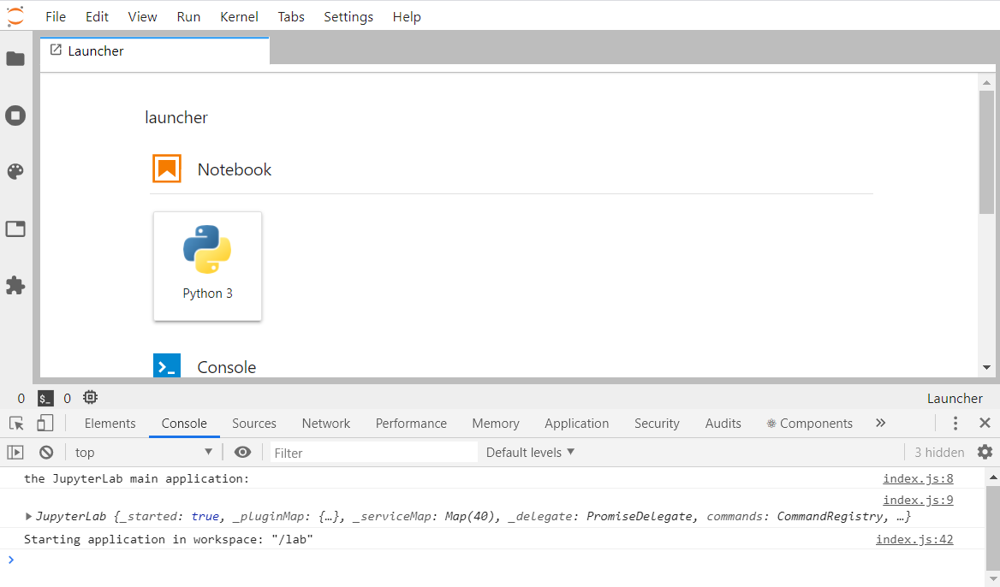

# Hello World

> Set up the development environment and print to the console.



- [The template folder structure](#the-template-folder-structure)
- [A minimal extension that prints to the browser console](#a-minimal-extension-that-prints-to-the-browser-console)
- [Building and Installing an Extension](#building-and-installing-an-extension)

## The template folder structure

Writing a JupyterLab extension usually starts from a configurable template. It
can be downloaded with the [`cookiecutter`](https://cookiecutter.readthedocs.io/en/latest/) tool and the following command:

```bash
cookiecutter https://github.com/jupyterlab/extension-cookiecutter-ts
```

`cookiecutter` asks for some basic information that could for example be setup
like this:

```bash
author_name []: tuto
extension_name [myextension]: hello-world
project_short_description [A JupyterLab extension.]: minimal lab example
repository [https://github.com/my_name/myextension]:
```

The cookiecutter creates the directory `hello-world` [or your extension name]
that looks like this:

```bash
hello-world/
│   .eslintignore
│   .eslintrc.js
│   .gitignore
│   .prettierignore
│   .prettierrc
│   LICENSE
│   package.json
│   README.md
│   tsconfig.json
│
├───.github
│   └───workflows
│           build.yml
│
├───src
│       index.ts
│
└───style
        index.css
```

Those files can be separated in 3 groups:

- Information about the extension:
  - `README.md` contains some instructions
  - `LICENSE` contains your extension code license; BSD-3 Clause by default (but you can change it).
- Extension code (those files are mandatory):
  - `package.json` contains information about the extension such as dependencies
  - `tsconfig.json` contains information for the typescript compilation
  - `src/index.ts` _this contains the actual code of your extension_
  - `style/index.css` contains style elements that you can use
- Validation:
  - `.prettierrc` and `.prettierignore` specify the code formatter [`prettier`](https://prettier.io) configuration
  - `.eslintrc.js` and `.eslintignore` specify the code linter [`eslint`](https://eslint.org) configuration
  - `.github/workflows/build.yml` sets the continuous integration tests of the code using [GitHub Actions](https://help.github.com/en/actions)

The following sections will walk you through the extension code files.

## A minimal extension that prints to the browser console

Start with the file `src/index.ts`. This typescript file contains the main
logic of the extension. It begins with the following import section:

```ts
// src/index.ts#L1-L4

import {
  JupyterFrontEnd,
  JupyterFrontEndPlugin
} from '@jupyterlab/application';
```

`JupyterFrontEnd` is the main Jupyterlab application class. It allows you to
access and modify some of its main components. `JupyterFrontEndPlugin` is the class
of the extension that you are building. Both classes are imported from a package
called `@jupyterlab/application`. The dependency of your extension on this
package is declared in the file `package.json`:

```json5
// package.json#L36-L38

"dependencies": {
  "@jupyterlab/application": "^2.0.0"
},
```

With this basic import setup, you can move on to construct a new instance
of the `JupyterFrontEndPlugin` class:

<!-- prettier-ignore-start -->
```ts
// src/index.ts#L9-L12

const extension: JupyterFrontEndPlugin<void> = {
  id: 'hello-world',
  autoStart: true,
  activate: (app: JupyterFrontEnd) => {
```

```ts
// src/index.ts#L13-L13

console.log('the JupyterLab main application:', app);
```

```ts
// src/index.ts#L17-L17

export default extension;
```
<!-- prettier-ignore-end -->

A `JupyterFrontEndPlugin` contains a few attributes:

- `id`: the unique id of the extension
- `autoStart`: a flag to start the extension automatically or not
- `activate`: a
  function (`() => {}` notation) that takes one argument `app` of type
  `JupyterFrontEnd` and will be called by the main application to activate the extension.

`app` is simply the main JupyterLab application. The `activate` function acts as an entry
point into the extension. In this example, it calls the `console.log` function to output
something into the browser developer tools console.

Your new `JupyterFrontEndPlugin` instance has to be finally exported to be visible to
JupyterLab, which is done with the line `export default extension`.

Now that the extension code is ready, you need to install it within JupyterLab.

## Building and Installing an Extension

These are the instructions on how your extension can be installed for development:

> The `jlpm` command is JupyterLab's pinned version of
> [yarn](https://yarnpkg.com/) that is installed with JupyterLab. You may use
> `yarn` or `npm` in lieu of `jlpm` below.

```bash
# Clone the repo to your local environment
# Move to hello-world directory
# Install dependencies
jlpm
# Build Typescript source
jlpm build
# Link your development version of the extension with JupyterLab
jupyter labextension link .
```

The first command installs the dependencies that are specified in
`package.json`. Among the dependencies are also all of the `JupyterLab`
components that you want to use in your project.

The second step runs the build script. In this step, the TypeScript code gets
converted to javascript using the compiler `tsc` and stored in a `lib`
directory. Finally, the module is linked to JupyterLab.

After all of these steps are done, running `jupyter labextension list` should
show something like:

```bash
   local extensions:
        @jupyterlab-examples/hello-world: [...]/basics/hello-world
```

Now let's check inside of JupyterLab if it works. Run [can take a while]:

```bash
jupyter lab --watch
```

Your extension writes something to the browser console. In most web browsers you can
open the console pressing the `F12` key. You should see something like:

```
JupyterLab extension hello-world is activated
```

Your extension works but it is not doing much. Let's modify the source code
a bit. Simply replace the `activate` function with the following lines:

<!-- prettier-ignore-start -->
```ts
// src/index.ts#L12-L14

activate: (app: JupyterFrontEnd) => {
  console.log('the JupyterLab main application:', app);
}
```
<!-- prettier-ignore-end -->

To update the module, simply go to the extension directory and run
`jlpm build` again. Since you used the `--watch` option when starting
JupyterLab, you just have to refresh the JupyterLab website in the browser
and should see in the browser console:

```
the JupyterLab main application:
Object { _started: true, _pluginMap: {…}, _serviceMap: Map(...), _delegate: {…}, commands: {…}, contextMenu: {…}, shell: {…}, registerPluginErrors: [], _dirtyCount: 0, _info: {…}, … }
```

This is the main application JupyterLab object and you will see how to interact
with it in the other examples.

Checkout how the core packages of JupyterLab are defined
[on this page](https://github.com/jupyterlab/jupyterlab/tree/master/packages). Each package is
structured similarly to the extension that you are writing. This modular
structure makes JupyterLab very adaptable.

An overview of the classes and their attributes and methods can be found in the
JupyterLab documentation. The `@jupyterlab/application` module documentation is
[here](https://jupyterlab.github.io/jupyterlab/application/index.html)
and here is the [JupyterFrontEnd class documentation](https://jupyterlab.github.io/jupyterlab/application/classes/jupyterfrontend.html).

## Where to Go Next

JupyterLab is built on top of three major concepts. It is advised to look through the corresponding
examples in the following order:

- _command_: Function to be executed from UI elements. See the [commands example](../../commands)
- _widget_: UI based brick. See the [widgets example](../../widget-tracker/widgets)
- _signal_: Observer pattern between JupyterLab elements. See the [signals example](../signals)
