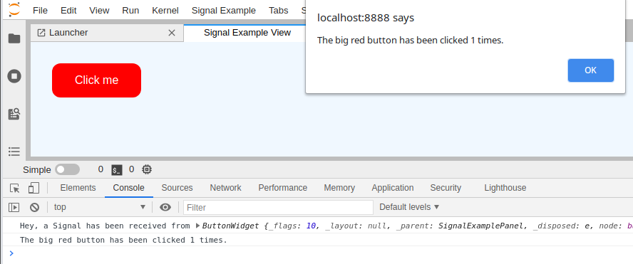

# Signals

> Use Signals to allow Widgets communicate with each others.

- [Lumino Signaling 101](#lumino-signaling-101)
- [A simple React Button](#a-simple-react-button)
- [Subscribing to a Signal](#subscribing-to-a-signal)



## Lumino Signaling 101

Communication between different components of JupyterLab is a key ingredient in building an
extension.

In this extension, a simple button will be added to print something to the console.

JupyterLab's Lumino engine uses the `ISignal` interface and the
`Signal` class that implements this interface for communication
(read more on the [documentation](https://jupyterlab.github.io/lumino/api/signaling/globals.html) page).

The basic concept is as follows:

First, a widget (`button.ts`), in this case the one that contains
some visual elements such as a button, defines a `_stateChanged` signal:

```ts
// src/button.tsx#L36-L36

private _stateChanged = new Signal<this, ICount>(this);
```

That private signal is exposed to other widgets via a public accessor method.

```ts
// src/button.tsx#L15-L17

public get stateChanged(): ISignal<this, ICount> {
  return this._stateChanged;
}
```

Another widget, in this case the panel (`panel.ts`) that boxes several different widgets,
subscribes to the `stateChanged` signal and links some function to it:

```ts
// src/panel.ts#L22-L22

this._widget.stateChanged.connect(this._logMessage, this);
```

The `_logMessage` is executed when the signal is triggered from the first widget with:

```ts
// src/button.tsx#L28-L28

this._stateChanged.emit(this._count);
```

Let's look at the implementations details.

## A simple React Button

Start with a file called `src/button.tsx`. The `tsx` extension allows to use
HTML-like syntax with the tag notation `<>`to represent some visual elements
(note that you have to add a line: `"jsx": "react",` to the
`tsconfig.json` file). This is a special syntax used by [React](https://reactjs.org/tutorial/tutorial.html).

You can also try the [React Widget example](./../../react/react-widget) for more details.

`button.tsx` contains one major class `ButtonWidget` that extends the
`ReactWidget` class provided by JupyterLab.

`ReactWidget` defines a `render()` method that defines some React elements such as a button.
This is the recommended way to include React component inside the JupyterLab widget based UI.

```ts
// src/button.tsx#L19-L34

protected render(): React.ReactElement<any> {
  return (
    <button
      key="header-thread"
      className="jp-example-button"
      onClick={(): void => {
        this._count = {
          clickCount: this._count.clickCount + 1
        };
        this._stateChanged.emit(this._count);
      }}
    >
      Clickme
    </button>
  );
}
```

`ButtonWidget` also contain a private attribute `_count` of type `ICount`.

```ts
// src/button.tsx#L11-L13

protected _count: ICount = {
  clickCount: 0
};
```

`ButtonWidget` further contains a private variable `_stateChanged` of type
`Signal`.

```ts
// src/button.tsx#L36-L36

private _stateChanged = new Signal<this, ICount>(this);
```

A signal object can be triggered and then emits an actual signal.

Other Widgets can subscribe to such a signal and react when a message is
emitted.

The button `onClick` event will increment the `_count`
private attribute and will trigger the `_stateChanged` signal passing
the `_count` variable.

```ts
// src/button.tsx#L24-L29

onClick={(): void => {
  this._count = {
    clickCount: this._count.clickCount + 1
  };
  this._stateChanged.emit(this._count);
}}
```

## Subscribing to a Signal

The `panel.ts` class defines an extension panel that displays the
`ButtonWidget` widget and that subscribes to its `stateChanged` signal.
This is done in the constructor.

```ts
// src/panel.ts#L13-L23

constructor() {
  super();
  this.addClass(PANEL_CLASS);
  this.id = 'SignalExamplePanel';
  this.title.label = 'Signal Example View';
  this.title.closable = true;

  this._widget = new ButtonWidget();
  this.addWidget(this._widget);
  this._widget.stateChanged.connect(this._logMessage, this);
}
```

Subscription to a signal is done using the `connect` method of the
`stateChanged` attribute.

```ts
// src/panel.ts#L22-L22

this._widget.stateChanged.connect(this._logMessage, this);
```

It registers the `_logMessage` function which is triggered when the signal is emitted.

**Note**

> From the official [JupyterLab Documentation](https://jupyterlab.readthedocs.io/en/stable/developer/patterns.html#signals):
> Wherever possible as signal connection should be made with the pattern `.connect(this._onFoo, this)`.
> Providing the `this` context enables the connection to be properly cleared by `clearSignalData(this)`.
> Using a private method avoids allocating a closure for each connection.

The `_logMessage` function receives as parameters the emitter (of type `ButtonWidget`)
and the count (of type `ICount`) sent by the signal emitter.

```ts
// src/panel.ts#L25-L25

private _logMessage(emitter: ButtonWidget, count: ICount): void {
```

In our case, that function writes `Button has been clicked ... times.` text
to the browser console and in an alert when the big red button is clicked.

```ts
// src/panel.ts#L25-L29

private _logMessage(emitter: ButtonWidget, count: ICount): void {
  console.log('Hey, a Signal has been received from', emitter);
  console.log(
    `The big red button has been clicked ${count.clickCount} times.`
  );
```

There it is. Signaling is conceptually important for building extensions.
