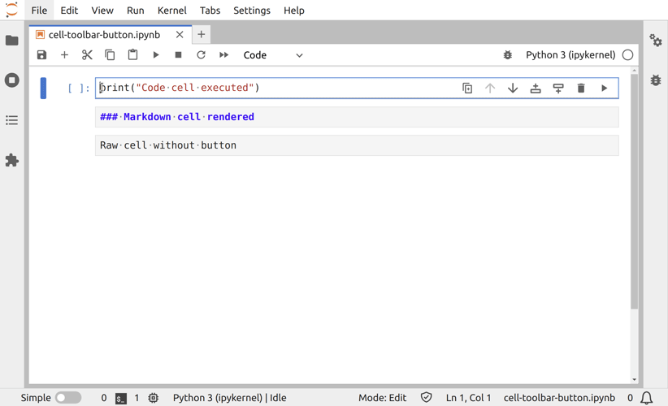

# Cell Toolbar Button

This example shows how to add buttons to the cell toolbar.
The buttons are displayed or not, depending on the cell type.



In this particular example, the buttons will execute a code cell, or render a markdown
cell.

The command to run is already defined (`notebook:run-cell`), but we need
to create new commands to display or not the button, depending on the cell type.

To add a button triggering a command to the cell toolbar, you must
specified the following settings:

```json5
// schema/plugin.json#L8-L19

"jupyter.lab.toolbars": {
  "Cell": [
    {
      "name": "run-code-cell",
      "command": "toolbar-button:run-code-cell"
    },
    {
      "name": "render-markdows-cell",
      "command": "toolbar-button:render-markdown-cell"
    }
  ]
}
```

The key `Cell` inform JupyterLab about which widget toolbar should be
extended. The `name` should be an unique identifier for the widget toolbar
items. The `command` is the unique command identifier.

The commands name are defined in the *src/index.ts* file:

```ts
// src/index.ts#L8-L17

const CommandIds = {
  /**
   * Command to render a markdown cell.
   */
  renderMarkdownCell: 'toolbar-button:render-markdown-cell',
  /**
   * Command to run a code cell.
   */
  runCodeCell: 'toolbar-button:run-code-cell'
}
```

And the commands are created when the extension is activated:

```ts
// src/index.ts#L30-L48

/* Adds a command enabled only on code cell */
commands.addCommand(CommandIds.runCodeCell, {
  icon: runIcon,
  caption: 'Run a code cell',
  execute: () => {
    commands.execute('notebook:run-cell');
  },
  isVisible: () => tracker.activeCell?.model.type === 'code'
});

/* Adds a command enabled only on markdown cell */
commands.addCommand(CommandIds.renderMarkdownCell, {
  icon: markdownIcon,
  caption: 'Render a markdown cell',
  execute: () => {
    commands.execute('notebook:run-cell');
  },
  isVisible: () => tracker.activeCell?.model.type === 'markdown'
});
```

The following line will add the class `lm-mod-hidden` to the button if the active cell
is not a code cell:

```ts
// src/index.ts#L37-L37

isVisible: () => tracker.activeCell?.model.type === 'code'
```

To hide the button, we need to add a CSS rule on the class `lm-mod-hidden` in the file
*style/base.css*:

<!-- prettier-ignore-start -->
<!-- embedme style/base.css#L7-L9 -->

```css
.jp-ToolbarButtonComponent.lm-mod-hidden {
  display: none;
}
```
<!-- prettier-ignore-end -->

## Where to Go Next

This example uses a command to display the widget. Have a look a the
[commands example](../commands/README.md) for more information about it.