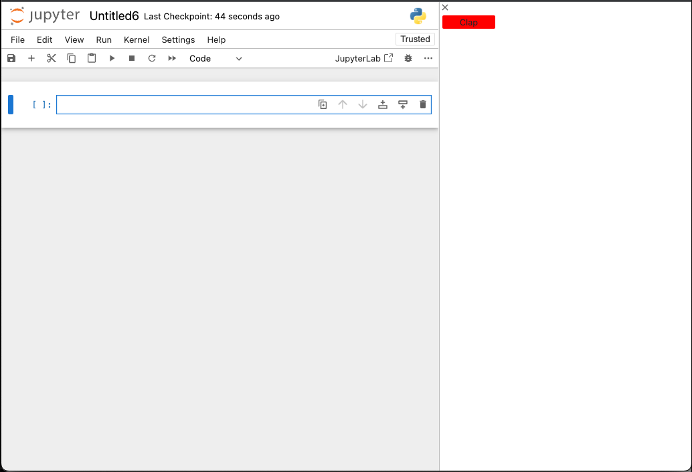

# Clap Button (cross compatible extension)

This example defines an extension that adds a button that if clicked will
display an alert to the user. In JupyterLab the button in added in the top
area (next to the main menu) and in Jupyter Notebook v7+ the button is added to the rights sidebar.



We strongly advice to look to those examples before diving into this one:

- [widgets](../widgets): The basic DOM Jupyter component.
- [Simple compatibility example](../toparea-text-widget): Extension working without modification in both Notebook and JupyterLab.
- [Conditional compatibility example](../shout-button-message): Extension that has
  a part conditionned on feature specific to JupyterLab.

## Jupyter Notebook / JupyterLab compatibility

As Jupyter Notebook 7+ is built with components from JupyterLab, and since
both use the same building blocks, that means your extension can work
on both (or any other frontend built with JupyterLab components) with
little or no modification depending on its design.

In this example, you will define two different plugins that require
different tokens to have a custom behavior depending on the frontend used.

## Require tokens

For JupyterLab you can require the specific
token `ILabShell`.

```ts
// src/index.ts#L48-L53

const pluginJupyterLab: JupyterFrontEndPlugin<void> = {
  id: '@jupyterlab-examples/clap-button:pluginLab',
  description: 'Adds a clap button to the top area JupyterLab',
  autoStart: true,
  requires: [ILabShell],
  activate: (app: JupyterFrontEnd, labShell: ILabShell) => {
```

And for Jupyter Notebook, you can require the specific token `INotebookShell`.

```ts
// src/index.ts#L68-L73

const pluginJupyterNotebook: JupyterFrontEndPlugin<void> = {
  id: '@jupyterlab-examples/clap-button:pluginNotebook',
  description: 'Adds a clap button to the right sidebar of Jupyter Notebook 7',
  autoStart: true,
  requires: [INotebookShell],
  activate: (app: JupyterFrontEnd, notebookShell: INotebookShell) => {
```

In the two plugins, the `activate` method will receive as
second argument the shell token. It is fine to not used
a required token as here the goal is to allow the application
to figure out if the plugin should be activated or not.

## Export multiple plugins

If your extension is defining multiple plugin, you have to
return as default export of your extension package an array
of plugins. In this example:

```ts
// src/index.ts#L88-L93

const plugins: JupyterFrontEndPlugin<void>[] = [
  pluginJupyterLab,
  pluginJupyterNotebook
];

export default plugins;
```

## Where to Go Next

You can have more information about making extension compatible with
multiple applications in the
[Extension Compatibility Guide](https://jupyterlab.readthedocs.io/en/latest/extension/extension_multiple_ui.html).
