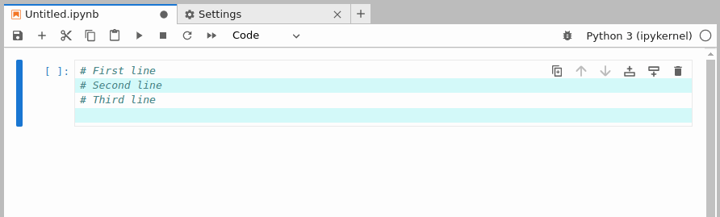

# CodeMirror Extension

> Add new features to CodeMirror editors. They are the text editors
> used for cell and text file edition.

In this example, you will learn you how to add a new CodeMirror extension
to the editors.



This example adds an CodeMirror extension displaying zebra stripes in
the editors with configurable stripe step.

> This example does not example how CodeMirror extensions
> are working but how to integrate it in JupyterLab. For
> more information, look at the [documentation](https://codemirror.net/docs/) and in particular
> at the [example](https://codemirror.net/examples/zebra/) this code is built upon.

To add a new CodeMirror extension, your JupyterLab extension must request
the token [`IEditorExtensionRegistry`]() from `@jupyterlab/codemirror`:

```ts
// src/index.ts#L94-L99

const plugin: JupyterFrontEndPlugin<void> = {
  id: '@jupyterlab-examples/codemirror-extension:plugin',
  description: 'A minimal JupyterLab extension adding a CodeMirror extension.',
  autoStart: true,
  requires: [IEditorExtensionRegistry],
  activate: (app: JupyterFrontEnd, extensions: IEditorExtensionRegistry) => {
```

Then you can use that registry to add your extension:

<!-- prettier-ignore-start -->
```ts
// src/index.ts#L101-L119

extensions.addExtension(
  Object.freeze({
    name: '@jupyterlab-examples/codemirror:zebra-stripes',
    // Default CodeMirror extension parameters
    default: 2,
    factory: () =>
      // The factory will be called for every new CodeMirror editor
      EditorExtensionRegistry.createConfigurableExtension((step: number) =>
        zebraStripes({ step })
      ),
    // JSON schema defining the CodeMirror extension parameters
    schema: {
      type: 'number',
      title: 'Show stripes',
      description:
        'Display zebra stripes every "step" in CodeMirror editors.'
    }
  })
);
```
<!-- prettier-ignore-end -->

The registration requires an unique identifier `name` and
a `factory`. That factory will be called every time a new
editor is created.  
In this specific case as the extension takes parameters,
the helper method `EditorExtensionRegistry.createConfigurableExtension`
is used. It expects a callback that will receive the extension
parameters and returns the CodeMirror extension.  
The callback will be triggered every time they change.

As parameters are used, the `default` key can be specified
with the default parameters value. And if you want the user
to be able to customize the parameters, you can define a
[JSON schema](https://json-schema.org/understanding-json-schema) describing the parameters.

Here are some comments on the CodeMirror extension. It is composed of
three elemental extensions:

```ts
// src/index.ts#L83-L89

export function zebraStripes(options: { step?: number } = {}): Extension {
  return [
    baseTheme,
    typeof options.step !== 'number' ? [] : stepSize.of(options.step),
    showStripes
  ];
}
```

`baseTheme` adds new CSS rules to the CodeMirror editors, `stepSize`
stores the configurable step parameter and `showStripes` update the
editor view to display the stripes.

## Where to Go Next

This example extends in a non-classical way JupyterLab user settings. You
can learn more about those settings looking at that [example](../settings/README.md).
