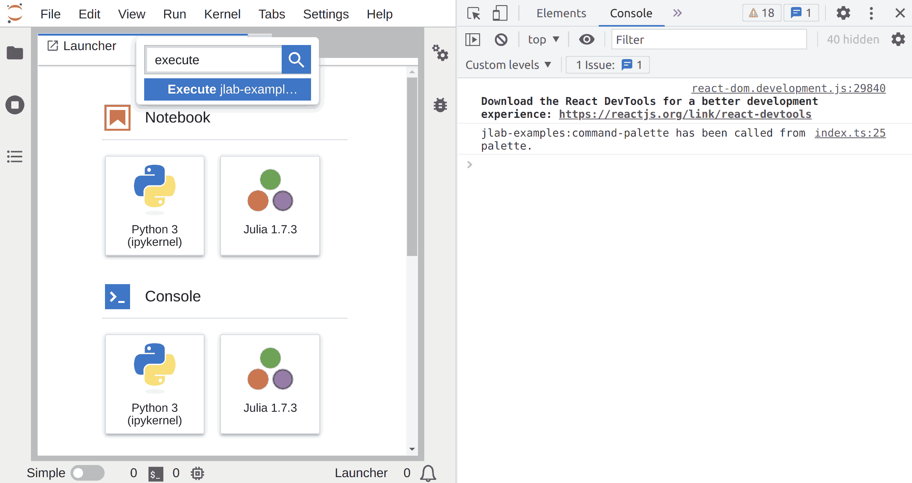

# Command Palette

> Register commands in the Command Palette.



One major concept of the Lumino library on which JupyterLab is built is
the notion of _Commands_ as explained in the
[commands example](https://github.com/jupyterlab/extension-examples/blob/master/commands/README.md).

Commands can be used from the command palette.

In this extension, you are going to add a command to the command palette.

The command palette interface `ICommandPalette` need to be imported with:

```ts
// src/index.ts#L6-L6

import { ICommandPalette } from '@jupyterlab/apputils';
```

To see how you can add the command to the palette, let's have a look at `src/index.ts`.

```ts
// src/index.ts#L11-L34

const extension: JupyterFrontEndPlugin<void> = {
  id: 'command-palette',
  autoStart: true,
  requires: [ICommandPalette],
  activate: (app: JupyterFrontEnd, palette: ICommandPalette) => {
    const { commands } = app;

    const command = 'jlab-examples:command-palette';

    // Add a command
    commands.addCommand(command, {
      label: 'Execute jlab-examples:command-palette Command',
      caption: 'Execute jlab-examples:command-palette Command',
      execute: (args: any) => {
        console.log(
          `jlab-examples:command-palette has been called ${args['origin']}.`
        );
      },
    });

    // Add the command to the command palette
    const category = 'Extension Examples';
    palette.addItem({ command, category, args: { origin: 'from palette' } });
  },
```

The `ICommandPalette`
([documentation](https://jupyterlab.github.io/jupyterlab/interfaces/_apputils_src_index_.icommandpalette.html))
is passed to the `activate` function as an argument (variable `palette`) in
addition to the JupyterLab application (variable `app`).

You should request that dependency with the property `requires: [ICommandPalette],`.
It lists the additional arguments you want to inject into the `activate` function in the `JupyterFontEndPlugin`.

`ICommandPalette` provides the method `addItem` that links a palette entry to a command in the command registry.

It requires two arguments: the unique command id and the command
category (that can be either an existing category or a new one). And optionally, you can specify
the arguments that will be passed to the command when executed from the palette.

When running JupyterLab with this extension, a message should
appear in the web browser console after clicking on the command in the palette.

## Where to Go Next

A command can be triggered by other UI elements:

- Add the command to a [menu](../main-menu/README.md)
- Add the command to the [launcher](../launcher/README.md)
