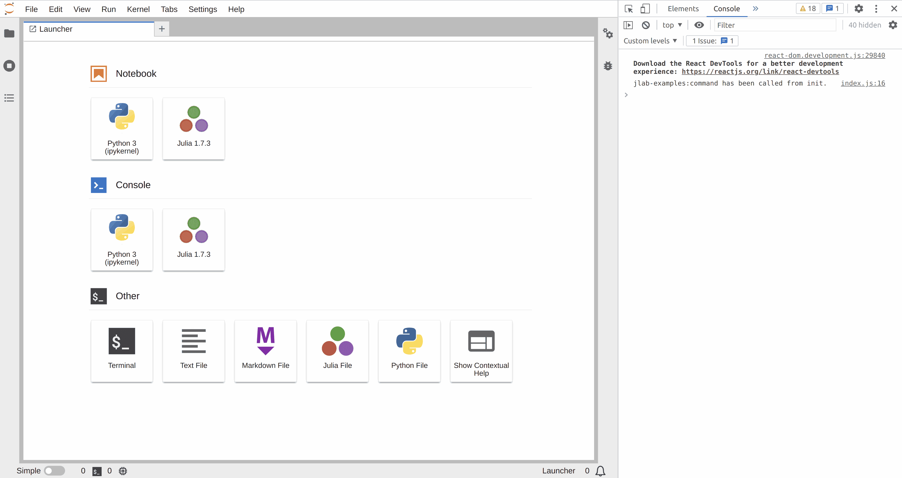

# Commands

> Extend the main app with a Command.



One major concept of the Lumino library on which JupyterLab is built is
the notion of _Commands_.

They are functions stored in a registry (under an unique
specifier) that can be executed from any piece of code having access to that
registry.

It is quite common for an extension to define one or more such commands.

In this extension, you are going to add a command to the application command registry.

The registry has `CommandRegistry` type ([documentation](https://jupyterlab.github.io/lumino/commands/classes/commandregistry.html)).

To see how you can access the application command registry, open the file `src/index.ts`.

```ts
// src/index.ts#L9-L37

const extension: JupyterFrontEndPlugin<void> = {
  id: 'commands',
  autoStart: true,
  activate: (app: JupyterFrontEnd) => {
    const { commands } = app;

    const command = 'jlab-examples:command';

    // Add a command
    commands.addCommand(command, {
      label: 'Execute jlab-examples:command Command',
      caption: 'Execute jlab-examples:command Command',
      execute: (args: any) => {
        const orig = args['origin'];
        console.log(`jlab-examples:command has been called from ${orig}.`);
        if (orig !== 'init') {
          window.alert(`jlab-examples:command has been called from ${orig}.`);
        }
      },
    });

    // Call the command execution
    commands.execute(command, { origin: 'init' }).catch((reason) => {
      console.error(
        `An error occurred during the execution of jlab-examples:command.\n${reason}`
      );
    });
  },
};
```

The CommandRegistry is an attribute of the main JupyterLab application
(variable `app` in the previous snippet). It has an `addCommand` method that
adds your own function.

That method takes two arguments: the unique command id
and [options](https://jupyterlab.github.io/lumino/commands/interfaces/commandregistry.icommandoptions.html) for the command.

The only mandatory option is `execute`, this takes the function to be called
when the command is executed. It can optionally takes arguments (arbitrarily defined
by the developer).

To execute that command, you only need access to the _Commands Registry_ in any other
part of the application. Then you will need to call the `execute` method of the registry
with the unique command id and optionally the arguments.

```ts
// src/index.ts#L31-L36

  commands.execute(command, { origin: 'init' }).catch((reason) => {
    console.error(
      `An error occurred during the execution of jlab-examples:command.\n${reason}`
    );
  });
},
```

When running JupyterLab with this extension, the following message should
appear in the web browser console as an alert:

```bash
jlab-examples:command has been called from init.
```

## Where to Go Next

Commands can be attached to a menu item, a launcher
card or the command palette to be easily triggered by the user.

- Add the command to the [command palette](../command-palette/README.md)
- Add the command to a [menu](../main-menu/README.md)
- Add the command to the [launcher](../launcher/README.md)
