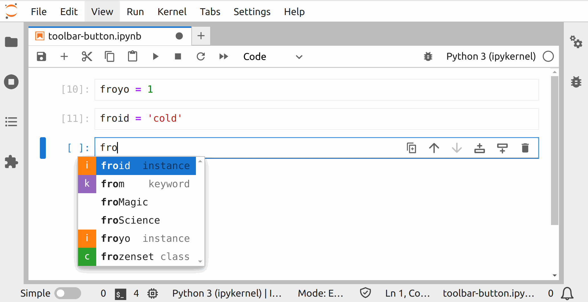

# Custom Completer

> Provide a connector to customize tab completion results in a notebook.

- [Code structure](#code-structure)
- [Creating a custom connector](#creating-a-custom-connector)
- [Aggregating connector responses](#aggregating-connector-responses)
- [Asynchronous extension initialization](#asynchronous-extension-initialization)
- [Where to go next](#where-to-go-next)



In this example, you will learn how to customize the behavior of JupyterLab notebooks' tab completion.

## Code structure

The code is split into three parts:

1.  the JupyterLab plugin that activates all the extension components and connects
    them to the main _JupyterLab_ application via commands,
2.  a custom `CompletionConnector`, adapted from jupyterlab/packages/completer/src/connector.ts,
    that aggregates completion results from three sources: _JupyterLab_'s existing `KernelConnector` and `ContextConnector`, plus...
3.  `CustomConnector`, a lightweight source of mocked completion results.

The first part is contained in the `index.ts` file, the second is in `connector.ts`, and the third is in `customconnector.ts`.

## Creating a custom DataConnector

In `src/customconnector.ts` we define a `CustomConnector` to generate mock autocomplete suggestions. Like the `ContextConnector` it is based on, `CustomConnector` extends _JupyterLab_'s [`DataConnector`](https://jupyterlab.readthedocs.io/en/latest/api/classes/statedb.dataconnector.html) class.

- Try adding a new token to `tokenList` in the `completionHint` function.
- Try modifying the `completionHint` function to return no matches when `token.value.length` is less than 3.

## Aggregating connector responses

[_JupyterLab_'s `CompletionConnector`](https://github.com/jupyterlab/jupyterlab/blob/master/packages/completer/src/connector.ts) fetches and merges completion responses from `KernelConnector` and `ContextConnector`. Our modified `CompletionConnector` in `src/connector.ts` is more general; given an array of `DataConnectors`, it can fetch and merge completion matches from every connector provided.

## Asynchronous extension initialization

[_JupyterLab_'s completer-extension](https://github.com/jupyterlab/jupyterlab/tree/master/packages/completer-extension) includes a notebooks plugin that registers notebooks for code completion. Our extension will override the notebooks plugin's behavior, so we [disable notebooks](https://jupyterlab.readthedocs.io/en/stable/extension/extension_dev.html#disabling-other-extensions) in our `.package.json`:

```json
// package.json#L75-L82
  "jupyterlab": {
    "extension": true,
    "schemaDir": "schema",
    "outputDir": "jupyterlab_examples_completer/labextension",
    "disabledExtensions": [
      "@jupyterlab/completer-extension:notebooks"
    ]
  }
```

`index.ts` contains the code to initialize this extension. Nearly all of the code in `index.ts` is copied directly from the notebooks plugin.

Note that the extension commands we're overriding are unified into one namespace at the top of the file:

```ts
// src/index.ts#L23-L31

namespace CommandIDs {
  export const invoke = 'completer:invoke';

  export const invokeNotebook = 'completer:invoke-notebook';

  export const select = 'completer:select';

  export const selectNotebook = 'completer:select-notebook';
}
```

`index.ts` imports four connector classes, two from `JupyterLab`:

```ts
// src/index.ts#L6-L10

import {
  ContextConnector,
  ICompletionManager,
  KernelConnector
} from '@jupyterlab/completer';
```

and two from our extension:

```ts
// src/index.ts#L17-L18

import { CompletionConnector } from './connector';
import { CustomConnector } from './customconnector';
```

Just like the notebooks plugin, when we update the handler for a notebook we call `updateConnector`:

```ts
// src/index.ts#L72-L74

// Update the handler whenever the prompt or session changes
panel.content.activeCellChanged.connect(updateConnector);
panel.sessionContext.sessionChanged.connect(updateConnector);
```

which, unlike the notebooks plugin, instantiates `KernelConnector`, `ContextConnector`, and `CustomConnector`, then passes them to our modified `CompletionConnector`:

```ts
// src/index.ts#L56-L70

const updateConnector = () => {
  editor = panel.content.activeCell?.editor ?? null;
  options.session = panel.sessionContext.session;
  options.editor = editor;
  handler.editor = editor;

  const kernel = new KernelConnector(options);
  const context = new ContextConnector(options);
  const custom = new CustomConnector(options);
  handler.connector = new CompletionConnector([kernel, context, custom]);
};
```

## Where to go next

Create a [server extension](../server-extension) to serve up custom completion matches.
