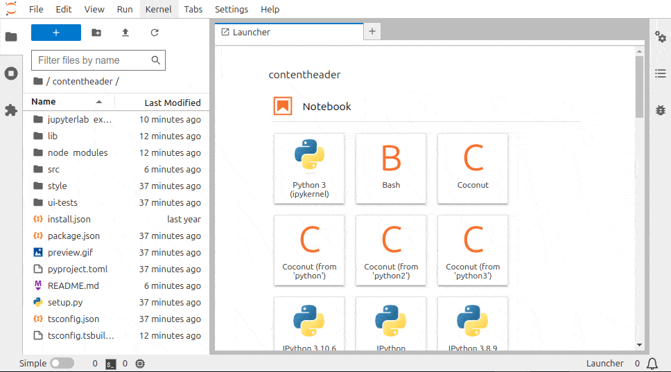

# Main Widget Content Header

> Insert a widget into the `contentHeader` section of a `MainAreaWidget`—useful for toolbars, headers, etc.



This JupyterLab example extension is intended to demo one specific feature of `MainAreaWidget`, namely, its `contentHeader` section.

> As background, `MainAreaWidget` is a high-level JupyterLab widget that conventionally is used to enclose the Launcher (shown above) or a notebook editor. The `contentHeader`, in turn, is a Lumino `BoxPanel` widget positioned at the very top of this main area. This makes the `contentHeader` potentially useful to extensions needing some place to put content that the user will _always see_.

In code: after you get a `MainAreaWidget`, for example via

```ts
// src/index.ts#L37-L37

const main = app.shell.currentWidget;
```

you can then create a widget of interest, for example as

```ts
// src/index.ts#L40-L40

const widget = new Widget();
```

before finally adding it to the JupyterLab main area's `contentHeader` real estate at its very top:

```ts
// src/index.ts#L45-L45

main.contentHeader.addWidget(widget);
```

## Install

First, ensure you've followed the installation instructions in the [top-level README](../README.md), e.g.:

```bash
# clone the repository
git clone https://github.com/jupyterlab/extension-examples.git jupyterlab-extension-examples

# go to the extension examples folder
cd jupyterlab-extension-examples

# create a new environment
conda env create

# activate the environment
conda activate jupyterlab-extension-examples
```

Then build this extension and launch it — this largely follows from the instructions in the top-level [README](../README.md), except using this example instead of the `hello-world` one:

```bash
# go to the contentheader example
cd contentheader

# install the extension in editable mode
python -m pip install -e .

# install your development version of the extension with JupyterLab
jupyter labextension develop . --overwrite

# build the TypeScript source after making changes
jlpm run build

# start JupyterLab
jupyter lab
```

## Activate

As in the demo animated GIF above, once in JupyterLab

1. Open the [Command Palette](https://jupyterlab.readthedocs.io/en/stable/user/commands.html) via, e.g., _View_ ➜ _Activate Command Palette_.
2. Type in `populate` to see the command created by this extension: _Populate content header (time example)_.
3. This will create a small header bar at the top of the main JupyterLab window that shows the current time in GMT (Greenwich Mean Time, also called UTC, Coordinated Universal Time).

> Nota bene, you can _toggle_ the `contentHeader` via the _Command Palette_ ➜ _Show Header Above Content_ if you decide you don't want to see it.

> Nota bene 2, the `contentHeader` and the _Show Header Above Content_ toggle apply on a _per_ `MainAreaWidget`: if you run this extension, it will show the time in the `contentHeader` of the _active_ main area, and the time will not appear in another notebook tab. This may be useful for some extension workflows and not others.

## Implementation notes

For full details see the body of the `execute` function in [`index.ts`](./src/index.ts), but in prose, here's what to do to make use of the `contentHeader` widget.

First, get a `MainAreaWidget`. The approach used here will likely be useful for many JupyterLab use cases: `JupyterFrontEnd.shell.currentWidget` will be a `MainAreaWidget` if your extension is being activated with a classic JupyterLab window, and you can ensure that by testing for `app.shell.currentWidget instanceof MainAreaWidget`.

`MainAreaWidget.contentHeader` is a "top-to-bottom" vertical [Lumino BoxPanel](https://jupyterlab.github.io/lumino/widgets/classes/boxpanel.html). You can call its `addWidget` and `insertWidget` methods to populate this space with your own custom widgets.

## Background

The motivation for this extension example was a question on the Jupyter Discourse, ["How to add Widget to an arbitrary HTMLElement?"](https://discourse.jupyter.org/t/how-to-add-widget-to-an-arbitrary-htmlelement/11576), where Michał Krassowski kindly recommended to create this example to remind JupyterLab developers of this feature.

The feature was added in [that PR](https://github.com/jupyterlab/jupyterlab/pull/9984) which has further discussion.
