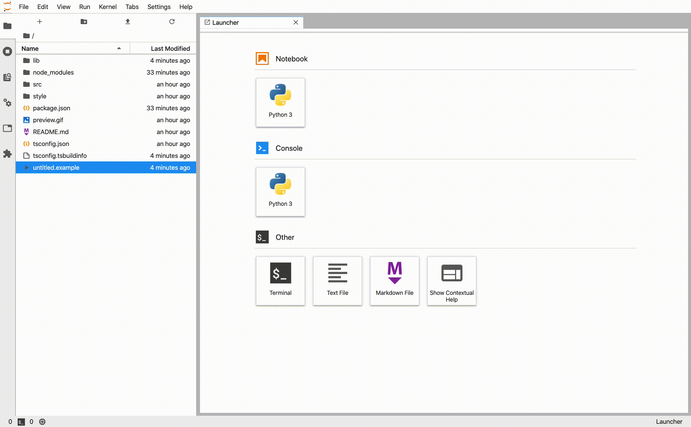

# Context Menu

> Create a new button in a context menu.

This is a basic example to show how to add a new entry to an existent context menu.



In JupyterLab plugins can expose context menus to offer an easy way to execute commands and perform actions. In this example, you will learn how to add a new entry to the file browser context menu, and at the same time how to register a new file type.

> It is strongly recommended to read [commands](https://github.com/jupyterlab/extension-examples/tree/master/commands) example before diving into this one.

To implement this example you need to install the `@jupyterlab/filebrowser`, where you can find the interface `IFileBrowserFactory` necessary to require the file browser instance of JupyterLab.

> This is not necessary to create a context menu. But it is a common case to be extended.

First of all, you will start looking into the declaration of the extension:

<!-- prettier-ignore-start -->
```ts
// src/index.ts#L9-L14

const extension: JupyterFrontEndPlugin<void> = {
  id: 'context-menu',
  autoStart: true,
  requires: [IFileBrowserFactory],
  optional: [],
  activate: (app: JupyterFrontEnd, factory: IFileBrowserFactory) => {
```
<!-- prettier-ignore-end -->

For this extension, you need to require `IFileBrowserFactory` to track the file browser item clicked by the user.

The example shows you how to create a new file type and add the entry to the context menu only to this file type. The first step is optional, you can also add your button to an existing file type (or all of them!).

To register a new file type, you need to call the `addFileType()` method of `docRegistry` property present in the `JupyterFrontEnd` object. This method requires an `IFileType` object with some properties to define your file type. The most important are:

- `name`: the new file type.
- `extension`: the list of extensions.
- `fileFormat`: the file content format (_base64_, _json_ or _text_).
- `contentType`: the file type (_directory_, _notebook_ or _file_).
- `mimeType`: the content mime type.

<!-- prettier-ignore-start -->
```ts
// src/index.ts#L15-L23

app.docRegistry.addFileType({
  name: 'example',
  icon: runIcon,
  displayName: 'Example File',
  extensions: ['.example'],
  fileFormat: 'text',
  contentType: 'file',
  mimeTypes: ['text/plain'],
});
```
<!-- prettier-ignore-end -->

The next step is to define the command that will be executed when clicking on the context menu entry. If you want to access the item information, you need to use the `IFileBrowserFactory` object to obtain the file browser selected item.

<!-- prettier-ignore-start -->
```ts
// src/index.ts#L25-L38

app.commands.addCommand('jlab-examples/context-menu:open', {
  label: 'Example',
  caption: "Example context menu button for file browser's items.",
  icon: buildIcon,
  execute: () => {
    const file = factory.tracker.currentWidget.selectedItems().next();

    showDialog({
      title: file.name,
      body: 'Path: ' + file.path,
      buttons: [Dialog.okButton()],
    }).catch((e) => console.log(e));
  },
});
```
<!-- prettier-ignore-end -->

Finally, you can add the command to a context menu using the `addItem()` method present in the `contextMenu` property. This method requires an `IItemOptions` object with the following properties:

- `command`: the command to execute.
- `selector`: the CSS classes of the element where you want to add the entry.
- `rank`: the position in the context menu

<!-- prettier-ignore-start -->
```ts
// src/index.ts#L40-L44

app.contextMenu.addItem({
  command: 'jlab-examples/context-menu:open',
  selector: '.jp-DirListing-item[data-file-type="example"]',
  rank: 0,
});
```
<!-- prettier-ignore-end -->

The `selector` can be any valid [CSS selector](https://developer.mozilla.org/en-US/docs/Web/CSS/CSS_Selectors). In this case, the first part is the CSS class that identifies the file browser items `.jp-DirListing-item` and the second part `[data-file-type="example"]` is a attribute value to be found on the item. You can omit the second part to add the button to every file type.

You can find some of the CSS classes that identify different widgets in JupyterLab in the [developer documentation](https://jupyterlab.readthedocs.io/en/stable/developer/css.html#commonly-used-css-selectors).
