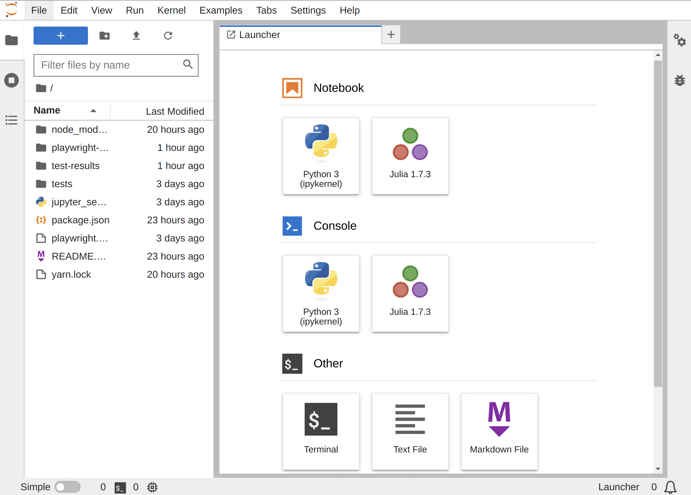

# Custom log console

> Create a custom log console.

This example shows how to create a log console to print log messages from a JupyterLab extension.



The default log console extension in JupyterLab obtains log outputs from the kernel context of the current active notebook. So you can either:

1. Obtain the current active notebook and send message to his `Logger` instance (see the [log message](https://github.com/jupyterlab/extension-examples/tree/master/log-messages) example).
2. Create your custom log console (covered in this example).

> It is strongly recommended to read [commands](https://github.com/jupyterlab/extension-examples/tree/master/commands), [command-palette](https://github.com/jupyterlab/extension-examples/tree/master/command-palette), [main-menu](https://github.com/jupyterlab/extension-examples/tree/master/main-menu), [widgets](https://github.com/jupyterlab/extension-examples/tree/master/widgets) and [react-widget](https://github.com/jupyterlab/extension-examples/tree/master/react-widget) examples before diving into this one.

To implement this log console you need to install the following packages:

- `@jupyterlab/logconsole`: Where you can find the different UI components and message format.
- `@jupyterlab/rendermime`: Used to create renderers for various mime-types.
- `@jupyterlab/nbformat`: Only necessary if you want to use the notebook output format as the type of message.

This example has two files. In the first one `index.ts`, you will find all the logic of the extension. And the second one `logLevelSwitcher.tsx` declares the React component used in the toolbar to switch between different log levels.

First of all, you will start by looking into the declaration of the extension:

<!-- prettier-ignore-start -->
```ts
// src/index.ts#L28-L39

const extension: JupyterFrontEndPlugin<void> = {
  id: 'custom-log-console',
  autoStart: true,
  requires: [ICommandPalette, IRenderMimeRegistry, IMainMenu, ILayoutRestorer],
  optional: [],
  activate: (
    app: JupyterFrontEnd,
    palette: ICommandPalette,
    rendermime: IRenderMimeRegistry,
    mainMenu: IMainMenu,
    restorer: ILayoutRestorer
  ) => {
```
<!-- prettier-ignore-end -->

To create a new log console the `IRenderMimeRegistry` token is required, which is necessary as a default _rendermime_ in the `LoggerRegistry` to render the outputs. Moreover you will need `JupyterFrontEnd` to have access to some JupyterLab features, `ICommandPalette` to register some commands. `IMainMenu` allows to add some commands to the main menu. And `ILayoutRestorer` can restore the extension layout after reloading the web page.

In the `activate` function, the first step is to declare `logConsolePanel` and `logConsoleWidget`. Therefore, you can pass their reference to the commands. The commands will be able to interact with the widget even when deleting and creating a new one after closing the tab, as well as tracking them before launching the widget.

<!-- prettier-ignore-start -->
```ts
// src/index.ts#L42-L43

let logConsolePanel: LogConsolePanel = null;
let logConsoleWidget: MainAreaWidget<LogConsolePanel> = null;
```
<!-- prettier-ignore-end -->

The next step is to create a new widget when clicking on the button to open the custom log console. The function `createLogConsoleWidget` has all the logic necessary to initialize a new `LogConsoleWidget` and add it to the main area:

<!-- prettier-ignore-start -->
```ts
// src/index.ts#L76-L76

const createLogConsoleWidget = (): void => {
```
<!-- prettier-ignore-end -->

To initialize a new `LogConsoleWidget` you have to create a `LogConsolePanel` to hold the log messages. `LogConsoleWidget` needs a `LoggerRegistry` to add new logs to the panel. `LoggerRegistry` requires two parameters: the default rendermime and the maximum length for the logs.

<!-- prettier-ignore-start -->
```ts
// src/index.ts#L77-L82

logConsolePanel = new LogConsolePanel(
  new LoggerRegistry({
    defaultRendermime: rendermime,
    maxLength: 1000,
  })
);
```
<!-- prettier-ignore-end -->

The `source` property identifies where the message comes from and is necessary to initialize the `logger` object present on `LogConsolePanel`. This object will let you send log messages to the log console and change the log level. In the `logconsole-extension` available in core JupyterLab, `source` identifies the kernel output of the active notebook. So when changing the active notebook, the log console change his logs. You can use any string for the value, but it is recommended to use the name of your extension.

<!-- prettier-ignore-start -->
```ts
// src/index.ts#L84-L84

logConsolePanel.source = 'custom-log-console';
```
<!-- prettier-ignore-end -->

Now you are ready to initialize a new `MainAreaWidget` passing the `logConsolePanel` as the content.

<!-- prettier-ignore-start -->
```ts
// src/index.ts#L86-L88

logConsoleWidget = new MainAreaWidget<LogConsolePanel>({
  content: logConsolePanel,
});
```
<!-- prettier-ignore-end -->

The last step of the function `createLogConsoleWidget` is to establish how to proceed after a dispose request. The `dispose` method is present in Lumino widgets to ensure that resources can be claimed by the garbage collector. In this case, this method is called when you close the tab for a `MainAreaWidget`. So you need to delete the `logConsolePanel` and `logConsoleWidget` instances to clean all logs and be ready to initialize a new widget when you decide to open the tab again.

<!-- prettier-ignore-start -->
```ts
// src/index.ts#L112-L116

logConsoleWidget.disposed.connect(() => {
  logConsoleWidget = null;
  logConsolePanel = null;
  commands.notifyCommandChanged();
});
```
<!-- prettier-ignore-end -->

To launch a new log console, you can add a new command. In this case, you can use the option `isToggled` to make the button checkable to open and close the log console with the same button. In the `execute` function there is an `if` statement to check when closing and deleting the `MainAreaWidget`, and when creating and opening a new one calling `createLogConsoleWidget`.

<!-- prettier-ignore-start -->

```ts
// src/index.ts#L125-L136

commands.addCommand('jlab-examples/custom-log-console:open', {
  label: 'Custom Log Console',
  caption: 'Custom log console example.',
  isToggled: () => logConsoleWidget !== null,
  execute: () => {
    if (logConsoleWidget) {
      logConsoleWidget.dispose();
    } else {
      createLogConsoleWidget();
    }
  },
});
```

Finally, you can send log messages calling `log` method present on the `logger` property of `logConsolePanel`. This method lets you send different types:

- HTML message with `IHtmlLog`:
<!-- prettier-ignore-start -->
```ts
// src/index.ts#L147-L153

const msg: IHtmlLog = {
  type: 'html',
  level: 'debug',
  data: '<div>Hello world HTML!!</div>',
};

logConsolePanel?.logger?.log(msg);
```
<!-- prettier-ignore-end -->

- Raw text message with `ITextLog`
  <!-- prettier-ignore-start -->

```ts
// src/index.ts#L161-L167

const msg: ITextLog = {
  type: 'text',
  level: 'info',
  data: 'Hello world text!!',
};

logConsolePanel?.logger?.log(msg);
```

<!-- prettier-ignore-end -->

- Cell output message with `IOutputLog`

<!-- prettier-ignore-start -->
```ts
// src/index.ts#L175-L188

const data: nbformat.IOutput = {
  output_type: 'display_data',
  data: {
    'text/plain': 'Hello world nbformat!!',
  },
};

const msg: IOutputLog = {
  type: 'output',
  level: 'warning',
  data,
};

logConsolePanel?.logger?.log(msg);
```
<!-- prettier-ignore-end -->
