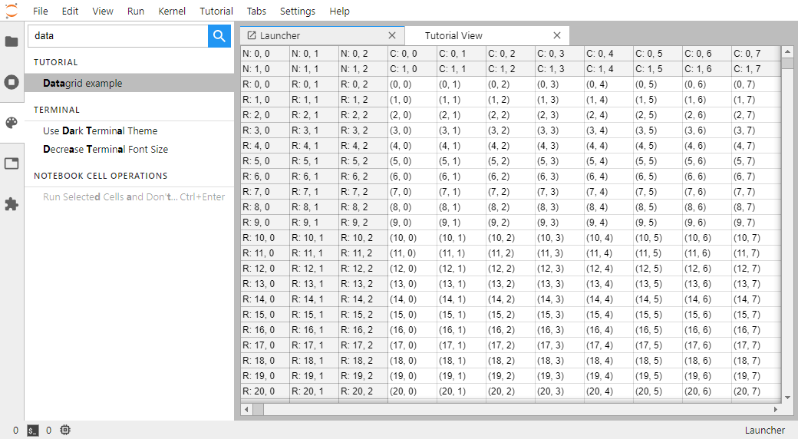

# Datagrid

> Display a Datagrid as a Lumino Widget.



JupyterLab is built on top of [Lumino](https://github.com/jupyterlab/lumino).
That library defines `Widget` as the primary interface brick.

In this example [the datagrid lumino example](https://jupyterlab.github.io/lumino/datagrid/classes/datagrid.html)
is integrated into JupyterLab.

First you need to import `StackedPanel`, `DataGrid`
and `DataModel` classes from lumino:

```ts
// src/index.ts#L14-L16

import { DataGrid, DataModel } from '@lumino/datagrid';

import { StackedPanel } from '@lumino/widgets';
```

The `StackedPanel` widget can hold several sub-widgets that are added with its
`.addWidget` method. _Stacked_ means that the panel can be stacked in
the main area of JupyterLab as seen in the above screenshot.

`DataModel` is a class that provides the data that is displayed by the `DataGrid` widget.

> Note:
> To be able to import those classes, you will need to add their
> package as dependencies:
> `jlpm add @lumino/datagrid @lumino/widgets`

With these three classes, you can create your own widget, called `DataGridPanel` :

```ts
// src/index.ts#L48-L68

class DataGridPanel extends StackedPanel {
  constructor(translator?: ITranslator) {
    super();
    this._translator = translator || nullTranslator;
    this._trans = this._translator.load('jupyterlab');

    this.addClass('jp-example-view');
    this.id = 'datagrid-example';
    this.title.label = this._trans.__('Datagrid Example View');
    this.title.closable = true;

    const model = new LargeDataModel();
    const grid = new DataGrid();
    grid.dataModel = model;

    this.addWidget(grid);
  }

  private _translator: ITranslator;
  private _trans: TranslationBundle;
}
```

Your widget is derived from `StackedPanel` to inherit its behavior. Then
some properties for the panel. Then the `DataGrid` widget and its associated model are created.
Finally the grid is inserted inside the panel.

Note that the private variables `_translator` and `_trans` are used for translating labels and other pieces of text that are displayed to the user.

The `DataModel` class is not used directly as it is an abstract class.
Therefore in this example a class `LargeDataModel` is derived from it
to implement its abstract methods:

```ts
// src/index.ts#L70-L79

class LargeDataModel extends DataModel {
  rowCount(region: DataModel.RowRegion): number {
    return region === 'body' ? 1000000000000 : 2;
  }

  columnCount(region: DataModel.ColumnRegion): number {
    return region === 'body' ? 1000000000000 : 3;
  }

  data(region: DataModel.CellRegion, row: number, column: number): any {
```

The three abstract methods are `rowCount`, `columnCount` and `data`. The
first two must return a number from a region argument. To know the possible
values of `RowRegion` and the `ColumnRegion`, you can look at the
[Lumino code](https://github.com/jupyterlab/lumino/blob/9c5f31cca3b02441850e086c1b19642a6e298493/packages/datagrid/src/datamodel.ts#L134-L155):

```ts
/**
 * A type alias for the data model row regions.
 */
export type RowRegion = 'body' | 'column-header';

/**
 * A type alias for the data model column regions.
 */
export type ColumnRegion = 'body' | 'row-header';

/**
 * A type alias for the data model cell regions.
 */
export type CellRegion =
  | 'body'
  | 'row-header'
  | 'column-header'
  | 'corner-header';
```

The `|` can be read as `or`. This means that the `RowRegion` type is
either `body` or `column-header`.

So the `rowCount` and `columnCount` functions define a table with `2` header rows,
with `3` index columns, with `1000000000000` rows and `1000000000000` columns.

Finally the `data` method of the `LargeDataModel` class defines the data
values of the datagrid. In this case it simply displays the row and
column index in each cell, and adds a letter prefix in the header regions:

```ts
// src/index.ts#L79-L90

data(region: DataModel.CellRegion, row: number, column: number): any {
  if (region === 'row-header') {
    return `R: ${row}, ${column}`;
  }
  if (region === 'column-header') {
    return `C: ${row}, ${column}`;
  }
  if (region === 'corner-header') {
    return `N: ${row}, ${column}`;
  }
  return `(${row}, ${column})`;
}
```
