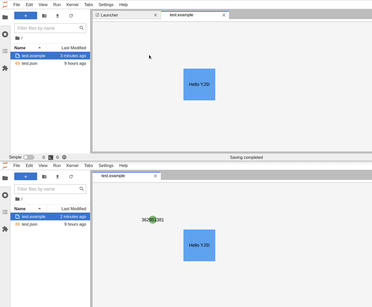

# Documents

> Create new documents and make them collaborative.



> ⚠ **This example only works on JupyterLab v3.6 or higher**

> Before starting this guide, it is strongly recommended to look at the documentation, precisely the section of [Documents](https://jupyterlab.readthedocs.io/en/stable/extension/documents.html#documents)

- [Documents](#documents)
  - [Introduction to documents](#introduction-to-documents)
  - [Factories](#factories)
  - [Registering new Documents](#registering-new-documents)
  - [Document Widget](#document-widget)
  - [Document Model](#document-model)
  - [Make it collaborative](#make-it-collaborative)

## Introduction to documents

In JupyterLab, we refer to a _document_ a type of file stored on disk. These files are represented in the frontend by a [`Context`](https://jupyterlab.readthedocs.io/en/latest/api/classes/docregistry.Context-1.html) which is the bridge between the file metadata (like the file path) and its model (the actual document content). Document [`IModel`](https://jupyterlab.readthedocs.io/en/latest/api/interfaces/docregistry.DocumentRegistry.IModel.html) represents the file content while [`IDocumentWidget`](https://jupyterlab.readthedocs.io/en/latest/api/interfaces/docregistry.IDocumentWidget.html) is a view of the model.  
Developers can provide new extensions to support additional documents (or replace existing implementation). A document is defined by three elements:

- A model: it contains and handles the document content. It should implement the [`IModel` interface](https://jupyterlab.readthedocs.io/en/latest/api/interfaces/docregistry.DocumentRegistry.IModel.html). And in particular it should contain the document content in a [`sharedModel`](https://jupyterlab.readthedocs.io/en/latest/api/interfaces/docregistry.DocumentRegistry.IModel.html#sharedModel) - so you will need to define two new model classes.
- A view: it defines a Widget to be included in the frontend for the user to view and interact with the document.
- A file type: this is a dictionary of attributes allowing JupyterLab to map a file or a content with a mimetype to available model(s) and view(s).

The model, the shared model and the view will be provided through new factories and the file type will be registered directly.
For that you will need to access the [`DocumentRegistry`](https://jupyterlab.readthedocs.io/en/latest/api/classes/docregistry.DocumentRegistry-1.html) to register new [`FileType`s](https://jupyterlab.readthedocs.io/en/latest/api/interfaces/rendermime_interfaces.IRenderMime.IFileType.html), models and views. This way, when opening a new file, the [`DocumentManager`](https://jupyterlab.readthedocs.io/en/latest/api/classes/docmanager.DocumentManager-1.html) will look into the file metadata and create an instance of `Context` with the right model for this file. To register new documents, you can create factories, either a [`IModelFactory`](https://jupyterlab.readthedocs.io/en/latest/api/interfaces/docregistry.DocumentRegistry.IModelFactory.html) for the model and/or a [`IWidgetFactory`](https://jupyterlab.readthedocs.io/en/latest/api/interfaces/docregistry.DocumentRegistry.IWidgetFactory.html) for the view.

The shared model needs to be registered only if your file must be collaborative. For that you will need to register it in the [`ICollaborativeDrive`](https://jupyterlab-realtime-collaboration.readthedocs.io/en/latest/api/interfaces/collaborative_drive.ICollaborativeDrive.html) token provided by the `@jupyter/collaborative-drive` package.

> Packaging note: when using an optional external extension (here
> `@jupyter/collaborative-drive` from `jupyter-collaboration`), you must
> tell JupyterLab to include that package in the current extension by
> adding the following configuration in `package.json`.:

```json5
// package.json#L109-L114

"sharedPackages": {
    "@jupyter/collaborative-drive": {
        "bundled": true,
        "singleton": true
    }
}
```

## Factories

Factories are objects meant to create instances of the suitable widget/model given a file. For example, when the `DocumentManager` detects that the file is a notebook, it uses the notebook widget factory to create a new instance of `NotebookPanel`. On the other hand, if you want to make a new `IModel` (model) or `IDocumentWidget` (view) for a specific file type, you have to create a factory and register it to the `DocumentRegister`. When registering a factory, you tell the `DocumentManager` that you added a new model or widget for a specific file type. Then, the `DocumentManager` will use those factories to create instances of the new model or view.

The easiest way of creating a new widget factory is extending from the [`ABCWidgetFactory<T, U>`](https://jupyterlab.readthedocs.io/en/latest/api/classes/docregistry.ABCWidgetFactory.html) and overwrite its method [`createNewWidget`](https://jupyterlab.readthedocs.io/en/latest/api/classes/docregistry.ABCWidgetFactory.html#createnewwidget). `createNewWidget` is called to create a new `IDocumentWidget` for a given file; usually by extending [`DocumentWidget`](https://jupyterlab.readthedocs.io/en/latest/api/classes/docregistry.DocumentWidget-1.html).
If you inherits from `DocumentWidget`, it needs the document context and a widget - `content`. The content is the main sub widget of the `DocumentWidget` (you can find more information on the section for the [Document Widget](#document-widget)).

For example, in this extension:

<!-- prettier-ignore-start -->
```ts
// src/factory.ts#L31-L38

protected createNewWidget(
  context: DocumentRegistry.IContext<ExampleDocModel>
): ExampleDocWidget {
  return new ExampleDocWidget({
    context,
    content: new ExamplePanel(context)
  });
}
```
<!-- prettier-ignore-end -->

On the other hand, to create a model factory, you need to implement the interface `IModelFactory<T>` specifying the name of your model, its content type and its format.

For example, in this extension, we define `ExampleDocModelFactory`:

<!-- prettier-ignore-start -->
```ts
// src/factory.ts#L44-L45

export class ExampleDocModelFactory
  implements DocumentRegistry.IModelFactory<ExampleDocModel>
```
<!-- prettier-ignore-end -->

with name:

<!-- prettier-ignore-start -->
```ts
// src/factory.ts#L52-L54

get name(): string {
  return 'example-model';
}
```
<!-- prettier-ignore-end -->

content type:

<!-- prettier-ignore-start -->
```ts
// src/factory.ts#L61-L63

get contentType(): Contents.ContentType {
  return 'exampledoc' as any;
}
```
<!-- prettier-ignore-end -->

and format:

<!-- prettier-ignore-start -->
```ts
// src/factory.ts#L70-L72

get fileFormat(): Contents.FileFormat {
  return 'text';
}
```
<!-- prettier-ignore-end -->

At the same time, you need to implement the method `createNew`. The `DocumentManager` will call this method when opening a file that uses your custom document model.

<!-- prettier-ignore-start -->
```ts
// src/factory.ts#L111-L115

createNew(
  options: DocumentRegistry.IModelOptions<ExampleDoc>
): ExampleDocModel {
  return new ExampleDocModel(options);
}
```
<!-- prettier-ignore-end -->

## Registering new Documents

When registering a new document, first of all, you need to know the file type of your new document model. If the file type is already registered, you won't need to register it again. You could register a new `DocumentModel` for an existing file type. If the file type you want to support is not registered, you will need to register it. To do that, you can use the API `addFileType` from the `DocumentRegistry`. The essential arguments are `extensions` to indicate the extension of the file, `fileFormat` that specifies the data format, and `contentType` to determine if it is a notebook, file or directory.

<!-- prettier-ignore-start -->
```ts
// src/index.ts#L59-L66

app.docRegistry.addFileType({
  name: 'example',
  displayName: 'Example',
  mimeTypes: ['text/json', 'application/json'],
  extensions: ['.example'],
  fileFormat: 'text',
  contentType: 'exampledoc' as any
});
```
<!-- prettier-ignore-end -->

Once the file type is registered, you can register the shared model in the collaborative drive:

<!-- prettier-ignore-start -->
```ts
// src/index.ts#L71-L79

if (drive) {
  const sharedExampleFactory = () => {
    return ExampleDoc.create();
  };
  drive.sharedModelFactory.registerDocumentFactory(
    'exampledoc',
    sharedExampleFactory
  );
}
```
<!-- prettier-ignore-end -->

The token `ICollaborativeDrive` (named above `drive`) must be optional as it is provided by the optional
extension `jupyter-collaboration`. In order for the new document type to be viewed in non-collaborative
JupyterLab instance, you should support missing `ICollaborativeDrive` token; the file will still be viewable
and editable but no collaboration will be enabled.

Then you need to register the model (`DocumentModel`) for the new file type. The `DocumentModel` represents the content of the file. For example, JupyterLab has two models registered for the notebook. When you open a notebook with the Notebook editor, the `DocumentManager` creates an instance of the `NotebookModel` that loads the notebook as a JSON object and offers a complex API to manage cells and metadata independently (treats the content of the notebook as a structured data). When opening a notebook with the plain text editor the `DocumentManager` creates an instance of the base `DocumentModel` class which treats the content of the notebook as a string. Note that you can register multiple models for the same file type. Still, these models are not in sync when the user opens two editors for the same file that use different models (like opening a notebook with the notebook editor and the plain text editor). These editors are not in sync because they use different models. At some point, they will show different content.

To register a new `DocumentModel` we can use the API `addModelFactory` from the `DocumentRegistry`. In this case, we created the model factory without arguments, but you can add the argument that you need.

<!-- prettier-ignore-start -->
```ts
// src/index.ts#L82-L83

const modelFactory = new ExampleDocModelFactory();
app.docRegistry.addModelFactory(modelFactory);
```
<!-- prettier-ignore-end -->

The last step is to register the view (`DocumentWidget`). As with the `DocumentModel`, you can register a widget for an existing model or a new model if the existing ones fit your needs. In this case, different widgets using the same model will stay in sync. The `DocumentWidget` is the view for the model, and it is only the layer that allows users to interact with the content of the file.

To register a new `DocumentWidget` we can use the API `addWidgetFactory` from the `DocumentRegistry`. The main arguments you need to add to the factory are the widget's name, the name of the model that this widget uses, a list of file types that the widget can open, and the list of file types that the widget is the default view.

<!-- prettier-ignore-start -->
```ts
// src/index.ts#L87-L92

const widgetFactory = new ExampleWidgetFactory({
  name: FACTORY,
  modelName: 'example-model',
  fileTypes: ['example'],
  defaultFor: ['example']
});
```

```ts
// src/index.ts#L104-L104

app.docRegistry.addWidgetFactory(widgetFactory);
```
<!-- prettier-ignore-end -->

## Document Widget

The `DocumentWidget` is the view that will open when opening the file. The `DocumentWidget` contains four main attributes:

- `context`: The context is the bridge between the file on disk and its content. This context includes all the information about the file and some methods to handle the file. Some other attributes you can find in the context are the `DocumentModel` and the `sessionContext`, which handles the communication with the backend.
- `title`: Which handles the content of the tab.
- `toolbar`: The editor's toolbar, where you can add different widgets to trigger actions on the document.
- `contentHeader`: This is a panel between the toolbar and the main content area. You can see this header as a second toolbar or as a notification area.
- `content`: The content is the main area of the `DocumentWidget` when you add the view for your document.

## Document Model

The `DocumentModel` represents the file content in the frontend. Through the model, you can listen to changes in the state of the file like its metadata or some other properties like `dirty` that indicates that the content differs from disk, and you can modify and listen to changes on the content. The main methods on the `DocumentModel` are `toString` and `fromString`, every file but the notebook is loaded/saved to disk as a string using these methods.

> For non-textual file, the string contains a base-64 representation of the file content.

## Make it collaborative

In JupyterLab v3.1, we switched from `ModelDB` as a data storage to shared models. We implemented these shared models using [Yjs](https://yjs.dev), a high-performance CRDT for building collaborative applications that automatically sync. You can find all the documentation of Yjs [here](https://docs.yjs.dev).

Yjs documents (`Y.Doc`) are the main class of Yjs. They represent a shared document between clients and hold multiple shared objects. Yjs documents enable you to share different [data types like text, Array, Map or set](https://docs.yjs.dev/getting-started/working-with-shared-types), which makes it possible to create not only collaborative text editors but also diagrams, drawings,... .

To sync content between clients, Yjs uses providers. Providers abstract Yjs from the network technology your application uses. They sync Yjs documents through a communication protocol or a database. Most providers have in common that they use the concept of room names to connect Yjs documents. In JupyterLab, we created a package called `@jupyterlab/docprovider` with a WebSocket provider that syncs documents through a new end-point (`api/yjs`) in the JupyterLab server.

Another critical component of Yjs is Awareness. Every Yjs document has an `awareness` attribute that enables you to share user's information like its name, cursor, mouse pointer position, etc. The `awareness` attribute doesn't persist across sessions. Instead, Yjs uses a tiny state-based Awareness CRDT that propagates JSON objects to all users. When you go offline, your awareness state is automatically deleted and notifies all users that you went offline.

After a short explanation of Yjs' features, now it's time to start with the implementation.

First you need to define your document data structure. For a text file, it is as
simple as a single string. But as mentioned earlier, it could be more complex. Here
the document represents a cube by its position and text content. It is stored as a JSON with two keys: a _position_ and a _content_.  
Although the position is also a dictionary with keys _x_ and _y_, we decided to store
both information as string (i.e. position will require parsing to be converted as a dictionary).  
That choice is purely at the discretion of the developer. Using a stringified
dictionary is fine if most of the dictionary changes every time. But if most of
the dictionary stay constant (especially if the all dictionary is large), it would
be more performant to use a shared dictionary instead of a shared string.

You can create a new shared model by extending from `YDocument<T>`. [YDocument](https://jupyter-ydoc.readthedocs.io/en/latest/api/classes/YDocument-1.html) is a generic implementation of a shared model that handles the initialization of the `YDoc` and already implements some functionalities like the changes history.

In this extension, we created:

<!-- prettier-ignore-start -->
```ts
// src/model.ts#L344-L344

export class ExampleDoc extends YDocument<ExampleDocChange> {
```
<!-- prettier-ignore-end -->

To create a new shared object, you have to use the `ydoc`. The new attribute will be linked to the `ydoc` and sync between the different clients automatically. You can also listen to changes on the shared attributes to propagate them to the `DocumentWidget`.

<!-- prettier-ignore-start -->
```ts
// src/model.ts#L348-L349

this._content = this.ydoc.getMap('content');
this._content.observe(this._contentObserver);
```
<!-- prettier-ignore-end -->

A good practice is to implement a data oriented interface for the `YDocument` in
order for the consumer to never face Yjs machinery directly. For example, here,
we provide helpers `get` and `set` to hide the complexity of `position` being stringified in the shared object.

<!-- prettier-ignore-start -->
```ts
// src/model.ts#L408-L417

get(key: 'content'): string;
get(key: 'position'): Position;
get(key: string): any {
  const data = this._content.get(key);
  return key === 'position'
    ? data
      ? JSON.parse(data)
      : { x: 0, y: 0 }
    : (data ?? '');
}
```

```ts
// src/model.ts#L425-L429

set(key: 'content', value: string): void;
set(key: 'position', value: PartialJSONObject): void;
set(key: string, value: string | PartialJSONObject): void {
  this._content.set(key, key === 'position' ? JSON.stringify(value) : value);
}
```
<!-- prettier-ignore-end -->

To access the information about the different users connected, you can use the `awareness` attribute on the shared model. The `awareness` keeps the state of every user as a map with the user's id as a key and a JSON object as the value for the state. This is very useful to shared information such as user cursor positions.

You could add new information to the user's state by using the method `setLocalStateField` and access to the state of all users with `getStates`.

<!-- prettier-ignore-start -->
```ts
// src/model.ts#L204-L204

this.sharedModel.awareness.setLocalStateField('mouse', pos);
```

```ts
// src/model.ts#L279-L279

const clients = this.sharedModel.awareness.getStates();
```
<!-- prettier-ignore-end -->

To listen for changes on the state of the users, you can use the method `on('change', () => {})`.

<!-- prettier-ignore-start -->
```ts
// src/model.ts#L50-L50

this.sharedModel.awareness.on('change', this._onClientChanged);
```
<!-- prettier-ignore-end -->

Every time you modify a shared property, this property triggers an event in all the clients to notify them. Still, sometimes you will need to apply a series of modifications as a single transaction to trigger the event only when it has applied all the changes. In this case, you can use the `transact` method to group all the operations.

<!-- prettier-ignore-start -->
```ts
// src/model.ts#L376-L379

this.transact(() => {
  this.set('position', { x: obj.x, y: obj.y });
  this.set('content', obj.content);
});
```
<!-- prettier-ignore-end -->

Since JupyterLab 3.6, you also need to define and register a Python version of
the shared model. This is a consequence of an architecture change. In 3.6, a machine client is implemented in the Jupyter Server itself.
That client is responsible for loading, saving and watching the file on disk and
to propagate all changes to all clients. This makes collaboration much more robust
in case of flaky connection, file rename,... .

In Python, Yjs protocol is implemented in the library [`ycrdt`](https://github.com/jupyter-server/pycrdt). But as we provide `@jupyter/ydoc` helpers for the frontend, we
provide [`jupyter-ydoc`](https://github.com/jupyter-server/jupyter_ydoc) helpers for Python.

A shared model must inherit from `YBaseDoc`, here:

```py
# jupyterlab_examples_documents/document.py#L6-L9

from jupyter_ydoc.ybasedoc import YBaseDoc


class YExampleDoc(YBaseDoc):
```

The shared map is added to the model like this:

<!-- prettier-ignore-start -->
```py
# jupyterlab_examples_documents/document.py#L12-L12

self._content = self._ydoc.get("content", type=pycrdt.Map)
```
<!-- prettier-ignore-end -->

Then the method get and set to respectively load and save from the content string
must be defined:

<!-- prettier-ignore-start -->
```py
# jupyterlab_examples_documents/document.py#L18-L49

def get(self) -> str:
    """
    Returns the content of the document as saved by the contents manager.

    :return: Document's content.
    """
    data = self._content.to_py()
    position = json.loads(data["position"])
    return json.dumps(
        {"x": position["x"], "y": position["y"], "content": data["content"]},
        indent=2,
    )

def set(self, raw_value: str) -> None:
    """
    Sets the content of the document from the contents manager read content.

    :param raw_value: The content of the document.
    """
    value = json.loads(raw_value)
    with self._ydoc.transaction():
        # clear document
        for key in self._content.keys():
            self._content.pop(key)
        for key in [k for k in self._ystate.keys() if k not in ("dirty", "path")]:
            self._ystate.pop(key)

        self._content["position"] = {"x": value["x"], "y": value["y"]}

        self._content["content"] = value["content"]

#
```
<!-- prettier-ignore-end -->

Finally you need to define the method `observe` to register callback for
reacting to a document changes:

<!-- prettier-ignore-start -->
```py
# jupyterlab_examples_documents/document.py#L51-L65

def observe(self, callback: "Callable[[str, Any], None]") -> None:
    """
    Subscribes to document changes.

    :param callback: Callback that will be called when the document changes.
    """
    self.unobserve()
    self._subscriptions[self._ystate] = self._ystate.observe(
        partial(callback, "state")
    )
    self._subscriptions[self._content] = self._content.observe(
        partial(callback, "content")
    )

#
```
<!-- prettier-ignore-end -->

> That Python model is not use if non-collaborative mode. In such case, the frontend method `fromString` and `toString` of the document model are used
> to load and save the document on disk.

Your new model is almost ready, the last piece required is the registration
of the Python shared model (similarly to the registration of the model in the
frontend). This is done by adding a Python package entry point:

<!-- prettier-ignore-start -->
```
# pyproject.toml#L29-L30

[project.entry-points.jupyter_ydoc]
exampledoc = "jupyterlab_examples_documents.document:YExampleDoc"
```
<!-- prettier-ignore-end -->
