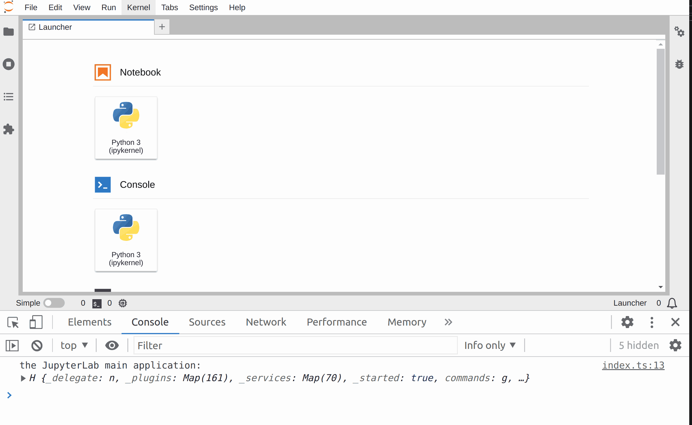

# Hello World

> Set up the development environment and print to the console.



- [The template folder structure](#the-template-folder-structure)
- [A minimal extension that prints to the browser console](#a-minimal-extension-that-prints-to-the-browser-console)
- [Building and Installing an Extension](#building-and-installing-an-extension)

## The template folder structure

Writing a JupyterLab extension usually starts from a configurable template. It
can be downloaded with the [`copier`](https://copier.readthedocs.io/) tool and the following command:

```bash
pip install "copier~=7.2" jinja2-time "pydantic<2.0.0"
mkdir my_extension
cd my_extension
copier copy https://github.com/jupyterlab/extension-template .
```

You will be asked for some basic information that could for example be setup
like this:

```bash
🎤 What is your extension kind?
   frontend
🎤 Extension author name
   tuto
🎤 Extension author email
   tuto@help.you
🎤 JavaScript package name
   hello-world
🎤 Python package name
   hello_world
🎤 Extension short description
   Minimal JupyterLab example.
🎤 Does the extension have user settings?
   No
🎤 Do you want to set up Binder example?
   Yes
🎤 Do you want to set up tests for the extension?
   Yes
🎤 Git remote repository URL
   https://github.com/github_username/hello-world
```

> The python name must be a valid Python module name (characters such `-`, `@` or `/` are not allowed).
> It is nice for user to test your extension online, so the _set up Binder_ was set to _Yes_.

The template creates creates files in the current director
that looks like this:

```bash
.
├── babel.config.js
├── binder
│   ├── environment.yml
│   └── postBuild
├── CHANGELOG.md
├── .copier-answers.yml
├── .github
│   └── workflows
│       ├── build.yml
│       ├── check-release.yml
│       ├── enforce-label.yml
│       ├── prep-release.yml
│       ├── publish-release.yml
│       └── update-integration-tests.yml
├── .gitignore
├── hello_world
│   └── __init__.py
├── install.json
├── jest.config.js
├── LICENSE
├── package.json
├── .prettierignore
├── pyproject.toml
├── README.md
├── RELEASE.md
├── setup.py
├── src
│   ├── index.ts
│   └── __tests__
│       └── hello_world.spec.ts
├── style
│   ├── base.css
│   ├── index.css
│   └── index.js
├── tsconfig.json
├── tsconfig.test.json
├── ui-tests
│   ├── jupyter_server_test_config.py
│   ├── package.json
│   ├── playwright.config.js
│   ├── README.md
│   ├── tests
│   │   └── hello_world.spec.ts
│   └── yarn.lock
└── .yarnrc.yml
```

Those files can be separated in 5 groups:

- Extension code (those files are mandatory):
  - `src/index.ts` _this contains the actual code of your extension_
  - `style/` folder contains style elements used by your extension
- Information about the extension:
  - `CHANGELOG.md` will be populated automatically by changes when using the suggested release tool.
  - `.copier-answers.yml` contains the answers given when generating the directory from the extension template.
  - `LICENSE` contains your extension code license; BSD-3 Clause by default (but you can change it).
  - `package.json` contains the JavaScript package metadata and configuration.
  - `README.md` contains some instructions to install and use the extension.
  - `RELEASE.md` contains instructions to release the extension.
- Configuration:
  - `binder/` contains configuration to test online your extension using [Binder](https://mybinder.org/).
  - `.gitignore` files to be ignored by Git (the recommended version control tool).
  - `.prettierignore` files to be ignored by JavaScript code formatter [`prettier`](https://prettier.io).
  - `package.json` contains the JavaScript configuration for the linters: [`eslint`](https://eslint.org), [`prettier`](https://prettier.io) and [`stylelint`](https://stylelint.io/).
  - `tsconfig.json` contains the typescript compilation configuration.
  - `.yarnrc.yml` contains the configuration of the JavaScript package manager `jlpm`.
- Tests:
  - `.github/workflows/build.yml` sets the continuous integration tests of the code using [GitHub Actions](https://help.github.com/en/actions)
  - `.github/workflows/update-integration-tests.yml` sets up a GitHub action to update integration test snapshots.
  - `.github/workflows/<others>.yml` set GitHub actions to check and handle release of the extension.
  - `jest.config.js`, `babel.config.js` and `tsconfig.test.json` configure the JavaScript test Framework [`jest`](https://jestjs.io/).
  - `ui-tests/` sets up integration tests using [`playwright`](https://playwright.dev/).
- Packaging as a Python package:
  - `pyproject.toml` contains the configuration to create the Python package (using [`hatch`](https://hatch.pypa.io/)) and to release it (using [`jupyter-releaser`](https://jupyter-releaser.readthedocs.io/)).
  - `install.json` contains information retrieved by JupyterLab to help users know how to manage the package
  - `hello_world/` folder contains the final code to be distributed
  - `setup.py` is present for backward compatibility with tools not supporting `pyproject.toml`.

The following sections will walk you through the extension code files.

## A minimal extension that prints to the browser console

Start with the file `src/index.ts`. This typescript file contains the main
logic of the extension. It begins with the following import section:

<!-- prettier-ignore-start -->
```ts
// src/index.ts#L1-L4

import {
  JupyterFrontEnd,
  JupyterFrontEndPlugin
} from '@jupyterlab/application';
```
<!-- prettier-ignore-end -->

`JupyterFrontEnd` is the main Jupyterlab application class. It allows you to
access and modify some of its main components. `JupyterFrontEndPlugin` is the class
of the extension that you are building. Both classes are imported from a package
called `@jupyterlab/application`. The dependency of your extension on this
package is declared in the file `package.json`:

```json5
// package.json#L54-L56

"dependencies": {
    "@jupyterlab/application": "^4.0.0"
},
```

With this basic import setup, you can move on to construct a new instance
of the `JupyterFrontEndPlugin` class:

<!-- prettier-ignore-start -->
```ts
// src/index.ts#L9-L13

const plugin: JupyterFrontEndPlugin<void> = {
  id: '@jupyterlab-examples/hello-world:plugin',
  description: 'Minimal JupyterLab extension.',
  autoStart: true,
  activate: (app: JupyterFrontEnd) => {
```

```ts
    console.log('JupyterLab extension hello-world is activated!');
```

```ts
// src/index.ts#L15-L18

  }
};

export default plugin;
```
<!-- prettier-ignore-end -->

A `JupyterFrontEndPlugin` contains a few attributes:

- `id`: the unique id of the extension
- `autoStart`: a flag to start the extension automatically or not
- `activate`: a
  function (`() => {}` notation) that takes one argument `app` of type
  `JupyterFrontEnd` and will be called by the main application to activate the extension.

`app` is the main JupyterLab application. The `activate` function acts as an entry
point into the extension. In this example, it calls the `console.log` function to output
something into the browser developer tools console.

Your new `JupyterFrontEndPlugin` instance has to be finally exported to be visible to
JupyterLab, which is done with the line `export default plugin`.

Now that the extension code is ready, you need to install it within JupyterLab.

## Building and Installing an Extension

These are the instructions on how your extension can be installed for development:

> You will need NodeJS to build the extension package.

```bash
# Install package in development mode
pip install -e .
# Link your development version of the extension with JupyterLab
jupyter labextension develop . --overwrite
# Rebuild extension Typescript source after making changes
jlpm run build
```

> The `jlpm` command is JupyterLab's pinned version of
> [yarn](https://yarnpkg.com/) that is installed with JupyterLab. You may use
> `yarn` or `npm` in lieu of `jlpm` below.

The first command installs the dependencies that are specified in the
`setup.py` file and in `package.json`. Among the dependencies are also all of the `JupyterLab` components that you want to use in your project.

It then runs the build script. In that step, the TypeScript code gets
converted to javascript using the compiler `tsc` and stored in a `lib`
directory. And a condensed form of the Javascript is copied in the Python
package (in the folder `hello_world/labextension`). This is the code that
would be installed by the user in JupyterLab.

The second command create a symbolic link to the folder `hello_world/labextension` so that extension is installed in development mode in JupyterLab.

The third command allows you to update the Javascript code each time you modify your
extension code.

After all of these steps are done, running `jupyter labextension list` should
show something like:

```bash
   local extensions:
        @jupyterlab-examples/hello-world: [...]/hello-world
```

Now let's check inside of JupyterLab if it works. Run:

```bash
jupyter lab
```

Your extension writes something to the browser console. In most web browsers you can
open the console pressing the `F12` key. You should see something like:

```
JupyterLab extension hello-world is activated
```

Your extension works but it is not doing much. Let's modify the source code
a bit. Simply replace the `activate` function with the following lines:

<!-- prettier-ignore-start -->
```ts
// src/index.ts#L13-L15

activate: (app: JupyterFrontEnd) => {
  console.log('The JupyterLab main application:', app);
}
```
<!-- prettier-ignore-end -->

To update the module, simply go to the extension directory and run
`jlpm build` again. You have to refresh the JupyterLab website in the browser
and should see in the browser console:

```
the JupyterLab main application:
Object { _started: true, _pluginMap: {…}, _serviceMap: Map(...), _delegate: {…}, commands: {…}, contextMenu: {…}, shell: {…}, registerPluginErrors: [], _dirtyCount: 0, _info: {…}, … }
```

This is the main application JupyterLab object and you will see how to interact
with it in the other examples.

> If you wish to avoid running `jlpm run build` after each change, executes
> `jlpm run watch` command from your extension directory. That command will
> automatically compile the TypeScript files as they are changed and saved.

Checkout how the core packages of JupyterLab are defined
[on this page](https://github.com/jupyterlab/jupyterlab/tree/main/packages). Each package is
structured similarly to the extension that you are writing. This modular
structure makes JupyterLab very adaptable.

An overview of the classes and their attributes and methods can be found in the
JupyterLab documentation. The `@jupyterlab/application` module documentation is
[here](https://jupyterlab.readthedocs.io/en/latest/api/modules/application.html)
and here is the [JupyterFrontEnd class documentation](https://jupyterlab.readthedocs.io/en/latest/api/modules/application.JupyterFrontEnd.html).

## Where to Go Next

JupyterLab is built on top of three major concepts. It is advised to look through the corresponding
examples in the following order:

- _command_: Function to be executed from UI elements. See the [commands example](../commands)
- _widget_: UI based brick. See the [widgets example](../widgets)
- _signal_: Observer pattern between JupyterLab elements. See the [signals example](../signals)
