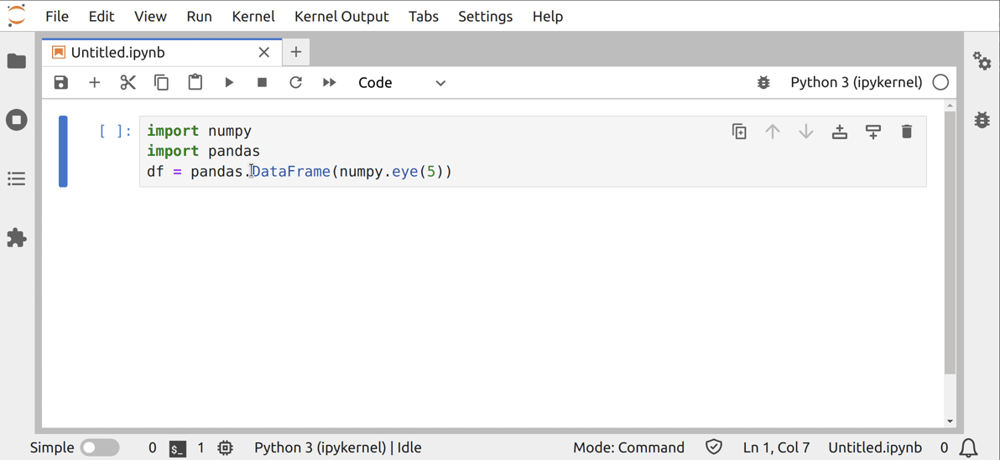

# Kernel Output

> Render kernel messages in an _OutputArea_.

- [Code structure](#code-structure)
- [Initializing a Kernel Session](#initializing-a-kernel-session)
- [OutputArea and Model](#outputarea-and-model)
- [Asynchronous Extension Initialization](#asynchronous-extension-initialization)
- [Make it Run](#make-it-run)



In this example, you will see how to initialize a kernel, execute code
and display the rendered output. The `OutputArea` class used by JupyterLab
to render an output area under a notebook cell or in the console will be reused.

Essentially, `OutputArea` will render the data that comes as a reply to an
execute message sent to an underlying kernel. Under the hood, the
`OutputArea` and the `OutputAreaModel` classes act similarly to the `KernelView`
and `KernelModel` classes defined in the [Kernel Messaging](../kernel-messaging/README.md)
example.

## Code structure

The code is split into two parts:

1.  the JupyterLab plugin that activates all the extension components and connects
    them to the main _JupyterLab_ application via commands and launcher
    items,
2.  a panel that contains the extension logic and UI elements to interact with it.

The first part is contained in the `index.ts` file and the second in `panel.ts`.

In the following sections, the logic will be first described. It is
followed by the creation of the visual element.

## Initializing a Kernel Session

To interact with a kernel, you can create a `SessionContext`
object ([see the documentation](https://jupyterlab.readthedocs.io/en/latest/api/classes/apputils.SessionContext-1.html)).
Here it is stored in the private `_sessionContext` variable:

```ts
// src/panel.ts#L103-L103

private _sessionContext: SessionContext;
```

A `SessionContext` handles a single kernel session. The session itself (not yet
the kernel) is started with these lines:

```ts
// src/panel.ts#L49-L53

this._sessionContext = new SessionContext({
  sessionManager: manager.sessions,
  specsManager: manager.kernelspecs,
  name: 'Kernel Output'
});
```

The private session variable is exposed as read-only for other users
through a getter method:

```ts
// src/panel.ts#L81-L83

get session(): ISessionContext {
  return this._sessionContext;
}
```

A session dialog is created:

```ts
// src/panel.ts#L61-L63

this._sessionContextDialogs = new SessionContextDialogs({
  translator: translator
});
```

Once you have created a session and a session dialog, the associated kernel can
be initialized with this lines:

<!-- prettier-ignore-start -->
```ts
// src/panel.ts#L67-L78

void this._sessionContext
  .initialize()
  .then(async value => {
    if (value) {
      await this._sessionContextDialogs.selectKernel(this._sessionContext);
    }
  })
  .catch(reason => {
    console.error(
      `Failed to initialize the session in ExamplePanel.\n${reason}`
    );
  });
```
<!-- prettier-ignore-end -->

When a session has no predefined preferred kernel, a dialog will request the user to choose a kernel to start. Conveniently, this can
also be an already existing kernel.

The following two methods ensure the clean disposal of the session
when you close the panel.

```ts
// src/panel.ts#L85-L88

dispose(): void {
  this._sessionContext.dispose();
  super.dispose();
}
```

```ts
// src/panel.ts#L98-L101

protected onCloseRequest(msg: Message): void {
  super.onCloseRequest(msg);
  this.dispose();
}
```

## OutputArea and Model

The `SimplifiedOutputArea` class is a `Widget`, as described in the [widget example](../widgets/README.md).
It has the ability to display the results of a notebook cell execution.
You can instantiate it with a new `OutputAreaModel`; this class is containing
the data to show:

```ts
// src/panel.ts#L55-L59

this._outputareamodel = new OutputAreaModel();
this._outputarea = new SimplifiedOutputArea({
  model: this._outputareamodel,
  rendermime: rendermime
});
```

`OutputArea` provides a static method `execute` that sends
some code to a kernel through a `ISessionContext` ([see documentation](https://jupyterlab.readthedocs.io/en/latest/api/functions/outputarea.OutputArea.execute.html)). And then it displays the result
in the specific `SimplifiedOutputArea` object you created:

```ts
// src/panel.ts#L90-L96

execute(code: string): void {
  OutputArea.execute(code, this._outputarea, this._sessionContext)
    .then((msg: KernelMessage.IExecuteReplyMsg | undefined) => {
      console.log(msg);
    })
    .catch(reason => console.error(reason));
}
```

The `OutputArea.execute` function receives at some point a response
message from the kernel which says that the code was executed (this message
does not contain the data that is displayed). When this message is received,
`.then` is executed and prints this message to the console.

To display the `SimplifiedOutputArea` Widget you need to add it to your
panel with:

```ts
// src/panel.ts#L65-L65

this.addWidget(this._outputarea);
```

The last step is to add the panel to the JupyterLab main area.

## Asynchronous Extension Initialization

`index.ts` contains the code to initialize the extension.

First, it is a good practice to unify the extension commands into one namespace at the top of the file:

```ts
// src/index.ts#L19-L23

namespace CommandIDs {
  export const create = 'kernel-output:create';

  export const execute = 'kernel-output:execute';
}
```

You can then add the commands to the palette by iterating
on a list:

```ts
// src/index.ts#L100-L103

// add items in command palette and menu
[CommandIDs.create, CommandIDs.execute].forEach(command => {
  palette.addItem({ command, category });
});
```

To create a new client session, the service manager must be obtained from
the JupyterLab application:

```ts
// src/index.ts#L53-L53

const manager = app.serviceManager;
```

To launch the panel, you need to wait for the service manager to be
ready. Then once the panel is created and its session is ready, it
can be added to the JupyterLab main area:

```ts
// src/index.ts#L58-L69

let panel: ExamplePanel;

/**
 * Creates a example panel.
 *
 * @returns The panel
 */
async function createPanel(): Promise<ExamplePanel> {
  panel = new ExamplePanel(manager, rendermime, translator);
  shell.add(panel, 'main');
  return panel;
}
```

## Make it Run

To make the output area useful, you will request the user to enter a statement
to be executed by the kernel. Then you will send it to your panel for execution
and display:

```ts
// src/index.ts#L78-L102

commands.addCommand(CommandIDs.execute, {
  label: trans.__('Contact Kernel and Execute Code'),
  caption: trans.__('Contact Kernel and Execute Code'),
  execute: async () => {
    // Prompt the user about the statement to be executed
    const input = await InputDialog.getText({
      title: trans.__('Code to execute'),
      okLabel: trans.__('Execute'),
      placeholder: trans.__('Statement to execute')
    });
    // Execute the statement
    if (input.button.accept) {
      const code = input.value || '';
      if (!panel) {
        // Create the panel if it does not exist
        createPanel().then(async panel => {
          await panel.session.ready;
          panel.execute(code);
        });
      } else {
        panel.execute(code);
      }
    }
  }
});
```

Any advanced output can be displayed by the `SimplifiedOutputArea` widget, from
raw text to [interactive ipywidgets](https://ipywidgets.readthedocs.io/).
In the GIF below, it is assumed you have a variable, named `df`, in your python kernel that contains a [pandas](https://pandas.pydata.org/) dataframe. By entering
the variable name in the input dialog, it will be displayed in the example panel.


## Where to Go Next

This example makes use of input dialogs. To know which input dialogs are available
have a look at the [documentation](https://jupyterlab.readthedocs.io/en/stable/extension/ui_helpers.html#dialogs).
