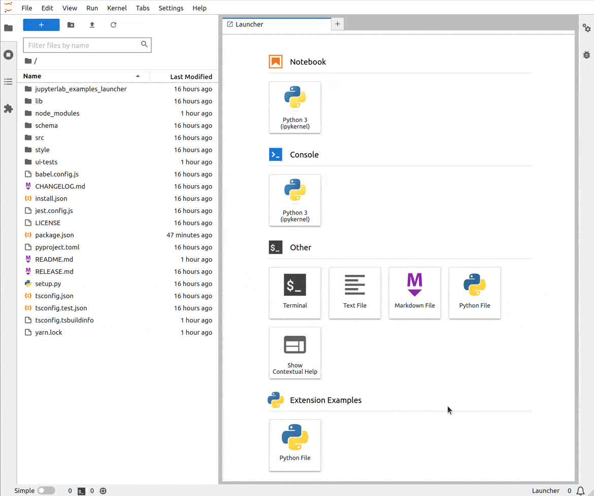

# Launcher

> Start your extension from the Launcher.

In this example, you will learn how to start your extension from the launcher and how to have optional
dependencies to JupyterLab features.



> Credit: This example is copied from Jeremy Tuloup [Python file extension](https://github.com/jtpio/jupyterlab-python-file).

This example allows to create an empty Python file. To do so,
your extension will use two commands defined by the [documents manager](https://github.com/jupyterlab/jupyterlab/blob/master/packages/docmanager-extension/src/index.tsx#L52-L82) of JupyterLab:

- `'docmanager:new-untitled'`: Create new untitled document
- `'docmanager:open'`: Open a document

The command will create a new Python file and then open it:

<!-- prettier-ignore-start -->
```ts
// src/index.ts#L41-L64

commands.addCommand(command, {
  label: (args) => (args['isPalette'] ? 'New Python File' : 'Python File'),
  caption: 'Create a new Python file',
  icon: (args) => (args['isPalette'] ? null : icon),
  execute: async (args) => {
    // Get the directory in which the Python file must be created;
    // otherwise take the current filebrowser directory
    const cwd =
      args['cwd'] || browserFactory.tracker.currentWidget.model.path;

    // Create a new untitled python file
    const model = await commands.execute('docmanager:new-untitled', {
      path: cwd,
      type: 'file',
      ext: 'py',
    });

    // Open the newly created file with the 'Editor'
    return commands.execute('docmanager:open', {
      path: model.path,
      factory: FACTORY,
    });
  },
});
```
<!-- prettier-ignore-end -->

To link that command to the JupyterLab launcher, the `ILauncher` interface needs to be passed to the `activate`
extension function. As that interface is provided by the `@jupyterlab/launcher` package, it needs first to be installed:

```bash
jlpm add @jupyterlab/launcher
```

Then you can use it in the extension by importing it:

```ts
// src/index.ts#L10-L10

import { ILauncher } from '@jupyterlab/launcher';
```

And finally you can add it to the list of dependencies:

```ts
// src/index.ts#L23-L33

const extension: JupyterFrontEndPlugin<void> = {
  id: 'launcher',
  autoStart: true,
  requires: [IFileBrowserFactory],
  optional: [ILauncher, ICommandPalette],
  activate: (
    app: JupyterFrontEnd,
    browserFactory: IFileBrowserFactory,
    launcher: ILauncher | null,
    palette: ICommandPalette | null
  ) => {
```

In this example, the `ILauncher` interface is requested as optional dependency
and not as a required dependency. This lets other applications without a launcher
be able to use your extension.

If the application is unable to provide an optional interface, it will take a `null`
value.

Therefore before adding the command to the launcher, you need to check if the `launcher`
variable is not `null`:

```ts
// src/index.ts#L66-L73

// Add the command to the launcher
if (launcher) {
  launcher.add({
    command,
    category: 'Extension Examples',
    rank: 1,
  });
}
```

## Where to Go Next

This example uses a _command_. This is an essential concept of JupyterLab. To know more about it
have a look at the [command example](../commands/README.md).

An user can execute a command from other UI elements than the launcher. To
know more about those other possibilities, you could look at the following examples:

- Add the command to the [command palette](../command-palette/README.md)
- Add the command to a [menu](../main-menu/README.md)
