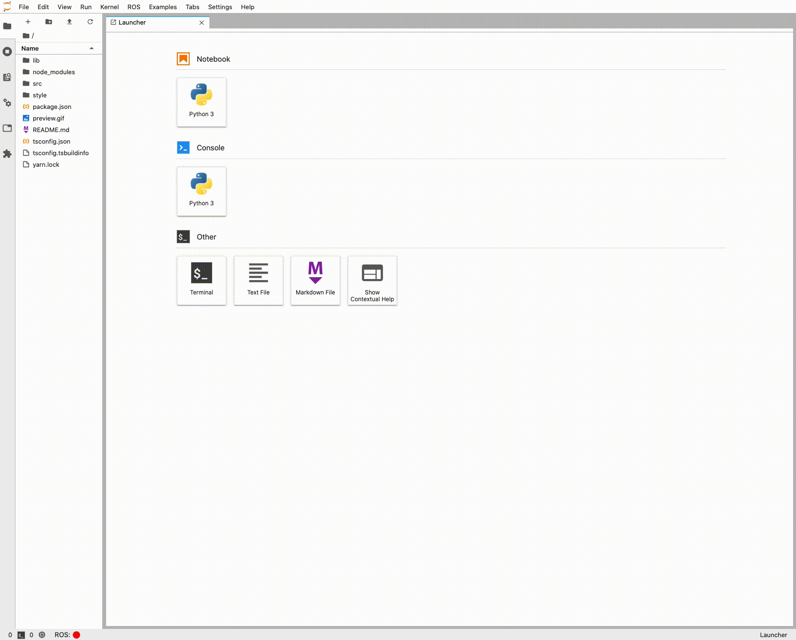

# Custom log console

> Create a custom log console.

This example shows how to create a log console to print log messages from a JupyterLab extension.



The default log console extension present in JupyterLab obtains log outputs from the kernel context of the current active notebook, that let log console to change the source input once we open a new notebook to show the log messages originated in this new one. There are different options to approach the problem, two of them are:

1. Obtain the current active notebook and send message to his `Logger` instance ([explained here](https://github.com/jupyterlab/extension-examples/tree/master/log-messages)).
2. Create your custom log console (we will explain in this example).

> Note:
> It is strongly recommended to read [commands](https://github.com/jupyterlab/extension-examples/tree/master/commands), [command-palette](https://github.com/jupyterlab/extension-examples/tree/master/command-palette), [main-menu](https://github.com/jupyterlab/extension-examples/tree/master/main-menu), [widget-tracker](https://github.com/jupyterlab/extension-examples/tree/master/widget-tracker) and [react-widget](https://github.com/jupyterlab/extension-examples/tree/master/react/react-widget) examples before diving into this one.

To implement this log console you need to install the following packages:

- `@jupyterlab/logconsole`: Where you can find the different UI components and message format.
- `@jupyterlab/rendermime`: Used to create renderers for various mime-types.
- `@jupyterlab/nbformat`: Only necessary if you want to use the notebook output format as the type of message.

To make this example a functional exercise you need to use some other packages that you can find in the code, but the strict necessaries for the log-console are those described above.

Additionally, this example has two files, in the first one index.ts, you will find all the logic of the extension and in the second one logLevelSwitcher.tsx, is just a react component used on the toolbar to switch between different log's levels.

First of all, we will start looking into the declaration of our extension:

<!-- prettier-ignore-start -->
```ts
// src/index.ts#L13-L24

const extension: JupyterFrontEndPlugin<void> = {
  id: 'log',
  autoStart: true,
  requires: [ICommandPalette, IRenderMimeRegistry, IMainMenu, ILayoutRestorer],
  optional: [],
  activate: (
    app: JupyterFrontEnd,
    palette: ICommandPalette,
    rendermime: IRenderMimeRegistry,
    mainMenu: IMainMenu,
    restorer: ILayoutRestorer
  ) => {
```
<!-- prettier-ignore-end -->

To create a new log console is required IRenderMimeRegistry which is necessary as a default rendermime in the LoggerRegistry to render the outputs, moreover, you will need JupyterFrontEnd to have access to some JupyterLab features, ICommandPalette to register some commands, IMainMenu to add some commands to the main menu and ILayoutRestorer to restore the extension after reloading the page.

In the activate function, the first step is to declare `logConsolePanel` and `logConsoleWidget`, therefore, you can pass their reference to the commands, so this commands will be able to interact with the widget even when deleting and creating a new one after closing the tab, furthermore, track them before launching our widget.

<!-- prettier-ignore-start -->
```ts
// src/index.ts#L28-L29

let logConsolePanel: LogConsolePanel = null;
let logConsoleWidget: MainAreaWidget<LogConsolePanel> = null;
```
<!-- prettier-ignore-end -->

The next step you will need to do is to create a new widget once you click on the button to open the custom log console. For clarity and understanding, we define a new function `createLogConsoleWidget` where you can find all the logic necessary to initialize a new `LogConsoleWidget` and add it to the main screen of JupyterLab.

<!-- prettier-ignore-start -->
```ts
// src/index.ts#L60

const createLogConsoleWidget = () => {
```
<!-- prettier-ignore-end -->

To initialize a new `LogConsoleWidget` you have to create a `LogConsolePanel` which is the main component of `LogConsoleWidget` and who will hold the log messages, on the other hand `LogConsoleWidget` needs a `LoggerRegistry` which is in charge of registering and adding new logs to the panel, `LoggerRegistry` expect two options, the default rendermime and the maximum length for logs.

<!-- prettier-ignore-start -->
```ts
// src/index.ts#L61-L66

logConsolePanel = new LogConsolePanel(
  new LoggerRegistry({
    defaultRendermime: rendermime,
    maxLength: 1000
  })
);
```
<!-- prettier-ignore-end -->

The `source` property identifies where the message comes from and is necessary to initialize the the `logger` object present on `LogConsolePanel` because this object will let you send log messages to the log console and change the log level. On the logconsole-extension present in jupyterlab, `source` identifies the kernel output of the active notebook, so when changing the notebook you are writing the log console change his logs. In this case, you can use every string you want but is recommended to use the name of your extension.

<!-- prettier-ignore-start -->
```ts
// src/index.ts#L68

logConsolePanel.source = "jlab-examples";
```
<!-- prettier-ignore-end -->

Now you are ready to initialize a new `MainAreaWidget` passing the `logConsolePanel` as content.

<!-- prettier-ignore-start -->
```ts
// src/index.ts#70

logConsoleWidget = new MainAreaWidget<LogConsolePanel>({ content: logConsolePanel });
```
<!-- prettier-ignore-end -->

The last step of the function `createLogConsoleWidget` is to establish how to proceed after a dispose request. The `dispose` method is present in Lumino widgets and is used to indicate Javascript that this widget is ready to be garbage collected. In this case, this method is called when you close the tab closing the `MainAreaWidget`, so you need to delete the `logConsolePanel` and `logConsoleWidget` instances to clean all logs and be ready to initialize a new widget when you decide to open the tab again.

<!-- prettier-ignore-start -->
```ts
// src/index.ts#L194-L98

logConsoleWidget.disposed.connect(() => {
  logConsoleWidget = null;
  logConsolePanel = null;
  commands.notifyCommandChanged();
});
```
<!-- prettier-ignore-end -->

To launch a new log console, you can add a new command. In this case, you can use the option `isToggled` to make the button checkable to open and close the log console with the same button. In the `execute` function there is an `if` statement to check when closing and deleting the `MainAreaWidget`, and when creating and opening a new one calling `createLogConsoleWidget`.

<!-- prettier-ignore-start -->

```ts
// src/index.ts#L107-L118

commands.addCommand('jlab-examples/log:open', {
  label: 'Custom log console',
  caption: 'Custom log console.',
  isToggled: () => logConsoleWidget !== null,
  execute: () => {
    // If the widget is opened we will close it
    // and if it's close we will open.
    if (logConsoleWidget) {
      logConsoleWidget.dispose();
    } else {
      createLogConsoleWidget();
    }
  }
});
```

Finally, you can send log messages calling `log` method present on the `logger` property of `logConsolePanel`. This method let you send different types of logs like `IHtmlLog`, `ITextLog` and `IOutputLog`.

<!-- prettier-ignore-start -->

```ts
// src/index.ts#L127-L133

const msg: IHtmlLog = {
  type: 'html',
  level: 'debug',
  data: `<div>Hello world HTML!!</div>`
};

logConsolePanel?.logger?.log(msg);
```

<!-- prettier-ignore-start -->

```ts
// src/index.ts#L142-L148

const msg: ITextLog = {
  type: 'text',
  level: 'info',
  data: 'Hello world text!!'
};

logConsolePanel?.logger?.log(msg);
```

<!-- prettier-ignore-start -->

```ts
// src/index.ts#L157-L170

const data: nbformat.IOutput = {
  output_type: 'display_data',
  data: {
    'text/plain': 'Hello world nbformat!!'
  }
};

const msg: IOutputLog = {
  type: 'output',
  level: 'warning',
  data
};

logConsolePanel?.logger?.log(msg);
```
