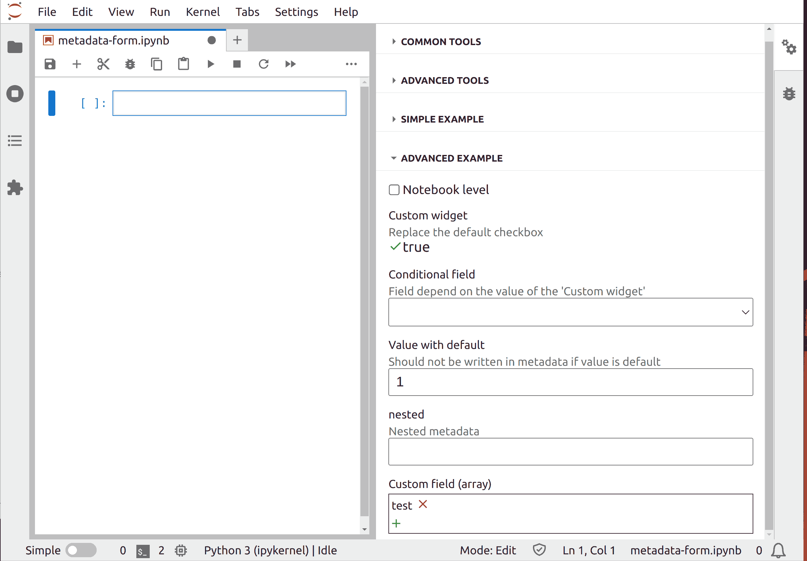

# Metadata form

> Create a schema and display the form in `NotebookTools`.


The Notebook files includes metadata at the Notebook or cell level, in JSON format.

This metadata can be filled using the NotebookTools panel (right panel), with a dedicated form and editors:

- the _common tool_ is a form giving access to some metadata.
- the _advanced tool_ is composed of two JSON editors to modify the metadata of the cell or the Notebook.

This example explains how to create a custom form to interact with metadata.

## Building a simple form


The forms are build using [react-json-schema-form (RJSF)](https://rjsf-team.github.io/react-jsonschema-form/docs/),
which rely on [JSON schema](https://json-schema.org/) for the format.

To build a new metadata-form, the first step is to create a JSON file in the _schema_ directory of the extension.

Here is a basic JSON file to create a form with two entries:

<!-- prettier-ignore-start -->
```json5
// schema/simple.json

{
  "type": "object",
  "title": "Metadata Form example",
  "description": "Settings of the metadata form extension.",
  "jupyter.lab.metadataforms": [
    {
      "id": "@jupyterlab-examples/metadata-form:simple",
      "label": "Simple example",
      "metadataSchema": {
        "type": "object",
        "properties": {
          "/my-extension/simple-integer": {
            "title": "Integer",
            "description": "An integer field",
            "type": "integer"
          },
          "/my-extension/simple-string": {
            "title": "Text",
            "description": "A text field",
            "type": "string"
          }
        }
      }
    }
  ],
  "additionalProperties": false
}

```
<!-- prettier-ignore-end -->

Without specific settings, this form will interact with cell metadata (default behavior). See the [Advanced section](#interacting-with-notebook-level-metadata) to interact with Notebook metadata.

First we need to tell JupyterLab which plugin will consume this information:

<!-- prettier-ignore-start -->
```json5
// schema/simple.json#L5-L5

"jupyter.lab.metadataforms": [
```
<!-- prettier-ignore-end -->

The metadata-form needs a unique _id_ and a _label_ (the section name in the Notebook tools).

<!-- prettier-ignore-start -->
```json5
// schema/simple.json#L7-L8

"id": "@jupyterlab-examples/metadata-form:simple",
"label": "Simple example",
```
<!-- prettier-ignore-end -->

The `metadataSchema` property is the schema that _RJSF_ will interprets to build the form.
Its minimal properties are `type` and `properties`.

In the case of metadata-form, each key of the `properties` object is the path of the metadata (nested if necessary).

In the simple example, the cell metadata are `simple-integer` (an integer field) and `simple-string` (a text field), both in `my-extension` object.

<!-- prettier-ignore-start -->
```json5
// schema/simple.json#L12-L21

"/my-extension/simple-integer": {
  "title": "Integer",
  "description": "An integer field",
  "type": "integer"
},
"/my-extension/simple-string": {
  "title": "Text",
  "description": "A text field",
  "type": "string"
}
```
<!-- prettier-ignore-end -->

Finally, to create the form, the JSON file must be associated to an extension. In this simple example, the extension do not do anything since the whole information is contained in the JSON file.

```ts
// src/index.ts#L17-L23

const simple: JupyterFrontEndPlugin<void> = {
  id: '@jupyterlab-examples/metadata-form:simple',
  autoStart: true,
  activate: (app: JupyterFrontEnd) => {
    console.log('Simple metadata-form example activated');
  }
};
```

**CAUTION** the extension ID must end with the file name (without the file extension _.json_):

```ts
// src/index.ts#L18-L18

id: '@jupyterlab-examples/metadata-form:simple',
```

## Building an advanced form



The JSON schema of the advanced form is quite similar but uses some more properties to customize the form.

Let's see some of the feature that can be used.

### **Using RJSF ui:schema**

_RJSF_ comes with some options to specify how the form should be rendered: [RJSF ui:schema](https://rjsf-team.github.io/react-jsonschema-form/docs/api-reference/uiSchema/).

In this example the [ui:order](https://rjsf-team.github.io/react-jsonschema-form/docs/usage/objects#specifying-property-order) key is used to modify the order of the fields in the form.

<!-- prettier-ignore-start -->
```json5
// schema/advanced.json#L69-L79

"uiSchema": {
  "ui:order": [
    "/notebook-level",
    "/my-extension/raw-cells",
    "/my-extension/active",
    "/my-extension/conditional",
    "/default-value",
    "/my-extension/nested/more-nested/test",
    "/custom-array"
  ]
},
```
<!-- prettier-ignore-end -->

### **Using conditional fields**

JSON schema can apply conditional fields, using [if-then-else](https://json-schema.org/understanding-json-schema/reference/conditionals.html#if-then-else) properties.

It is better to includes these properties in an `allOf` object to be able to manage several conditions. This is what is done in this example, by displaying the field `conditional` only if the field `active` is set to true.

<!-- prettier-ignore-start -->
```json5
// schema/advanced.json#L47-L67

"allOf": [
  {
    "if": {
      "properties": {
        "/my-extension/active": {
          "const": true
        }
      }
    },
    "then": {
      "properties": {
        "/my-extension/conditional": {
          "title": "Conditional field",
          "description": "Field depend on the value of the 'Custom widget'",
          "type": "string",
          "enum": ["condition1", "condition2", "condition3"]
        }
      }
    }
  }
]
```
<!-- prettier-ignore-end -->

### **Using metadata-form options**

The metadata-form provides some options to customize more specifically the form and its behavior, using the special key `metadataOptions` in the schema.

<!-- prettier-ignore-start -->
```json5
// schema/advanced.json#L80-L80

"metadataOptions": {
```
<!-- prettier-ignore-end -->

It is possible to set options for any metadata described in the `metadataSchema/properties` object.

#### **Customizing widgets**

_RJSF_ comes with a set of predefined widgets (input) for each data type. However we can replace the default widget by a custom one.

The widget is a function that takes a `WidgetProps` argument, defined in [@rjsf/utils](https://github.com/rjsf-team/react-jsonschema-form/blob/24cd2bc64fe032f59eaee16ad01e0e605ff965fe/packages/utils/src/types.ts#L645).

In the advanced example, a `checkbox` widget is changed to to a span:

<!-- prettier-ignore-start -->
```tsx
// src/customWidget.tsx

import React from 'react';
import { WidgetProps } from '@rjsf/utils';
import { checkIcon, closeIcon } from '@jupyterlab/ui-components';

export const CustomCheckbox = function (props: WidgetProps) {
  return (
    <span
      id="metadataform-example-custom-widget"
      style={{ display: 'flex', fontSize: '16px' }}
      className={`metadata-form-example-custom-checkbox ${
        props.value ? 'checked' : 'unchecked'
      }`}
      onClick={() => props.onChange(!props.value)}
    >
      {props.value && <checkIcon.react />}
      {!props.value && <closeIcon.react />}
      {String(props.value)}
    </span>
  );
};

```
<!-- prettier-ignore-end -->

The important thing here is the use of the `onChange()` function, which triggers the saving of the metadata and the rendering of the widget:

```ts
// src/customWidget.tsx#L13-L13

onClick={() => props.onChange(!props.value)}
```

Some CSS is also added:

```scss
// style/base.css#L28-L34

.metadata-form-example-custom-checkbox.checked .jp-icon3 {
  fill: var(--jp-success-color1);
}

.metadata-form-example-custom-checkbox.unchecked .jp-icon3 {
  fill: var(--jp-error-color1);
}
```

A `widgetRenderer` must be created when initializing the extension, and registered with a unique id to be usable in the form:

```ts
// src/index.ts#L38-L46

const component: IFormRenderer = {
  widgetRenderer: (props: WidgetProps) => {
    return CustomCheckbox(props);
  }
};
formRegistry.addRenderer(
  '@jupyterlab-examples/metadata-form:advanced.custom-checkbox',
  component
);
```

Finally the renderer must be declared in the `metadataOptions` of the schema, using the `customRenderer` property :

<!-- prettier-ignore-start -->
```json5
// schema/advanced.json#L81-L83

"/my-extension/active": {
  "customRenderer": "@jupyterlab-examples/metadata-form:advanced.custom-checkbox"
},
```
<!-- prettier-ignore-end -->

#### **Customizing fields**

It is also possible to customize the whole field, which is interesting to display custom array or object.

The example used here replaces an array with a custom field in [customField.tsx](src/customField.tsx), with some CSS in [base.css](style/base.css). Here a class is implemented. The `render()` function is the function that will be registered as a field.

Updating the metadata must be done manually, by calling the `updateMetadata` function, with the metadata to update and the value(s):

<!-- prettier-ignore-start -->
```ts
// src/customField.tsx#L35-L38

this._props.formContext.updateMetadata(
  { [this._props.name]: formData },
  true
);
```
<!-- prettier-ignore-end -->

This function is called when adding or removing an entry in the array.
The second argument is a boolean that indicates whether the field should be rendered again or not.

Again, a renderer must be registered, as a `FieldRenderer` this time:

```ts
// src/index.ts#L48-L56

const customField: IFormRenderer = {
  fieldRenderer: (props: FieldProps) => {
    return new CustomField().render(props);
  }
};
formRegistry.addRenderer(
  '@jupyterlab-examples/metadata-form:advanced.custom-field',
  customField
);
```

and the renderer must be declared in the `metadataOptions` of the schema:

<!-- prettier-ignore-start -->
```json5
// schema/advanced.json#L93-L95

"/custom-array": {
  "customRenderer": "@jupyterlab-examples/metadata-form:advanced.custom-field"
}
```
<!-- prettier-ignore-end -->

#### **Interacting with Notebook level metadata**

In the `metadataOptions` object, the `metadataLevel` level must be set to `"notebook"`:

<!-- prettier-ignore-start -->
```json5
// schema/advanced.json#L90-L92

"/notebook-level": {
  "metadataLevel": "notebook"
},
```
<!-- prettier-ignore-end -->

#### **Displaying the field depending on the cell type**

It is possible to display some field only for some types of cell. This can be done with the `cellTypes` property, that must be filled with an array of `"code" | "markdown" | "raw"`.

<!-- prettier-ignore-start -->
```json5
// schema/advanced.json#L84-L86

"/my-extension/raw-cells": {
  "cellTypes": ["raw"]
},
```
<!-- prettier-ignore-end -->

#### **Default values**

Each metadata can have a default value. It is possible to not save the metadata entry when the value is the default.

<!-- prettier-ignore-start -->
```json5
// schema/advanced.json#L27-L32

"/default-value": {
  "title": "Value with default",
  "description": "Should not be written in metadata if value is default",
  "type": "integer",
  "default": 1
},
```
<!-- prettier-ignore-end -->

<!-- prettier-ignore-start -->
```json5
// schema/advanced.json#L87-L89

"/default-value": {
  "writeDefault": false
},
```
<!-- prettier-ignore-end -->

## Several forms for one extension

In the example presented here, two extensions were created to display two forms. This is only for a didactic reason. The two forms could have been described in a single JSON file, initializing a single extension.
Indeed, the `"jupyter.lab.metadataforms"` object is an array, each item being a form.
