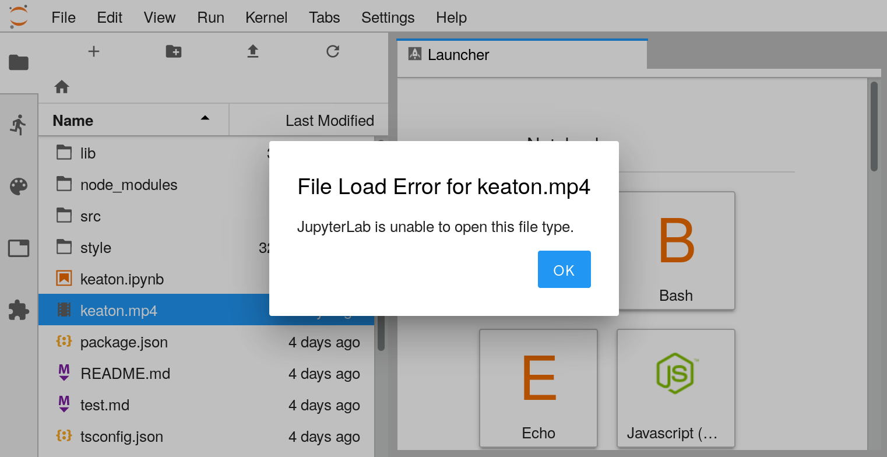
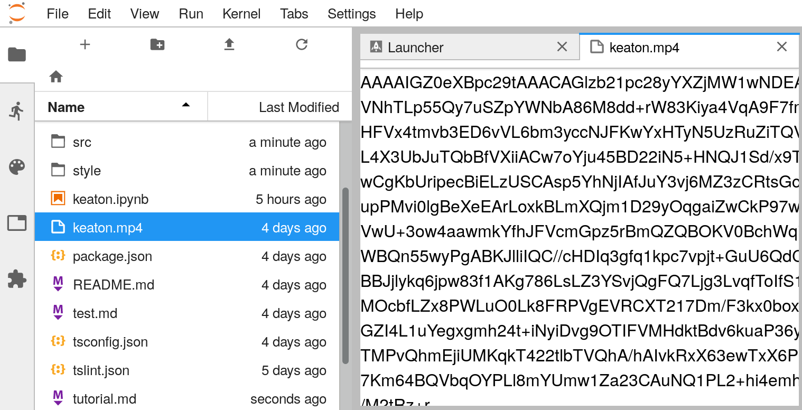

# Tutorial

The [MIME type](https://developer.mozilla.org/en-US/docs/Web/HTTP/Basics_of_HTTP/MIME_types)
of a data source is a standard way to indicate the type of that data.
JupyterLab (and Project Jupyter as a whole) make
[wide use](https://jupyter-client.readthedocs.io/en/stable/messaging.html#display-data)
of MIME types to decide how to render data.

This tutorial will teach you how to make a
[mimerenderer extension](https://jupyterlab.readthedocs.io/en/latest/developer/extension_dev.html#mime-renderer-extensions)
for JupyterLab.
These extensions are simpler to write than full-fledged JupyterLab extensions,
and are focused around adding the ability to render new MIME types to the application.
Specifically, we will be adding the ability for Jupyter Lab to render mp4 videos.

### 1. Initialize the project
We will initialize the project by using a [cookiecutter](https://github.com/audreyr/cookiecutter). Enter the following in your terminal:
```bash
cookiecutter https://github.com/jupyterlab/mimerender-cookiecutter-ts.git 
```
This will copy the project template for a mimerenderer extension and
prepopulate it with the answers you give in a series of questions.
Answer the questions as follows (with appropriate choices for `<Your name>` and `<Your email>`):

```bash
author_name []: <Your name>
author_email []: <Your email>
extension_name [myextension]: jupyterlab-mp4
viewer_name [My Viewer]: JupyterLab mp4 viewer
mimetype [application/vnd.my_organization.my_type]: video/mp4
mimetype_name [my_type]: mp4
file_extension [.my_type]: .mp4
Select data_format:
1 - string
2 - json
Choose from 1, 2 [1]: 1
```

We now want to check this new extension directory into version control:
```
cd jupyterlab-mp4
git init
git add .
git commit -m "Initial commit from cookiecutter"
```

### 2. Build and install the extension

Your new extension project has enough code in it to see it working in
your JupyterLab. Run the following commands to install the initial
project dependencies and install it in the JupyterLab environment. We
defer building since it will be built in the next step.

```bash
jlpm install
jlpm run build
jupyter labextension install . --no-build
```

Once the install completes, run this command to watch your extension code for
changes so that it can recompile them as soon as you make them:

```bash
jlpm run watch
```

Now, open a second terminal and run this command to start a JupyterLab instance
that will watch your *built* extension for changes, and incorporate them
into the application as it runs:

```bash
jupyter lab --watch
```

These two watch processes should significantly speed up the
extension development experience. When the JupyterLab watch process
incorporates changes, you can refresh the page to see them take effect.

### 3. Browse the code

Now let's take a look at the core code for this extension. Open `src/index.ts` to browse it.
There are three main data structures here:
1. The `OutputWidget` class. This is the class that takes the data of your MIME type and knows how to render it to an HTML DOM node. This contains most of the logic for the extension.
2. The `rendererFactory` object. This object knows how to create new instances of the `OutputWidget` class for use in the application.
3. The `extension` object. This is the main entry point for your extension. It describes the metadata necessary for JupyterLab to load and use the extension.

### 4. Rename `OutputWidget`

`OutputWidget` is not a very descriptive name for our rendered video class. Let's rename `OutputWidget` to `VideoWidget`.

```text/x-diff
--- a/src/index.ts
+++ b/src/index.ts
@@ -19,7 +19,7 @@ const CLASS_NAME = 'mimerenderer-mp4';
 /**
  * A widget for rendering mp4.
  */
-export class OutputWidget extends Widget implements IRenderMime.IRenderer {
+export class VideoWidget extends Widget implements IRenderMime.IRenderer {
   /**
    * Construct a new output widget.
    */
@@ -49,7 +49,7 @@ export class OutputWidget extends Widget implements IRenderMime.IRenderer {
 export const rendererFactory: IRenderMime.IRendererFactory = {
   safe: true,
   mimeTypes: [MIME_TYPE],
-  createRenderer: options => new OutputWidget(options)
+  createRenderer: options => new VideoWidget(options)
 };
```

Let's commit this change:
```bash
git commit -a -m "Rename OutputWidget to VideoWidget"
```

### 5. Choose a sample mp4

In order to test our mp4 video, we will want one handy.
Choose a `.mp4` from the internet, or use the one in the demo repository:

```bash
wget https://raw.githubusercontent.com/jupyterlab/jupyterlab-mp4/master/keaton.mp4
``` 
<video controls width=600 src="keaton.mp4"></video>

### 6. Set the model format

Let's try to open your new video in JupyterLab.
Find it in the filebrowser and double-click.



Ouch! The reason that JupyterLab is unable to open this file is that it is binary,
and the application is defaulting to reading it as plain text.
We need to inform JupyterLab to interpret the file as a
[base64-encoded](https://developer.mozilla.org/en-US/docs/Web/API/WindowBase64/Base64_encoding_and_decoding)
file before we can load it from disk correctly.
To do this, make the following changes to the `extension` object:

```text/x-diff
--- a/src/index.ts
+++ b/src/index.ts
@@ -63,6 +63,7 @@ const extension: IRenderMime.IExtension = {
   fileTypes: [
     {
       name: 'mp4',
+      fileFormat: 'base64',
       mimeTypes: [MIME_TYPE],
       extensions: ['.mp4']
     }
@@ -70,6 +71,7 @@ const extension: IRenderMime.IExtension = {
   documentWidgetFactoryOptions: {
     name: 'JupyterLab mp4 viewer',
     primaryFileType: 'mp4',
+    modelName: 'base64',
     fileTypes: ['mp4'],
     defaultFor: ['mp4']
   }
```
and commit them.
```bash
git commit -a -m "Use base64 encoding for the file type"
```

Now let's try to rebuild the extension and reload the video:



Well, it's loading, but it's also not a video.

### 7. Render the video

The cookiecutter extension defaults to dumping the data into the host node as text.
We will need to put that data into an HTML video tag.
Make the following edits to `src/index.ts`:

```text/x-diff
--- a/src/index.ts
+++ b/src/index.ts
@@ -27,19 +27,22 @@ export class VideoWidget extends Widget implements IRenderMime.IRenderer {
     super();
     this._mimeType = options.mimeType;
     this.addClass(CLASS_NAME);
+    this._video = document.createElement('video');
+    this._video.setAttribute('controls', '');
+    this.node.appendChild(this._video);
   }
 
   /**
    * Render mp4 into this widget's node.
    */
   renderModel(model: IRenderMime.IMimeModel): Promise<void> {
-    
     let data = model.data[this._mimeType] as string;
-    this.node.textContent = data.slice(0, 16384);
+    this._video.src = `data:${MIME_TYPE};base64,${data}`;
     
     return Promise.resolve();
   }
 
+  private _video: HTMLVideoElement;
   private _mimeType: string;
 }
```
and commit them.

```bash
git commit -a -m "Add an HTML video element to output"
```

These changes take the base64 encoded data and adds it as a
[data URL](https://developer.mozilla.org/en-US/docs/Web/HTTP/Basics_of_HTTP/Data_URIs)
to the `src` attribute of an HTML `<video>` tag.
That `<video>` tag is added to the DOM node of the `VideoWidget`.

Rebuild the application and try to open the video again.
You should now be able to play the video!

### 8. Style the video

Your video extension should work, but its layout leaves something to be desired.
We can fix up the sizing of the video in its input frame by adding
the following to `style/index.css`:

```text/x-diff
--- a/style/index.css
+++ b/style/index.css
@@ -0,0 +1,8 @@
+.mimerenderer-mp4 {
+  overflow: auto;
+}
+
+.mimerenderer-mp4 video {
+  width: 100%;
+  height: auto;
+}
```
and commit it:
```bash
git commit -a -m "Make the video the full width of its container"
```

### 9. Give .mp4 files a nice icon (optional)

The video file icon in the file browser and tab show a generic file icon.
We can add a more appropriate icon to apply to `.mp4` files here as well.
Get the SVG icons (You will need to restart the `jupyter lab --watch`
process to pick up these new files):

```
cd style
wget https://raw.githubusercontent.com/jupyterlab/jupyterlab-mp4/master/style/movie-light.svg
wget https://raw.githubusercontent.com/jupyterlab/jupyterlab-mp4/master/style/movie-dark.svg
git add *.svg
```

We can then add CSS classes for these icons:
```text/x-diff
--- a/style/index.css
+++ b/style/index.css
@@ -6,3 +6,11 @@
+
+[data-jp-theme-light="true"] .mimerenderer-mp4-icon {
+  background-image: url(movie-light.svg);
+}
+
+[data-jp-theme-light="false"] .mimerenderer-mp4-icon {
+  background-image: url(movie-dark.svg);
+}
```

The `[data-jp-theme-light]` selectors allow you to use a different icon
depending upon whether the overall JupyterLab theme is light or dark.
We can now add this new CSS class to the `mp4` file type in the extension:
```text/x-diff
--- a/src/index.ts
+++ b/src/index.ts
@@ -66,6 +66,7 @@ const extension: IRenderMime.IExtension = {
   fileTypes: [
     {
       name: 'mp4',
+      iconClass: 'jp-MaterialIcon mimerenderer-mp4-icon',
       fileFormat: 'base64',
       mimeTypes: [MIME_TYPE],
       extensions: ['.mp4']
```
Commit these changes, and we are done!

```bash
git commit -a -m "Add movie icon"
```
