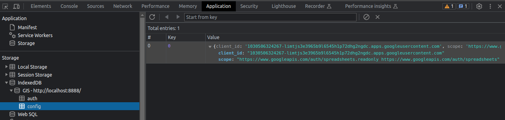
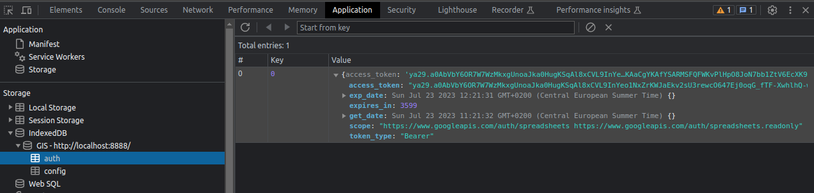
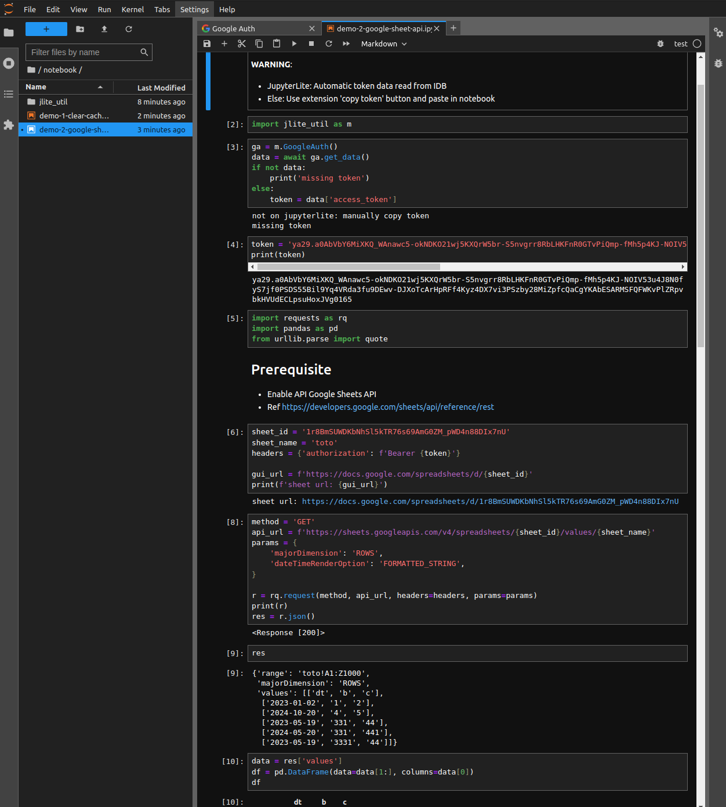

# React Auth Google Widget

This extension is based on the [ReactWidget](https://github.com/jupyterlab/extension-examples/tree/main/react-widget) and enables users to log in with Google Identity service for webapps and then use the token to interact with Google services.  
A notebook to read/write Google sheets is included.

Browser IndexDB stores:

- Google auth config:
  

- Google auth token data:
  

- Get token:
  

- Use token from notebook to read/write a Google sheet (for example):
  [demo-2-google-sheet-api.ipynb](./notebook/demo-2-google-sheet-api.ipynb)
  

## Dev Install

Commands:

```sh
# from folder react-auth-google

# Required to deal with Yarn 3 workspace rules
touch yarn.lock

# install the extension in editable mode
python -m pip install -e .

# install your development version of the extension with JupyterLab
jupyter labextension develop . --overwrite

# build the TypeScript source once
jlpm build

# first terminal
# build the TypeScript source in watch mode
jlpm watch

# second terminal
# start JupyterLab in watch mode
jupyter lab --no-browser --watch

```

## Install

```bash
jlpm
jlpm build
jupyter labextension install .

# Rebuild Typescript source after making changes
jlpm build
# Rebuild JupyterLab after making any changes
jupyter lab build
```

You can watch the source directory and run JupyterLab in watch mode to watch for changes in the extension's source and automatically rebuild the extension and application.

```bash
# Watch the source directory in another terminal tab
jlpm watch
# Run jupyterlab in watch mode in one terminal tab
jupyter lab --watch
```
