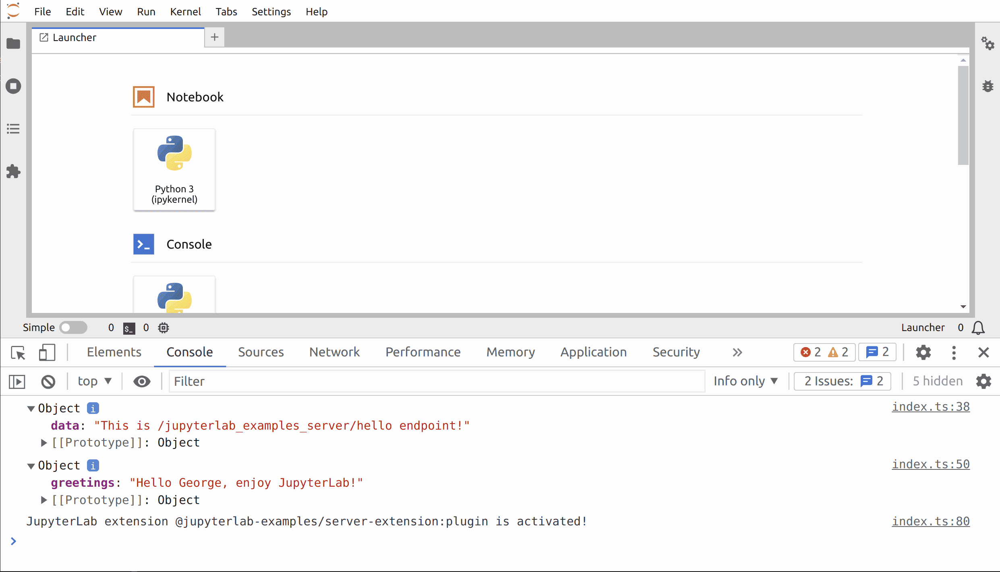

# Server Hello World

> Create a minimal extension with backend (i.e. server) and frontend parts.



It is strongly recommended to read the [basic hello-world](../hello-world)
example before diving into this one.

- [The template folder structure](#the-template-folder-structure)
- [Frontend Part](#frontend-part)
- [Backend (server) Part](<#backend-(server)-part>)
- [Packaging the Extension](#packaging-the-extension)
- [Installing the Package](#installing-the-package)

## The template folder structure

Writing a JupyterLab extension usually starts from a configurable template. It
can be downloaded with the [`cookiecutter`](https://cookiecutter.readthedocs.io/en/latest/) tool and the following command for an extension with a server part:

<!-- prettier-ignore-start -->
```bash
cookiecutter https://github.com/jupyterlab/extension-cookiecutter-ts
```

`cookiecutter` asks for some basic information that could for example be setup
like this (be careful to set _has\_server\_extension_ to _y_):

```bash
author_name []: my_name
python_name [myextension]: jlab_ext_example
extension_name [jlab_ext_example]: jlab-ext-example
project_short_description [A JupyterLab extension.]: A minimal JupyterLab extension with backend and frontend parts.
has_server_extension [n]: y
has_binder [n]: y
repository [https://github.com/github_username/jlab_ext_example]:
```

> The python name should not contain `-`. It is nice for user to test your extension online, so the `has_binder` was set to _yes_.

The cookiecutter creates the directory `jlab_ext_example` [or your extension name]
that looks like this:

```bash
jlab_ext_example/
│  # Generic Files
│   .gitignore
│   install.json                # Information retrieved by JupyterLab to help users know how to manage the extension
│   LICENSE                     # License of your code
│   README.md                   # Instructions to install and build
│
├───.github
│   └───workflows
│           build.yml
│
├───binder
│       environment.yml
│       postBuild
│  
│  # Python Package Files
│   MANIFEST.in                 # Help Python to list your source files
│   pyproject.toml              # Define dependencies for building the package
│   setup.py                    # Information about the package
│
│  # Backend (server) Files
├───jupyter-config
│       jlab_ext_example.json   # Server extension enabler
│
├───jlab_ext_example
│       handlers.py             # API handler (where things happen)
│       _version.py             # Server extension version
│       __init__.py             # Hook the extension in the server
│  
│  # Frontend Files
│   .eslintignore               # Code linter configuration
│   .eslintrc.js
│   .prettierignore             # Code formatter configuration
│   .prettierrc
│   package.json                # Information about the frontend package
│   tsconfig.json               # Typescript compilation configuration
│  
├───src
│       index.ts                # Actual code of the extension
│       handler.ts       # More code used by the extension
│
└───style
        base.css               # CSS styling
        index.css
        index.js
```

There are two major parts in the extension:

- A Python package for the server extension and the packaging
- A NPM package for the frontend extension

In this example, you will see that the template code have been extended
to demonstrate the use of GET and POST HTTP requests.

## Frontend Part

The entry point for the frontend extension is `src/index.ts`. The
communication with the server extension is contained in another file
`src/handler.ts`. So you need to import it:

```ts
// src/index.ts#L12-L12

import { requestAPI } from './handler';
```

In the `activate` function, the server extension is first called through
a GET request on the endpoint _/jlab-ext-example/hello_. The response from the server
is printed in the web browser console:

```ts
// src/index.ts#L36-L42

// GET request
try {
  const data = await requestAPI<any>('hello');
  console.log(data);
} catch (reason) {
  console.error(`Error on GET /jlab-ext-example/hello.\n${reason}`);
}
```

As the server response is not instantaneous, the request is done asynchronously
using the `await` keyword:

```ts
// src/index.ts#L38-L38

const data = await requestAPI<any>('hello');
```

To use that `await` keyword, the function must be declared as asynchronous
using the `async` keyword:

```ts
// src/index.ts#L29-L33

activate: async (
  app: JupyterFrontEnd,
  palette: ICommandPalette,
  launcher: ILauncher | null
) => {
```

A GET request cannot carry data from the frontend to the server. To achieve that,
you will need to execute a POST request. In this example, a POST request
is sent to the _/jlab-ext-example/hello_ endpoint with the data `{name: 'George'}`:

```ts
// src/index.ts#L45-L56

const dataToSend = { name: 'George' };
try {
  const reply = await requestAPI<any>('hello', {
    body: JSON.stringify(dataToSend),
    method: 'POST'
  });
  console.log(reply);
} catch (reason) {
  console.error(
    `Error on POST /jlab-ext-example/hello ${dataToSend}.\n${reason}`
  );
}
```

The difference with the GET request is the use of the `body` option to send data
and the `method` option to set the appropriate HTTP method.

The data sent from the frontend to the backend can have different types. In
JupyterLab, the most common format is JSON. But JSON cannot directly be sent to
the server, it needs to be stringified to be carried over by the request.

The communication logic with the server is hidden in the `requestAPI` function.
Its definition is :

```ts
// src/handler.ts#L12-L37

export async function requestAPI<T>(
  endPoint = '',
  init: RequestInit = {}
): Promise<T> {
  // Make request to Jupyter API
  const settings = ServerConnection.makeSettings();
  const requestUrl = URLExt.join(
    settings.baseUrl,
    'jlab-ext-example',
    endPoint
  );

  let response: Response;
  try {
    response = await ServerConnection.makeRequest(requestUrl, init, settings);
  } catch (error) {
    throw new ServerConnection.NetworkError(error);
  }

  const data = await response.json();

  if (!response.ok) {
    throw new ServerConnection.ResponseError(response, data.message);
  }

  return data;
```

First the server settings are obtained from:

```ts
// src/handler.ts#L17-L17

const settings = ServerConnection.makeSettings();
```

This requires to add `@jupyterlab/services` to the package dependencies:

```bash
jlpm add @jupyterlab/services
```

Then the class `ServerConnection` can be imported:

```ts
// src/handler.ts#L3-L3

import { ServerConnection } from '@jupyterlab/services';
```

The next step is to build the full request URL:

```ts
// src/handler.ts#L18-L21

const requestUrl = URLExt.join(
  settings.baseUrl,
  'jlab-ext-example',
  endPoint
```

To concatenate the various parts, the `URLExt` utility is imported:

```ts
// src/handler.ts#L1-L1

import { URLExt } from '@jupyterlab/coreutils';
```

This requires to add another dependency to the package:

```bash
jlpm add @jupyterlab/coreutils
```

You now have all the elements to make the request:

```ts
// src/handler.ts#L26-L26

response = await ServerConnection.makeRequest(requestUrl, init, settings);
```

Finally, once the server response is obtained, its body is interpreted as
JSON. And the resulting data is returned.

```ts
// src/handler.ts#L31-L37

const data = await response.json();

if (!response.ok) {
  throw new ServerConnection.ResponseError(response, data.message);
}

return data;
```

This example also showcases how you can serve static files from the server extension.

```ts
// src/index.ts#L58-L79

const { commands, shell } = app;
const command = CommandIDs.get;
const category = 'Extension Examples';

commands.addCommand(command, {
  label: 'Get Server Content in a IFrame Widget',
  caption: 'Get Server Content in a IFrame Widget',
  execute: () => {
    const widget = new IFrameWidget();
    shell.add(widget, 'main');
  }
});

palette.addItem({ command, category: category });

if (launcher) {
  // Add launcher
  launcher.add({
    command: command,
    category: category
  });
}
```

Invoking the command (via the command palette or the launcher) will open a new tab with
an `IFrame` that will display static content fetched from the server extension.

**Note**

- If the response is not ok (i.e. status code not in range 200-299),
  a `ResponseError` is thrown.
- The response body is interpreted as JSON even in case the response is not
  ok. In JupyterLab, it is a good practice in case of error on the server
  side to return a response with a JSON body. It should at least define a
  `message` key providing nice error message for the user.

## Backend (Server) Part

The server part of the extension is going to be presented in this section.

JupyterLab server is built on top of the [Tornado](https://tornadoweb.org/en/stable/guide.html) Python package. To extend the server,
your extension needs to be defined as a proper Python package with some hook functions:

```py
# jlab_ext_example/__init__.py

import json
from pathlib import Path

from .handlers import setup_handlers
from ._version import __version__

HERE = Path(__file__).parent.resolve()

with (HERE / "labextension" / "package.json").open() as fid:
    data = json.load(fid)


def _jupyter_labextension_paths():
    return [{"src": "labextension", "dest": data["name"]}]


def _jupyter_server_extension_points():
    return [{"module": "jlab_ext_example"}]


def _load_jupyter_server_extension(server_app):
    """Registers the API handler to receive HTTP requests from the frontend extension.
    Parameters
    ----------
    server_app: jupyterlab.labapp.LabApp
        JupyterLab application instance
    """
    url_path = "jlab-ext-example"
    setup_handlers(server_app.web_app, url_path)
    server_app.log.info(
        f"Registered jlab_ext_example extension at URL path /{url_path}"
    )

# For backward compatibility with the classical notebook
load_jupyter_server_extension = _load_jupyter_server_extension

```

The `_jupyter_server_extension_points` provides the Python package name
to the server. But the most important one is `_load_jupyter_server_extension`
that register new handlers.

```py
# jlab_ext_example/__init__.py#L29-L29

setup_handlers(server_app.web_app, url_path)
```

A handler is registered in the web application by linking an url to a class. In this
example the url is _base_server_url_`/jlab-ext-example/hello` and the class handler is `RouteHandler`:

```py
# jlab_ext_example/handlers.py#L28-L34

host_pattern = ".*$"
base_url = web_app.settings["base_url"]

# Prepend the base_url so that it works in a JupyterHub setting
route_pattern = url_path_join(base_url, url_path, "hello")
handlers = [(route_pattern, RouteHandler)]
web_app.add_handlers(host_pattern, handlers)
```

For Jupyter server, the handler class must inherit from the `APIHandler` and it should
implement the wanted HTTP verbs. For example, here, `/jlab-ext-example/hello` can be requested
by a _GET_ or a _POST_ request. They will call the `get` or `post` method respectively.

```py
# jlab_ext_example/handlers.py#L11-L24

class RouteHandler(APIHandler):
    # The following decorator should be present on all verb methods (head, get, post,
    # patch, put, delete, options) to ensure only authorized user can request the
    # Jupyter server
    @tornado.web.authenticated
    def get(self):
        self.finish(json.dumps({"data": "This is /jlab-ext-example/hello endpoint!"}))

    @tornado.web.authenticated
    def post(self):
        # input_data is a dictionary with a key "name"
        input_data = self.get_json_body()
        data = {"greetings": "Hello {}, enjoy JupyterLab!".format(input_data["name"])}
        self.finish(json.dumps(data))
```

**Security Note**

> The methods to handle request like `get`, `post`, etc.
> must be decorated with `tornado.web.authenticated` to ensure only
> authenticated users can request the Jupyter server.

Once the server has carried out the appropriate task, the handler should finish the request
by calling the `finish` method. That method can optionally take an argument that will
become the response body of the request in the frontend.

```py
# jlab_ext_example/handlers.py#L16-L17

def get(self):
    self.finish(json.dumps({"data": "This is /jlab-ext-example/hello endpoint!"}))
```

In Jupyter, it is common to use JSON as format between the frontend and the backend.
But it should first be stringified to be a valid response body. This can be done using
`json.dumps` on a dictionary.

A _POST_ request is similar to a _GET_ request except it may have a body containing data
sent by the frontend. When using JSON as communication format, you can directly use the
`get_json_body` helper method to convert the request body into a Python dictionary.

```py
# jlab_ext_example/handlers.py#L22-L23

input_data = self.get_json_body()
data = {"greetings": "Hello {}, enjoy JupyterLab!".format(input_data["name"])}
```

The part responsible to serve static content with a `StaticFileHandler` handler
is the following:

```py
# jlab_ext_example/handlers.py#L37-L43

doc_url = url_path_join(base_url, url_path, "public")
doc_dir = os.getenv(
    "JLAB_SERVER_EXAMPLE_STATIC_DIR",
    os.path.join(os.path.dirname(__file__), "public"),
)
handlers = [("{}/(.*)".format(doc_url), StaticFileHandler, {"path": doc_dir})]
web_app.add_handlers(".*$", handlers)
```

**Security Note**

> The `StaticFileHandler` is not secured.
> For enhanced security, please consider using `AuthenticatedFileHandler`.

**Note**

> Server extensions can be used for different frontends (like
> JupyterLab and the classical Jupyter Notebook). Some additional
> documentation is available in the [Notebook documentation](https://jupyter-notebook.readthedocs.io/en/stable/extending/handlers.html)

## Packaging the Extension

### Python Package Manager

In the previous sections, the acting code has been described. But there are other files
with the sole purpose of packaging the full extension nicely to help its distribution
through package managers like `pip`.

> Note: In particular, [`jupyter-packaging`](https://github.com/jupyter/jupyter-packaging) provides helpers to package and install JS files
> with a Python package for Jupyter frontends (classical notebook,
> JupyterLab,...).
> As this package is a setup requirement, it needs to be specified in the `pyproject.toml` to be installed by `pip`.

The `setup.py` file is the entry point to describe package metadata:

```py
# setup.py

"""
jlab_ext_example setup
"""
import json
from pathlib import Path

from jupyter_packaging import (
    create_cmdclass,
    install_npm,
    ensure_targets,
    combine_commands,
    skip_if_exists,
)
import setuptools

HERE = Path(__file__).parent.resolve()

# The name of the project
name = "jlab_ext_example"

lab_path = HERE / name / "labextension"

# Representative files that should exist after a successful build
jstargets = [
    str(lab_path / "package.json"),
]

package_data_spec = {name: ["*"]}

labext_name = "@jupyterlab-examples/server-extension"

data_files_spec = [
    ("share/jupyter/labextensions/%s" % labext_name, str(lab_path), "**"),
    ("share/jupyter/labextensions/%s" % labext_name, str(HERE), "install.json"),
    ("etc/jupyter/jupyter_notebook_config.d", "jupyter-config/jupyter_notebook_config.d", "jlab_ext_example.json"),
    ("etc/jupyter/jupyter_server_config.d", "jupyter-config/jupyter_server_config.d", "jlab_ext_example.json"),
]

cmdclass = create_cmdclass(
    "jsdeps", package_data_spec=package_data_spec, data_files_spec=data_files_spec
)

js_command = combine_commands(
    install_npm(HERE, build_cmd="build:prod", npm=["jlpm"]),
    ensure_targets(jstargets),
)

is_repo = (HERE / ".git").exists()
if is_repo:
    cmdclass["jsdeps"] = js_command
else:
    cmdclass["jsdeps"] = skip_if_exists(jstargets, js_command)

long_description = (HERE / "README.md").read_text()

# Get the package info from package.json
pkg_json = json.loads((HERE / "package.json").read_bytes())

setup_args = dict(
    name=name,
    version=pkg_json["version"],
    url=pkg_json["homepage"],
    author=pkg_json["author"],
    description=pkg_json["description"],
    license=pkg_json["license"],
    long_description=long_description,
    long_description_content_type="text/markdown",
    cmdclass=cmdclass,
    packages=setuptools.find_packages(),
    install_requires=[
        "jupyterlab~=3.0",
    ],
    zip_safe=False,
    include_package_data=True,
    python_requires=">=3.6",
    platforms="Linux, Mac OS X, Windows",
    keywords=["Jupyter", "JupyterLab", "JupyterLab3"],
    classifiers=[
        "License :: OSI Approved :: BSD License",
        "Programming Language :: Python",
        "Programming Language :: Python :: 3",
        "Programming Language :: Python :: 3.6",
        "Programming Language :: Python :: 3.7",
        "Programming Language :: Python :: 3.8",
        "Programming Language :: Python :: 3.9",
        "Framework :: Jupyter",
    ],
)


if __name__ == "__main__":
    setuptools.setup(**setup_args)

```

But in this case, it is a bit more complicated to build the frontend extension and ship it
directly with the Python package. To deploy simultaneously the frontend and the backend,
the frontend NPM package needs to be built and inserted in the Python package. This is
done using a special `cmdclass`:

```py
# setup.py#L39-L46

cmdclass = create_cmdclass(
    "jsdeps", package_data_spec=package_data_spec, data_files_spec=data_files_spec
)

js_command = combine_commands(
    install_npm(HERE, build_cmd="build:prod", npm=["jlpm"]),
    ensure_targets(jstargets),
)
```

Basically it will build the frontend NPM package:

```py
# setup.py#L44-L44

install_npm(HERE, build_cmd="build:prod", npm=["jlpm"]),
```

It will ensure one of the generated files is `jlab_ext_example/labextension/package.json`:

```py
# setup.py#L23-L26

# Representative files that should exist after a successful build
jstargets = [
    str(lab_path / "package.json"),
]
```

It will copy the NPM package in the Python package and force it to be copied in a place
JupyterLab is looking for frontend extensions when the Python package is installed:

```py
# setup.py#L33-L33

("share/jupyter/labextensions/%s" % labext_name, str(lab_path), "**"),
```

The last piece of configuration needed is the enabling of the server extension. This is
done by copying the following JSON file:

```json5
// jupyter-config/jlab_ext_example.json

{
  "ServerApp": {
    "jpserver_extensions": {
      "jlab_ext_example": true
    }
  }
}

```

in the appropriate jupyter folder (`etc/jupyter/jupyter_server_config.d`):

```py
# setup.py#L36-L36

("etc/jupyter/jupyter_server_config.d", "jupyter-config/jupyter_server_config.d", "jlab_ext_example.json"),
```

For backward compatibility with the classical notebook, the old version of that file is copied in
 (`etc/jupyter/jupyter_notebook_config.d`):

```py
# setup.py#L35-L35

("etc/jupyter/jupyter_notebook_config.d", "jupyter-config/jupyter_notebook_config.d", "jlab_ext_example.json"),
```

### JupyterLab Extension Manager

The distribution as a Python package has been described in the previous subsection. But
in JupyterLab, users have an extension manager at their disposal to find extensions. If,
like in this example, your extension needs a server extension, you should inform the
user about that dependency by adding the `discovery` metadata to your `package.json`
file:

```json5
// package.json#L70-L80

"jupyterlab": {
  "discovery": {
    "server": {
      "managers": [
        "pip"
      ],
      "base": {
        "name": "jlab_ext_example"
      }
    }
  },
```

In this example, the extension requires a `server` extension:

```json5
// package.json#L71-L71

"discovery": {
```

And that server extension is available through `pip`:

```json5
// package.json#L72-L74

"server": {
  "managers": [
    "pip"
```

For more information on the `discovery` metadata, please refer to the [documentation](https://jupyterlab.readthedocs.io/en/stable/extension/extension_dev.html#ext-author-companion-packages).

## Installing the Package

With the packaging described above, installing the extension is done in one command once the package is published on pypi.org:

```bash
# Install the server extension and
# copy the frontend extension where JupyterLab can find it
pip install jlab_ext_example
```

As developer, you might want to install the package in local editable mode.
This will shunt the installation machinery described above. Therefore the commands
to get you set are:

```bash
# Install package in development mode
pip install -e .
# Link your development version of the extension with JupyterLab
jupyter labextension develop . --overwrite
# Rebuild extension Typescript source after making changes
jlpm run build
```
<!-- prettier-ignore-end -->
