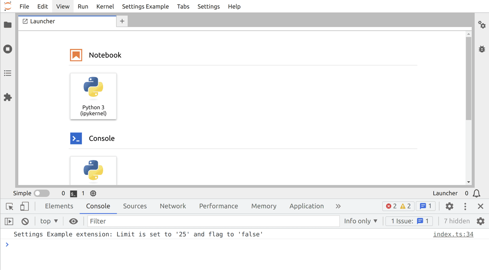

# Settings

> Create and use new Settings for your extension.

This example shows how to create and use settings
in a JupyterLab extension.



The core token required for handling the settings is
`ISettingRegistry` ([documentation](https://jupyterlab.github.io/jupyterlab/modules/_settingregistry_src_index_.isettingregistry.html)). To use it,
you first need to install its npm package:

```bash
jlpm add @jupyterlab/settingregistry
```

Once this is done, you can import the interface in your code.

<!-- prettier-ignore-start -->
```ts
// src/index.ts#L6-L6

import { ISettingRegistry } from '@jupyterlab/settingregistry';
```
<!-- prettier-ignore-end -->

To see how you can access the settings, let's have a look at
`src/index.ts`.

```ts
// src/index.ts#L19-L27

const extension: JupyterFrontEndPlugin<void> = {
  id: PLUGIN_ID,
  autoStart: true,
  requires: [IMainMenu, ISettingRegistry],
  activate: (
    app: JupyterFrontEnd,
    mainMenu: IMainMenu,
    settings: ISettingRegistry
  ) => {
```

The `ISettingRegistry` is passed to the `activate` function as an
argument (variable `settings`) in addition to the JupyterLab application
(variable `app`). You request that dependency with the property
`requires: [ISettingRegistry],`. It lists the additional arguments
you want to inject into the `activate` function in the `JupyterFontEndPlugin`.

But before going further, you need to define the settings of your
extension. This is done through a [JSON Schema](https://json-schema.org/understanding-json-schema/).
In the example it is called `schema/settings-example.json`.

<!-- prettier-ignore-start -->
```json5
// schema/settings-example.json

{
  "title": "Settings Example",
  "description": "Settings of the settings example.",
  "type": "object",
  "properties": {
    "limit": {
      "type": "integer",
      "title": "Limit",
      "description": "This is an example of an integer setting.",
      "default": 25
    },
    "flag": {
      "type": "boolean",
      "title": "Simple flag",
      "description": "This is an example of a boolean setting.",
      "default": false
    }
  }
}

```
<!-- prettier-ignore-end -->

The _title_ is the entry shown in the JupyterLab Advanced Settings. The
_description_ entry is a more detailed explanation of the extension using
those settings. The _type_ is a mandatory key required by [JSON Schema](https://json-schema.org/understanding-json-schema/reference/type.html).
For all extensions, this will be an `object` as the settings are defined
by a _dictionary_. Then the most important entry is `properties` describing a mapping of _setting id_ and the associated properties.

The naming of the file needs to follow a strict convention. When using
settings, your extension name must be structured as _package name_**:**_settings name_. The settings file must be named _settings name_. In the example, the package name is:

<!-- prettier-ignore-start -->
```json5
// package.json#L2-L2

"name": "@jupyterlab-examples/settings",
```
<!-- prettier-ignore-end -->

and the extension id is:

<!-- prettier-ignore-start -->
```ts
// src/index.ts#L12-L12

const PLUGIN_ID = '@jupyterlab-examples/settings:settings-example';
```
<!-- prettier-ignore-end -->

Therefore the settings file must be named `settings-example.json`.

The folder containing the settings definition needs to be specified in
the `package.json` file in the `jupyterlab` section (here `schema`):

<!-- prettier-ignore-start -->
```json5
// package.json#L75-L79

"jupyterlab": {
  "extension": true,
  "schemaDir": "schema",
  "outputDir": "jupyterlab_examples_settings/labextension"
},
```
<!-- prettier-ignore-end -->

And you should not forget to add it to the files of the package:

```json5
// package.json#L19-L24

"files": [
  "lib/**/*.{d.ts,eot,gif,html,jpg,js,js.map,json,png,svg,woff2,ttf}",
  "schema/**/*.json",
  "style/**/*.{css,eot,gif,html,jpg,json,png,svg,woff2,ttf}",
  "style/index.js"
],
```

Now that the settings are defined and included in the package, you can
use them inside your extension. Let's look at this example:

<!-- prettier-ignore-start -->
```ts
// src/index.ts#L19-L97

const extension: JupyterFrontEndPlugin<void> = {
  id: PLUGIN_ID,
  autoStart: true,
  requires: [IMainMenu, ISettingRegistry],
  activate: (
    app: JupyterFrontEnd,
    mainMenu: IMainMenu,
    settings: ISettingRegistry
  ) => {
    const { commands } = app;
    let limit = 25;
    let flag = false;

    /**
     * Load the settings for this extension
     *
     * @param setting Extension settings
     */
    function loadSetting(setting: ISettingRegistry.ISettings): void {
      // Read the settings and convert to the correct type
      limit = setting.get('limit').composite as number;
      flag = setting.get('flag').composite as boolean;

      console.log(
        `Settings Example extension: Limit is set to '${limit}' and flag to '${flag}'`
      );
    }

    // Wait for the application to be restored and
    // for the settings for this plugin to be loaded
    Promise.all([app.restored, settings.load(PLUGIN_ID)])
      .then(([, setting]) => {
        // Read the settings
        loadSetting(setting);

        // Listen for your plugin setting changes using Signal
        setting.changed.connect(loadSetting);

        commands.addCommand(COMMAND_ID, {
          label: 'Toggle Flag and Increment Limit',
          isToggled: () => flag,
          execute: () => {
            // Programmatically change a setting
            Promise.all([
              setting.set('flag', !flag),
              setting.set('limit', limit + 1),
            ])
              .then(() => {
                const newLimit = setting.get('limit').composite as number;
                const newFlag = setting.get('flag').composite as boolean;
                window.alert(
                  `Settings Example extension: Limit is set to '${newLimit}' and flag to '${newFlag}'`
                );
              })
              .catch((reason) => {
                console.error(
                  `Something went wrong when changing the settings.\n${reason}`
                );
              });
          },
        });

        // Create a menu
        const settingsMenu = new Menu({ commands });
        settingsMenu.title.label = 'Settings Example';
        mainMenu.addMenu(settingsMenu, { rank: 80 });

        // Add the command to the menu
        settingsMenu.addItem({
          command: COMMAND_ID,
        });
      })
      .catch((reason) => {
        console.error(
          `Something went wrong when reading the settings.\n${reason}`
        );
      });
  },
};
```
<!-- prettier-ignore-end -->

First, the extension waits for the application and for
your plugin settings to be loaded :

<!-- prettier-ignore-start -->
```ts
// src/index.ts#L49-L49

Promise.all([app.restored, settings.load(PLUGIN_ID)])
```
<!-- prettier-ignore-end -->

Then once the settings are loaded, each setting can be read using
the `get` method and the _setting id_ (the key defined in the settings
JSON file).

After getting the setting, you need to access the `composite` attribute
to get its value and specify the type explicitly.

<!-- prettier-ignore-start -->
```ts
// src/index.ts#L37-L45

function loadSetting(setting: ISettingRegistry.ISettings): void {
  // Read the settings and convert to the correct type
  limit = setting.get('limit').composite as number;
  flag = setting.get('flag').composite as boolean;

  console.log(
    `Settings Example extension: Limit is set to '${limit}' and flag to '${flag}'`
  );
}
```
<!-- prettier-ignore-end -->

> `composite` means the setting value is the composition of the default
> and the user values.

To react at a setting change by the user, you should use the signal
`changed`. In this case, when that signal is emitted the function
`loadSetting` is called with the new settings.

<!-- prettier-ignore-start -->
```ts
// src/index.ts#L55-L55

setting.changed.connect(loadSetting);
```
<!-- prettier-ignore-end -->

Finally, to demonstrate the programmatic change of a setting, a command to toggle
the `flag` and increment the `limit` settings is implemented.

<!-- prettier-ignore-start -->
```ts
// src/index.ts#L60-L78

execute: () => {
  // Programmatically change a setting
  Promise.all([
    setting.set('flag', !flag),
    setting.set('limit', limit + 1),
  ])
    .then(() => {
      const newLimit = setting.get('limit').composite as number;
      const newFlag = setting.get('flag').composite as boolean;
      window.alert(
        `Settings Example extension: Limit is set to '${newLimit}' and flag to '${newFlag}'`
      );
    })
    .catch((reason) => {
      console.error(
        `Something went wrong when changing the settings.\n${reason}`
      );
    });
},
```
<!-- prettier-ignore-end -->

The `set` method of `setting` is the one storing the
new value.

<!-- prettier-ignore-start -->
```ts
// src/index.ts#L63-L64

setting.set('flag', !flag),
setting.set('limit', limit + 1),
```
<!-- prettier-ignore-end -->

That command can be executed by clicking on the item menu created at the end of the
`activate` function.

<!-- prettier-ignore-start -->
```ts
// src/index.ts#L82-L89

const settingsMenu = new Menu({ commands });
settingsMenu.title.label = 'Settings Example';
mainMenu.addMenu(settingsMenu, { rank: 80 });

// Add the command to the menu
settingsMenu.addItem({
  command: COMMAND_ID,
});
```
<!-- prettier-ignore-end -->

Note

> This example uses [Promises](https://developer.mozilla.org/en-US/docs/Web/JavaScript/Reference/Global_Objects/Promise).
> This is a technology to handle asynchronous action like reading
> the settings in this example. So have a look at that [tutorial](https://scotch.io/tutorials/javascript-promises-for-dummies)
> if you want to know more about the `then`/`catch` used here.

## Where to Go Next

This example makes use of various concepts of JupyterLab. To
get more information about them, have a look at the corresponding examples:

- [Commands](../commands/README.md)
- [Main Menu](../main-menu/README.md)
- [Signal](../signals/README.md)

You may be interested to save state variables instead of settings; i.e. save variables that the
user is not aware of (e.g. the current opened widgets). For that, you
will need another core token `IStateDB` (see [that example](../state/README.md)
for more information).
