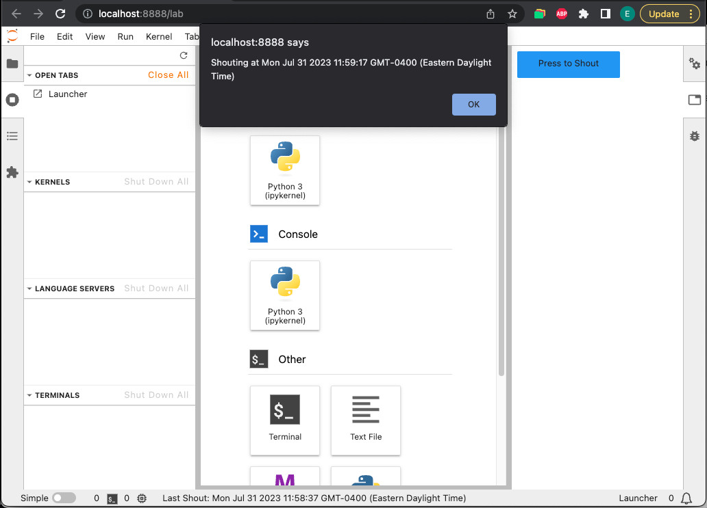

# Shout button (cross compatible extension)

This example defines an extension that adds a button in the right sidebar that
if clicked will display an alert to the user and in JupyterLab will update
a widget in the status bar.



We strongly advice to look to those examples before diving into this one:

- [signals](../signals/): Communication between JavaScript objects.
- [widgets](../widgets): The basic DOM Jupyter component.
- [Simple compatibility example](../toparea-text-widget): Extension working without modification in both Notebook and JupyterLab.

## Jupyter Notebook / JupyterLab compatibility

As Jupyter Notebook 7+ is built with components from JupyterLab, and since
both use the same building blocks, that means your extension can work
on both (or any other frontend built with JupyterLab components) with
little or no modification depending on its design.

This example has a part specific to JupyterLab. This translate by having
optional dependency for your extension plugin.

```ts
// src/index.ts#L122-L122

optional: [IStatusBar],
```

If your dependency is optional, the object pass to the `activate` method
will be `null` if no other plugin provides it.

```ts
// src/index.ts#L126-L126

activate: (app: JupyterFrontEnd, statusBar: IStatusBar | null) => {
```

## Add the button in the sidebar

You can add a widget to the right sidebar through the application shell:

```ts
// src/index.ts#L130-L133

const shoutWidget: ShoutWidget = new ShoutWidget();
shoutWidget.id = 'JupyterShoutWidget'; // Widgets need an id

app.shell.add(shoutWidget, 'right');
```

The `ShoutWidget` is a widget that contains a button that when clicked
emit a signal `messageShouted` that any callback can listen to to react
to it and display an alert to the user.

```ts
// src/index.ts#L101-L105

shout() {
  this._lastShoutTime = new Date();
  this._messageShouted.emit(this._lastShoutTime);
  window.alert('Shouting at ' + this._lastShoutTime);
}
```

## Connect the button and the status bar

The status bar does not exist in all Jupyter applications (e.g. in
Jupyter Notebook). So a good practice is to make that dependency
optional and test for it to be non-null to carry related action:

```ts
// src/index.ts#L137-L137

if (statusBar) {
```

In this specific case, the action is to create a widget to add to the
status bar. You can achieve that by calling the `registerStatusItem`
method from the status bar object.

```ts
// src/index.ts#L138-L140

const statusBarWidget = new ShoutStatusBarSummary();

statusBar.registerStatusItem('shoutStatusBarSummary', {
```

If you want to react to a click on the button, you can `connect` to the
widget `messageShouted` signal. In which for example, you update the
text displayed in the status bar.

```ts
// src/index.ts#L144-L146

// Connect to the messageShouted to be notified when a new message
// is published and react to it by updating the status bar widget.
shoutWidget.messageShouted.connect((widget: ShoutWidget, time: Date) => {
```

## Alternative approach

An alternative approach to condition a part of an extension with the
frontend used can be designed from the application name:

```ts
activate(app: JupyterFrontend) {
  switch(name) {
    case 'JupyterLab':
      console.log('The frontend used is JupyterLab.');
      break;
    case 'Jupyter Notebook':
      console.log('The frontend used is Jupyter Notebook.');
      break;
  }
}
```

## Where to Go Next

You should look at [Clap button](../clap-button-message) example to design compatible extension using two plugins.

You can have more information about making extension compatible with
multiple applications in the
[Extension Compatibility Guide](https://jupyterlab.readthedocs.io/en/latest/extension/extension_multiple_ui.html).
