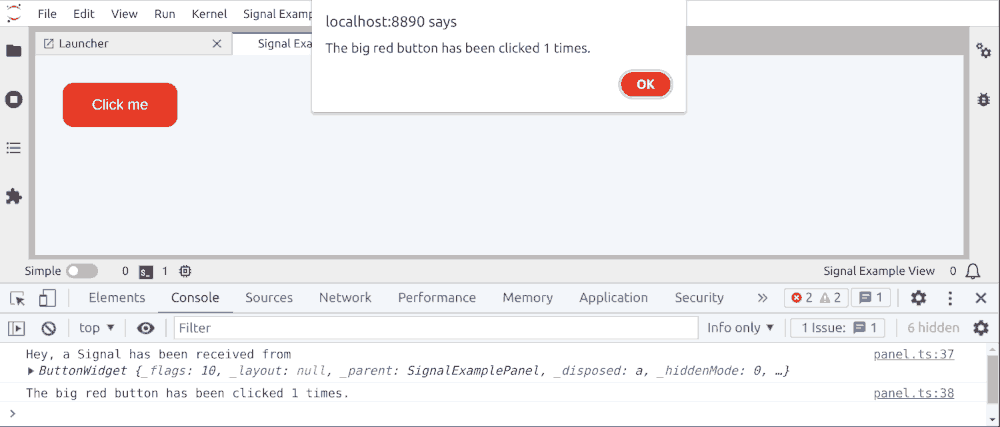

# Signals

> Use Signals to allow Widgets to communicate with each others.

- [Lumino Signaling 101](#lumino-signaling-101)
- [A simple HTML Button](#a-simple-html-button)
- [Subscribing to a Signal](#subscribing-to-a-signal)



## Lumino Signaling 101

Communication between different components of JupyterLab is a key ingredient in building an extension.

In this extension, a simple HTML button will be added to print something to the console.

JupyterLab's Lumino engine uses the `ISignal` interface and the
`Signal` class that implements this interface for communication
(read more on the [documentation](https://jupyterlab.github.io/lumino/signaling/index.html) page).

The basic concept is as follows:

First, a widget (`ButtonWidget` in `button.ts`), in this case the one that contains
some visual elements such as a button, defines a `_stateChanged` signal:

```ts
// src/button.ts#L32-L32

private _stateChanged = new Signal<ButtonWidget, ICount>(this);
```

That private signal is exposed to other widgets via a public accessor method.

```ts
// src/button.ts#L34-L36

public get stateChanged(): ISignal<ButtonWidget, ICount> {
  return this._stateChanged;
}
```

Another widget, in this case the panel (`SignalExamplePanel` in `panel.ts`) that can box several different widgets,
subscribes to the `stateChanged` signal and links a function to it:

```ts
// src/panel.ts#L33-L33

this._widget.stateChanged.connect(this._logMessage, this);
```

The `_logMessage` is executed when the signal is triggered from the first widget with:

```ts
// src/button.ts#L24-L24

this._stateChanged.emit(this._count);
```

Let's look at the implementations details.

## A Simple HTML Button

Start with a file called `src/button.ts`.

NB: For a React widget, you can try the [React Widget example](../react-widget) for more details.

`button.ts` contains one class `ButtonWidget` that extends the
`Widget` class provided by Lumino.

The constructor argument of the `ButtonWidget` class is assigned a default `HTMLButtonElement` node (e.g., `<button></button>`). The Widget's `node` property references its respective `HTMLElement`. For example, you can set the content of the button with `this.node.textContent = 'Click me'`.

```ts
// src/button.ts#L11-L11

constructor(options = { node: document.createElement('button') }) {
```

`ButtonWidget` also contains a private attribute `_count` of type `ICount`.

```ts
// src/button.ts#L28-L30

private _count: ICount = {
  clickCount: 0,
};
```

`ButtonWidget` further contains a private variable `_stateChanged` of type
`Signal`.

```ts
// src/button.ts#L32-L32

private _stateChanged = new Signal<ButtonWidget, ICount>(this);
```

A signal object can be triggered and then emits an actual signal.

Other Widgets can subscribe to such a signal and react when a message is
emitted.

The button `click` event will increment the `_count`
private attribute and will trigger the `_stateChanged` signal passing
the `_count` variable.

```ts
// src/button.ts#L22-L25

this.node.addEventListener('click', () => {
  this._count.clickCount = this._count.clickCount + 1;
  this._stateChanged.emit(this._count);
});
```

## Subscribing to a Signal

The `panel.ts` class defines an extension panel that displays the
`ButtonWidget` widget and that subscribes to its `stateChanged` signal.
This is done in the constructor.

```ts
// src/panel.ts#L19-L34

constructor(translator?: ITranslator) {
  super();
  this._translator = translator || nullTranslator;
  this._trans = this._translator.load('jupyterlab');
  this.addClass(PANEL_CLASS);

  //  This ensures the id of the DOM node is unique for each Panel instance.
  this.id = 'SignalExamplePanel_' + SignalExamplePanel._id++;

  this.title.label = this._trans.__('Signal Example View');
  this.title.closable = true;

  this._widget = new ButtonWidget();
  this.addWidget(this._widget);
  this._widget.stateChanged.connect(this._logMessage, this);
}
```

Subscription to a signal is done using the `connect` method of the
`stateChanged` attribute.

```ts
// src/panel.ts#L33-L33

this._widget.stateChanged.connect(this._logMessage, this);
```

It registers the `_logMessage` function which is triggered when the signal is emitted.

**Note**

From the official [JupyterLab Documentation](https://jupyterlab.readthedocs.io/en/stable/developer/patterns.html#signals):

> Wherever possible as signal connection should be made with the pattern `.connect(this._onFoo, this)`.
> Providing the `this` context enables the connection to be properly cleared by `clearSignalData(this)`.
> Using a private method avoids allocating a closure for each connection.

The `_logMessage` function receives as parameters the emitter (of type `ButtonWidget`)
and the count (of type `ICount`) sent by the signal emitter.

```ts
// src/panel.ts#L36-L36

private _logMessage(emitter: ButtonWidget, count: ICount): void {
```

In our case, that function writes `The big red button has been clicked ... times.` text
to the browser console and in an alert when the big red button is clicked.

```ts
// src/panel.ts#L36-L44

private _logMessage(emitter: ButtonWidget, count: ICount): void {
  console.log('Hey, a Signal has been received from', emitter);
  console.log(
    `The big red button has been clicked ${count.clickCount} times.`
  );
  window.alert(
    `The big red button has been clicked ${count.clickCount} times.`
  );
}
```

There it is. Signaling is conceptually important for building extensions.
