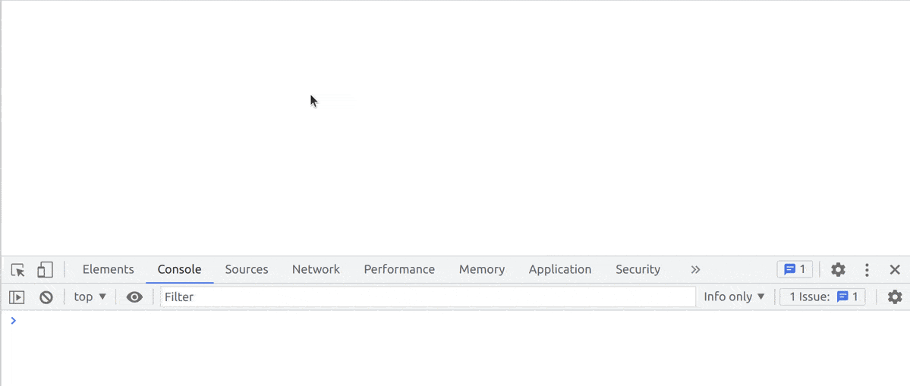

# State

> Use State persistence in an extension.

This example shows how to save and restore data saved in persistent state database
in a JupyterLab extension.



The core token required for handling the state database (DB) is
`IStateDB` ([documentation](https://jupyterlab.github.io/jupyterlab/interfaces/_statedb_src_index_.istatedb.html)).

To use it, you first need to install its npm package:

```bash
jlpm add @jupyterlab/statedb
```

Once this is done. You can import the interface in your code.

```ts
// src/index.ts#L8-L8

import { IStateDB } from '@jupyterlab/statedb';
```

To see how you can access the state, let's have a look at `src/index.ts`.

```ts
// src/index.ts#L17-L57

const extension: JupyterFrontEndPlugin<void> = {
  id: PLUGIN_ID,
  autoStart: true,
  requires: [IStateDB],
  activate: (app: JupyterFrontEnd, state: IStateDB) => {
    const options = ['one', 'two', 'three'];
    let option = options[0];

    app.restored
      // Get the state object
      .then(() => state.fetch(PLUGIN_ID))
      .then((value) => {
        // Get the option attribute
        if (value) {
          option = (value as ReadonlyJSONObject)['option'] as string;
          console.log(`Option ${option} read from state.`);
        }

        // Ask the user to pick a option with `option` as default
        return InputDialog.getItem({
          title: 'Pick an option to persist by the State Example extension',
          items: options,
          current: Math.max(0, options.indexOf(option)),
        });
      })
      .then((result) => {
        // If the user click on the accept button of the dialog
        if (result.button.accept) {
          // Get the user option
          option = result.value;
          // Save the option in the state database
          return state.save(PLUGIN_ID, { option });
        }
      })
      .catch((reason) => {
        console.error(
          `Something went wrong when reading the state for ${PLUGIN_ID}.\n${reason}`
        );
      });
  },
};
```

The `IStateDB` is passed to the `activate` function as an
argument (variable `state`) in addition to the JupyterLab application
(variable `app`).

You request that dependency with the property
`requires: [IStateDB],`. It lists the additional arguments
you want to inject into the `activate` function in the `JupyterFontEndPlugin`.

First, the extension waits for the application to be restored before
loading the state data for your plugin:

<!-- prettier-ignore-start -->
```ts
// src/index.ts#L25-L27

app.restored
  // Get the state object
  .then(() => state.fetch(PLUGIN_ID))
```
<!-- prettier-ignore-end -->

The data is loaded as a `ReadonlyJSONValue` object.

**Important**: All stored data must be JSON-able and its type value
should be specifically set when accessing the value.
For instance, in this example the variable `option` is of type `string`:

```ts
// src/index.ts#L30-L33

if (value) {
  option = (value as ReadonlyJSONObject)['option'] as string;
  console.log(`Option ${option} read from state.`);
}
```

The `if` test ensure some value has been read. It is important to set a default value.
Indeed the first time a user will install the extension, the state won't contain
any value for the plugin.

In the example, once the state is read, the user is prompted to choose an option from
an item list with the default option being stored as a state variable.

```ts
// src/index.ts#L36-L40

return InputDialog.getItem({
  title: 'Pick an option to persist by the State Example extension',
  items: options,
  current: Math.max(0, options.indexOf(option)),
});
```

This implies to store the new option done by the user in the state. This is done
using the `save` method of `IStateDB`:

```ts
// src/index.ts#L48-L48

return state.save(PLUGIN_ID, { option });
```

To see it in action,

1. Install the example within JupyterLab
2. Pick a different option that _one_
3. Refresh your browser
4. The input dialog should have your option as default value

Note

> This example uses [Promises](https://developer.mozilla.org/en-US/docs/Web/JavaScript/Reference/Global_Objects/Promise).
> This is a technology to handle asynchronous action like reading
> the settings in this example. So have a look at that [tutorial](https://scotch.io/tutorials/javascript-promises-for-dummies)
> if you want to know more about the `then`/`catch` used here.

## Where to Go Next

You may be interested to save settings instead of state; i.e. save variables that the
user knows and changes explicitly (e.g. which JupyterLab theme to use). For that, you
will need another core token `ISettingRegistry` (see [that example](../settings/README.md)
for more information).

This example makes use of a dialog to quickly request information from the user. JupyterLab
comes with a couple of helpful dialogs; see the [documentation](https://jupyterlab.readthedocs.io/en/stable/extension/ui_helpers.html#dialogs).
