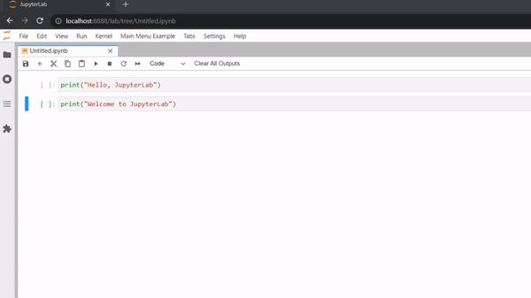

# Toolbar Item

This example shows how to add a button to the notebook toolbar.



In this particular example, the button will clear all cell outputs

To use it first you need to import the following packages:

```ts
// src/index.ts#L1-L16

import { IDisposable, DisposableDelegate } from '@lumino/disposable';

import {
  JupyterFrontEnd,
  JupyterFrontEndPlugin,
} from '@jupyterlab/application';

import { ToolbarButton } from '@jupyterlab/apputils';

import { DocumentRegistry } from '@jupyterlab/docregistry';

import {
  NotebookActions,
  NotebookPanel,
  INotebookModel,
} from '@jupyterlab/notebook';
```

Firstly you have to register the plugin information. For that you have to pass a activate **function** and the plugin **id**.

```ts
// src/index.ts#L21-L25

const plugin: JupyterFrontEndPlugin<void> = {
  activate,
  id: 'toolbar-button',
  autoStart: true,
};
```

New widgets can be added to a document widget by implementing the interface [DocumentRegistry.IWidgetExtension](https://jupyterlab.readthedocs.io/en/latest/api/interfaces/docregistry.DocumentRegistry.IWidgetExtension.html). In particular, you need to add your widget in the `createNew` method that is called when creating a new
document widget; in this case a notebook panel.

```ts
// src/index.ts#L30-L59

export class ButtonExtension
  implements DocumentRegistry.IWidgetExtension<NotebookPanel, INotebookModel>
{
  /**
   * Create a new extension for the notebook panel widget.
   *
   * @param panel Notebook panel
   * @param context Notebook context
   * @returns Disposable on the added button
   */
  createNew(
    panel: NotebookPanel,
    context: DocumentRegistry.IContext<INotebookModel>
  ): IDisposable {
    const clearOutput = () => {
      NotebookActions.clearAllOutputs(panel.content);
    };
    const button = new ToolbarButton({
      className: 'clear-output-button',
      label: 'Clear All Outputs',
      onClick: clearOutput,
      tooltip: 'Clear All Outputs',
    });

    panel.toolbar.insertItem(10, 'clearOutputs', button);
    return new DisposableDelegate(() => {
      button.dispose();
    });
  }
}
```

Finally you need to tell the document registry about your widget extension:

```ts
// src/index.ts#L66-L68

function activate(app: JupyterFrontEnd): void {
  app.docRegistry.addWidgetExtension('Notebook', new ButtonExtension());
}
```

## Where to Go Next

This example uses a command to display the widget. Have a look a the
[commands example](../commands/README.md) for more information about it.
