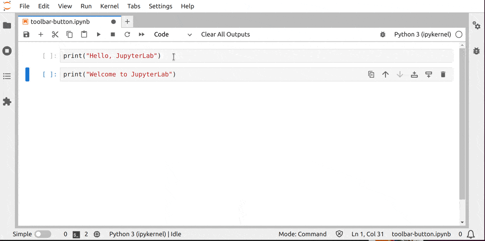

# Toolbar Item

This example shows how to add a button to the notebook toolbar.



In this particular example, the button will clear all cell outputs.

If the wanted action is already defined as a command like in this case, you will
not need to add any code. Otherwise you will need to add a new [command](../commands/README.md).

> Actually you can do this by updating your user settings.

To add a button triggering a command to the notebook toolbar, you must
specified the following settings:

```json5
// schema/plugin.json#L2-L9

"jupyter.lab.toolbars": {
  "Notebook": [
    {
      "name": "clear-all-outputs",
      "command": "notebook:clear-all-cell-outputs"
    }
  ]
},
```

The key `Notebook` inform JupyterLab about which widget toolbar should be
extended. The `name` should be an unique identifier for the widget toolbar
items. The `command` is the unique command identifier. For JupyterLab core
commands, you can look at that [list](https://jupyterlab.readthedocs.io/en/latest/user/commands.html#commands-list) to find it.

## Where to Go Next

This example uses a command to display the widget. Have a look a the
[commands example](../commands/README.md) for more information about it.
