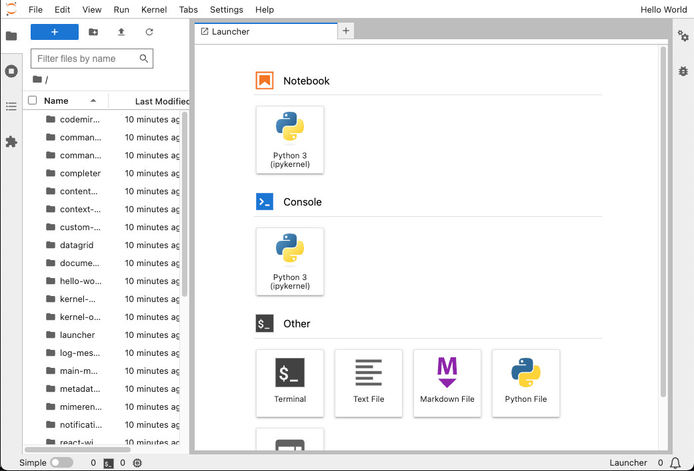

# Top area widget (cross compatible extension)

This example defines an extension that adds a single self-contained text widget
to the top bar of the UI.



## Jupyter Notebook / JupyterLab compatibility

As Jupyter Notebook 7+ is built with components from JupyterLab, and since
both use the same building blocks, that means your extension can work
on both (or any other frontend built with JupyterLab components) with
little or no modification depending on its design.

This extension doesn't need to do anything at all to be compatible
with both JupyterLab and Notebook 7+ (both apps have a top area that can hold the
widget, so it will be visible in both JupyterLab and Notebook 7+ upon install and
after launch). This will be the case if your extension only uses features
that both applications have.

## Adding a widget to the top area

You can add a widget to the top area by calling the following
method of the application shell:

```ts
// src/index.ts#L34-L34

app.shell.add(widget, 'top', { rank: 1000 });
```

The _rank_ is used to order the widget within the top area.

## Where to Go Next

If your extension is using features that are not common to both interfaces,
special steps needs to be taken. You can have a look at the [Shout button](../shout-button-message) and the [Clap button](../clap-button-message) examples
for such advanced case.

You can have more information about this in the
[Extension Dual Compatibility Guide](https://jupyterlab.readthedocs.io/en/latest/extension_dual_compatibility.html).
