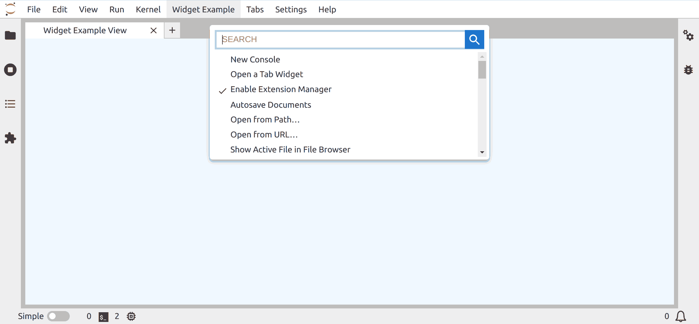

# Widgets

> Add a new Widget element to the main window.

In this example you will learn how to add a new tab to JupyterLab.

Visible elements such as tabs and notebooks are represented by widgets in the [Lumino](https://jupyterlab.github.io/lumino/widgets/index.html)
library that is the basis of the JupyterLab application.

It is the fundamental brick of any visual component in the JupyterLab interface.



## A Basic Tab

The base widget class can be imported with:

```ts
// src/index.ts#L10-L10

import { Menu, Widget } from '@lumino/widgets';
```

It requires to add the library as package dependency:

```bash
jlpm add @lumino/widgets
```

A Widget can be added to the main area through the
[JupyterLab Shell](https://jupyterlab.github.io/jupyterlab/classes/_application_src_index_.labshell.html).

Inside of the `activate` function, you can obtain it through the `shell` attribute
of the `app` object:

```ts
// src/index.ts#L24-L24

const { commands, shell } = app;
```

Then the widget can be inserted by calling the `add` method, like in the command defined
in this example:

<!-- prettier-ignore-start -->
```ts
// src/index.ts#L30-L33

execute: () => {
  const widget = new ExampleWidget();
  shell.add(widget, 'main');
},
```
<!-- prettier-ignore-end -->

The custom widget `ExampleWidget` is inherited from the base class `Widget`.

In this case, no specific behavior is defined for the widget. Only some properties are set:

- `addClass`: Add a CSS class to allow widget styling
- `id`: id of the widget's DOM node - it is mandatory to be set to be included in JupyterLab
- `title.label`: The widget tab title
- `title.closable`: Allow the widget tab to be closed

```ts
// src/index.ts#L47-L55

class ExampleWidget extends Widget {
  constructor() {
    super();
    this.addClass('jp-example-view');
    this.id = 'simple-widget-example';
    this.title.label = 'Widget Example View';
    this.title.closable = true;
  }
}
```

You can associate style properties to the custom CSS class in the file
`style/index.css`:

<!-- embedme style/index.css -->

```css
.jp-example-view {
  background-color: AliceBlue;
}
```

## Where to Go Next

This example uses a command to display the widget. Have a look a the
[commands example](../commands/README.md) for more information about it.

The widget created in this example is simple. You will find more advanced
widgets in the following examples:

- Widget showing a [Datagrid](../datagrid/README.md)
- Widget integrating [React components](../react-widget/README.md)
- Widget interacting with a [Kernel](../kernel-messaging/README.md)
- Extending document widget (like the notebook panel) with a new [Toolbar Button](../toolbar-button/README.md)
